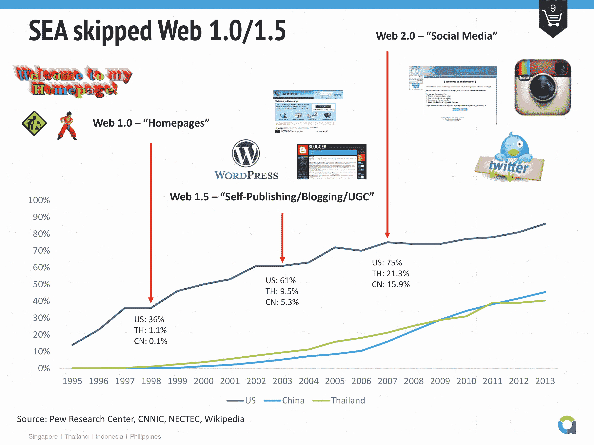
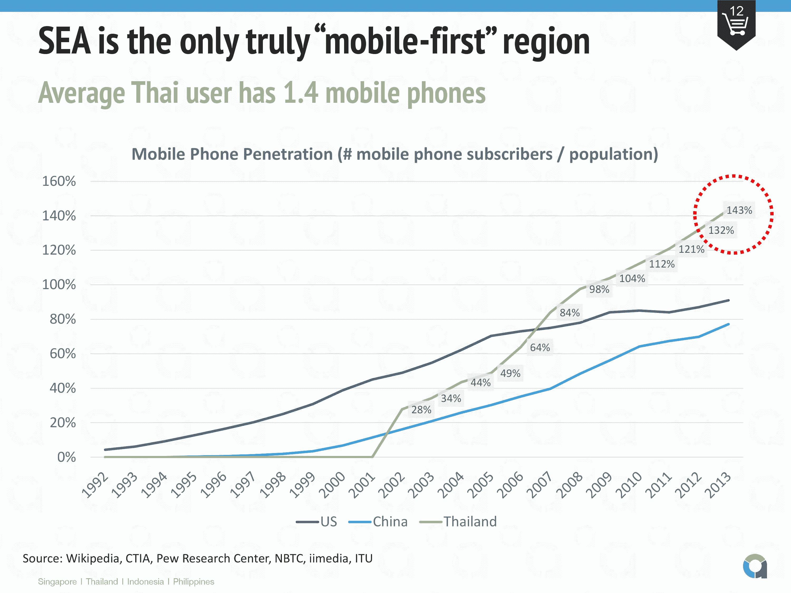
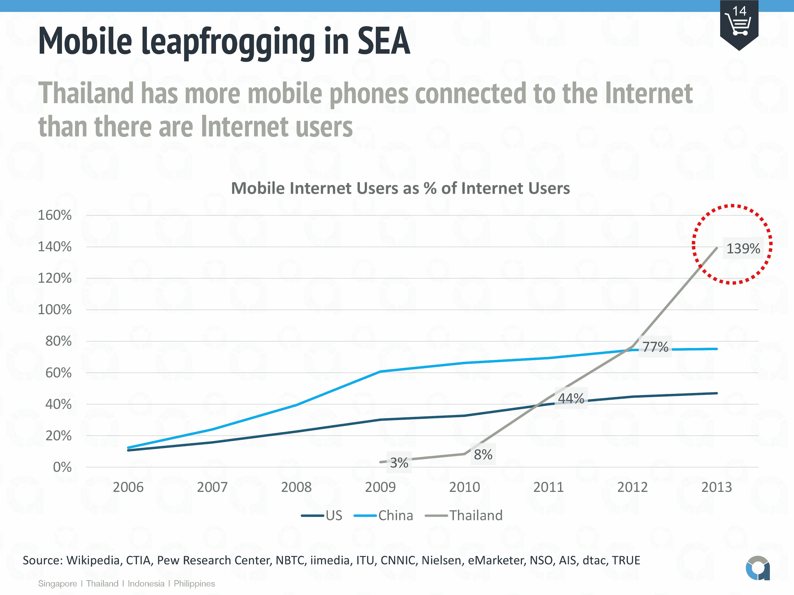
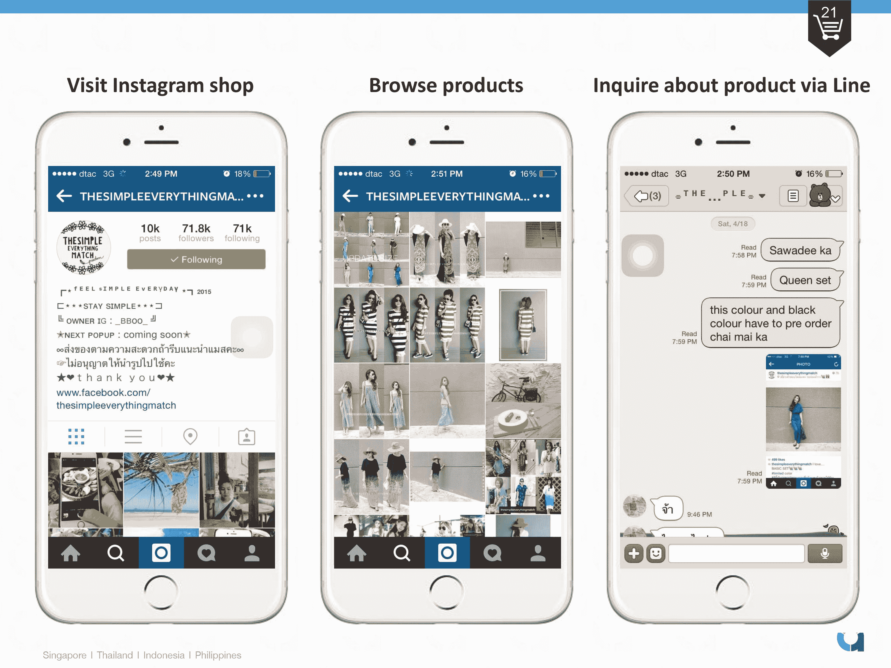
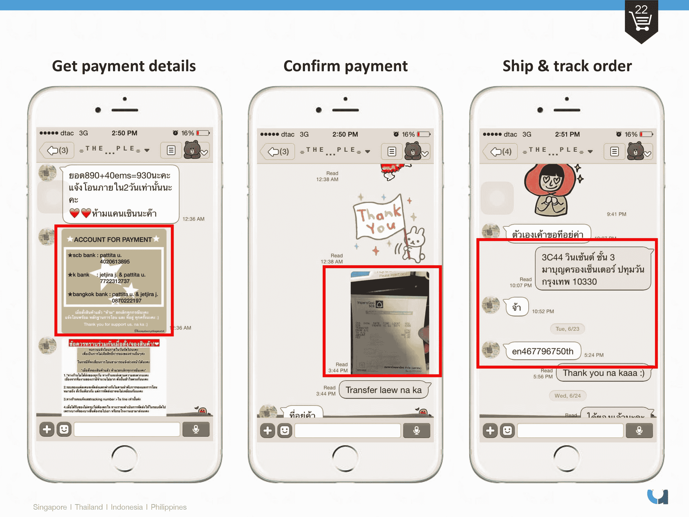
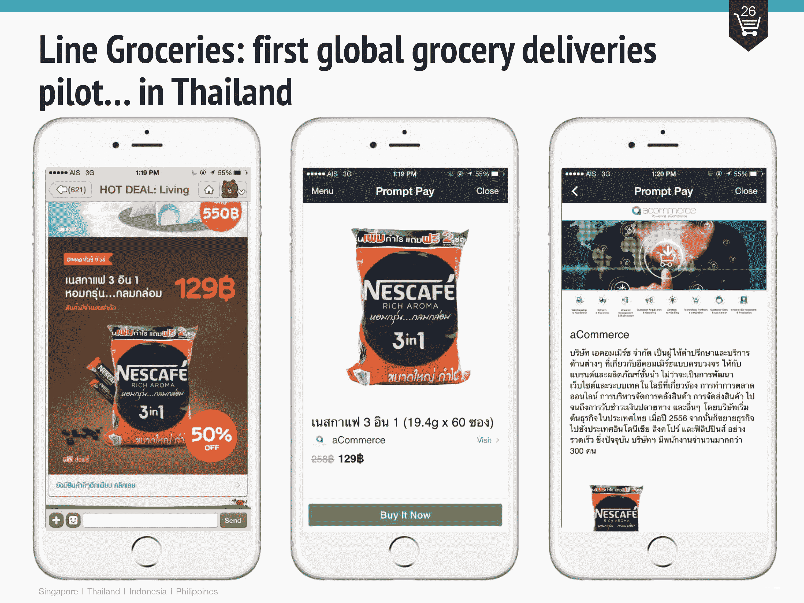
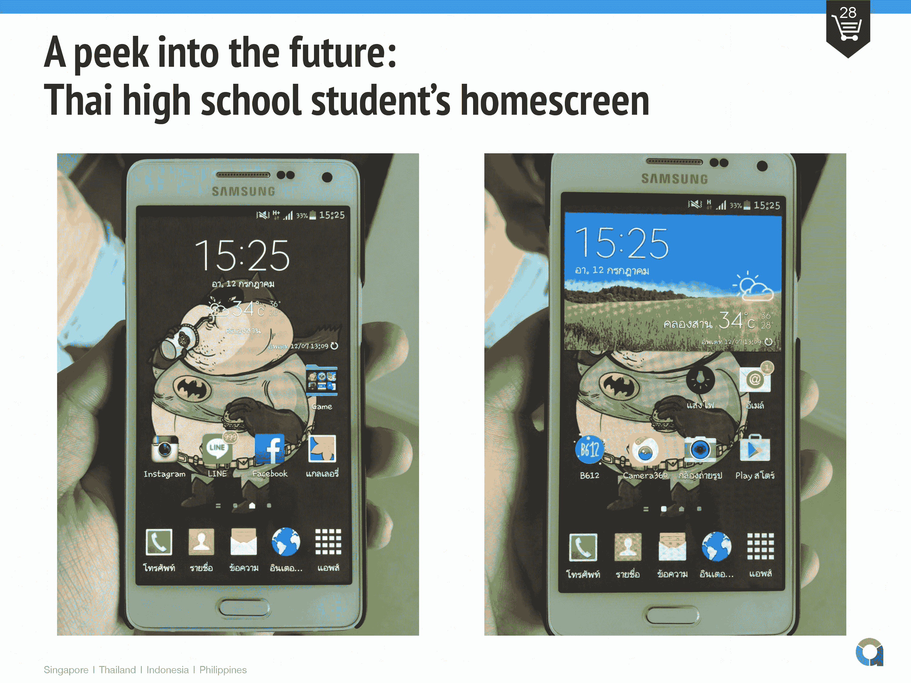

# 为什么东南亚引领着世界上最具颠覆性的移动商业模式

> 原文：<https://web.archive.org/web/http://techcrunch.com/2015/09/08/why-southeast-asia-is-leading-the-worlds-most-disruptive-mobile-business-models/>

More posts by this contributor

今年夏天早些时候，超过 35，000 名行业领袖聚集在 2015 年上海世界移动通信大会上讨论移动的未来，这是亚洲有史以来规模最大的移动通信盛会。虽然会议的大部分时间都集中在 5G 和物联网等新技术上，但我和来自网飞、Line、Ola Cabs、Flipkart 和 Twitter 的同行一起讨论了移动互联网的未来商业模式。

大部分讨论都指向中国和印度，但我在那里关注的是东南亚。这种观点(或者有些人会说是偏见)不仅仅是因为我的公司在东南亚运营，而是因为我们在[1600 万美元的赌注](https://web.archive.org/web/20230322163547/https://techcrunch.com/2015/05/10/acommerce-5-million-for-logistics-in-southeast-asia/)，正如预期的那样，东南亚的移动创新和颠覆将远远快于美国、中国和日本等其他地区。

为什么？下面我将论证东南亚正处于两种主要社会技术力量的交汇点，这两种力量正在创造一个完美的风暴场景:“无尾巴”和“移动跨越”的融合。

## 没有尾巴:东南亚直接进入了 Web 2.0，商业将比广告驱动的商业模式更长久

还记得 GeoCities 主页的千年全盛时期，以及后来向自助出版/博客、用户生成内容的演变吗？Web 1.0 的辉煌时代，更重要的是，Web 1.5 在西方市场催生了一个围绕广告网络的整体盈利模式，如谷歌 AdSense 和优质广告网络，通过 Blogger.com、MovableType 和 WordPress 等平台上的“长尾”出版商内容的[生态系统。](https://web.archive.org/web/20230322163547/https://www.techinasia.com/talk/ad-tech-desperately-reality-check-southeast-asia/)

但在东南亚，互联网的发展比西方同行要晚一些，当时像脸书这样的小网站已经是大多数亚洲互联网用户的第一次在线体验——这是 Web 2.0 浪潮的结束，2007 年泰国的互联网普及率超过 20%。

我们将泰国作为东南亚的代表，因为该国是该地区(不包括新加坡/马来西亚)最发达的国家，而且与新加坡/马来西亚不同，[大多数风投公司](https://web.archive.org/web/20230322163547/https://www.techinasia.com/talk/tia-adrian-ceo-ardent-capital-southeast-asias-leading-vcs-ama/)倾向于认为，泰国的趋势和经验教训适用于该地区的其他地方，尤其是即将到来的主要市场，如印度尼西亚、菲律宾和越南。

如果您对比美国和泰国的互联网渗透率数据，您会发现美国经历了 Web 1.0 和 Web 1.5 的繁荣，同时拥有两位数的互联网采用率，分别为 36%和 61%。在泰国，同一时期这个数字只有一位数。直到 2007 年左右的 Web 2.0，泰国才开始看到互联网的迅速普及，为国家 GDP 和电子商务的增长做出了巨大贡献。

晚些时候参加互联网派对导致用户生成的内容直接进入封闭的社交媒体系统，如脸书、Instagram 和推特——实际上，营销人员称之为“无尾”的景观缺乏[高质量的长尾出版商库存](https://web.archive.org/web/20230322163547/https://www.techinasia.com/talk/ad-tech-desperately-reality-check-southeast-asia/)。

由于东南亚缺乏这种长尾，在线广告行业已经落后，迫使老牌公司和初创公司寻找非广告盈利来源。进军电商和数码商品。

## 从传统的广告驱动的货币化到混合和商业驱动的商业模式

“无尾巴”的一个更有趣的影响是独特的和亚洲特有的商业模式的加速发展和扩散。这是亚洲文化和生态系统与当地创造力和企业家精神相遇的地方。尽管美国的初创公司和互联网公司倾向于将广告作为他们的默认盈利策略——参见 [Pinterest](https://web.archive.org/web/20230322163547/https://ads.pinterest.com/) (推广的图钉)、 [Instagram](https://web.archive.org/web/20230322163547/http://blog.business.instagram.com/post/112707530471/carousel-ads) (轮播广告)以及最近的 [Snapchat](https://web.archive.org/web/20230322163547/https://www.snapchat.com/ads) (“垂直、视频、视图”)——我们这个领域的亚洲企业不得不寻找其他地方来赚钱。

中国的腾讯是这方面的典型代表。该公司 80%以上的收入来自增值服务(增值服务，主要是虚拟商品)和电子商务。[不到 10%的收入来自销售横幅广告和搜索关键词。另一个例子是](https://web.archive.org/web/20230322163547/http://www.economist.com/news/business/21586557-chinese-internet-firm-finds-better-way-make-money-tencents-worth)[蘑菇街](https://web.archive.org/web/20230322163547/https://www.techinasia.com/mogujie-daily-deals-china/?utm_source=search&utm_medium=web&utm_campaign=%2Fmogujie-daily-deals-china%2F)，一个专注于女性的社交购物网站[在被阿里巴巴](https://web.archive.org/web/20230322163547/https://www.crunchbase.com/organization/mogujie)收购之前筹集了超过 2 亿美元。蘑菇街最初是中国 Pinterest 的翻版，但很快转向了电子商务和社交购物。与 Pinterest 通过“推广别针”赚钱不同，蘑菇街难以通过广告赚钱，不得不转向电子商务以求生存。

同样的事情也发生在东南亚，因为有着相似的生态系统，它走着与中国相似的道路。出版商正在寻求通过电子商务赚钱的帮助，因为他们很难通过广告网络销售广告赚钱。例如，根据泰国的平均 RPMs(每 1000 次展示/页面浏览量的收入)，像 [Cosmenet.in.th](https://web.archive.org/web/20230322163547/http://cosmenet.in.th/) 这样受欢迎的本地垂直出版商根据 SimilarWeb 的页面浏览量每月只能赚 350 美元。这甚至不足以支付托管费，这就是为什么这些出版商正在寻找电子商务等非传统的盈利渠道并不奇怪。

## 移动跨越:东南亚是“移动优先”——这将如何成为未来商业模式的温床

每个人都在谈论中国和印度将如何成为移动领域的下一个大事件，这并不奇怪，因为这些市场是如此之大。然而，如果你将数字标准化，看看手机和移动互联网的普及率，东南亚实际上是更有趣的情况。

## 泰国用户平均拥有 1.4 部手机

近年来，泰国的手机普及率大幅上升，最新数据显示，在手机普及率方面，泰国已经超过了美国和中国。由于没有桌面互联网遗留的负担，并且受到智能手机制造成本越来越低的推动，泰国的手机普及率已经加快到平均每个泰国人拥有 1.4 部手机，或者说普及率达到了 140%。相比之下，美国和中国分别只有 91%和 77%的采用率。

## 移动跨越式发展:在引入 3G 后不到一年的时间里，泰国的移动互联网渗透率已经超过了美国和中国

泰国的移动互联网普及率已从 2009 年的仅 1%跃升至 2013 年的 56%，其中大部分增长是在该国于 2013 年初正式推出 3G 后实现的。泰国的移动互联网普及率超过了美国和中国等成熟市场，这两个市场的普及率分别为 40%和 34%。

看待这个问题的另一种方式是分析移动互联网用户占互联网用户总数的百分比。对泰国来说，这个数字是 139 %,这意味着泰国连接到互联网的手机比互联网用户还多。泰国击败了美国和中国，这两个国家的比例分别是 47%和 75%。

东南亚的公司注意到了这一趋势，并迅速适应这一趋势。例如， [Lazada 现在有超过 50%的流量来自移动渠道](https://web.archive.org/web/20230322163547/http://www.slideshare.net/TechInAsiaVN/lazada-kinnevik-rocket-cmd-2014-35285360)，在此之前，它已经将应用程序开发列为重中之重。他们也是东南亚首批同时推出 iOS 和 Android 应用的电子商务公司之一。 [MatahariMall](https://web.archive.org/web/20230322163547/https://www.mataharimall.com/) ，力宝集团的新电子商务公司，从他们的移动网站开始，通过逆向工作创造了他们的桌面体验。其他的，比如印度尼西亚的一个快速发展的快速时尚电子商务网站 SaleStock，完全放弃了桌面，只提供一个移动的，虽然不是本地的，购物用户界面。

## 完美风暴:无尾遭遇移动跨越——东南亚移动商业模式未来一瞥

在“无尾巴”和“移动跨越”的十字路口，我们可以期待看到东南亚新的和独特的移动商业模式的熔炉。

## C2C 模式:东南亚快速社交商务的六个步骤

一个有趣且东南亚独有的现象是“影子市场”。由于两种力量的作用——高移动渗透率和内容创作集中在社交媒体平台上——社交媒体上的非正式 C2C 电子商务正在兴起，如 Instagram、脸书和 Line。这些不是到处出售零零碎碎的小夫妻店——据估计，泰国 GMV 电子商务总额的三分之一来自这些影子市场。

它是这样运作的:商家在 Instagram 上展示他们的产品，交易通过泰国最受欢迎的聊天应用 Line messaging 完成:

对于我们许多习惯于在亚马逊和天猫等平台上进行更“先进”和无缝的电子商务购物的人来说，这似乎是非常低科技的，但它对东南亚电子商务的社会和经济影响不容忽视。

## B2C 模式

在世界移动通信大会上，我与 Line 公司的 Hanna Lee 同台，她是 Line 中国和香港业务的总经理。Hanna 展示了 Line 从一个消息应用到涵盖数字商品、音乐和视频的整体媒体解决方案的演变。在东南亚，意识到向移动商务的转变，该公司已经启动了几个试点项目，以利用电子商务货币化，最著名的是[线闪购](https://web.archive.org/web/20230322163547/https://www.techinasia.com/line-pulled-55-million-interested-shoppers-flash-sales-thailand-infographic/)，线热交易和[线杂货。](https://web.archive.org/web/20230322163547/https://techcrunch.com/2015/02/01/line-groceries-southeast-asia/)

Line 杂货首先在泰国推出，因为泰国是 Line 在日本以外的第二大市场，在 6 亿多用户中有超过 2900 万用户。这证明了像 Line 这样的大公司已经放弃了在日本这样的最大市场推出产品，而是直接投入到最肥沃的土地上来测试新的和创新的商业模式。

## B2B2C 模式

我们最近已经看到像 Pinterest、脸书和谷歌这样的玩家积极进入电子商务领域进行盈利。上个月早些时候，[谷歌宣布“在谷歌上购买”](https://web.archive.org/web/20230322163547/https://techcrunch.com/2015/07/15/purchases-on-google)在手机上启用购买按钮。同一天，[脸书开始在数字商店](https://web.archive.org/web/20230322163547/https://techcrunch.com/2015/07/15/cant-buy-me-love)测试脸书页面的购买按钮，加入了 Twitter、Instagram 和 Pinterest 在几个月前尝试购买按钮的行列。所有这些公司都将电子商务视为一种额外的、尽管有利可图的收入来源。

然而，在东南亚，与美国和欧洲等成熟市场相比，这可能不是奢侈品。相反，通过购买按钮实现电子商务可能是一种必然，甚至是一种生存机制，因为正如我们之前所争论的那样，市场是由商业驱动的，而不是由广告驱动的。此外，鉴于我们在影子市场案例中看到的东南亚供需的完美匹配，我们预计这里采用购买按钮的速度会快得多。

鉴于现有的电子商务平台过多，即使在东南亚这样的新兴市场，人们也会想知道为什么谷歌和脸书支持电子商务如此重要。快速浏览一下像泰国这样的市场中的实际移动行为有助于我们理清头绪。下图显示了一名泰国高中生的两个手机主屏幕。

左边的第一个屏幕显示了社交媒体和聊天应用，如 Instagram、脸书和 Line，此外还有一个专用于游戏的文件夹。另一个屏幕只显示相机应用程序。

这里可以得出三个有趣的观察结果:

*   没有谷歌。尽管谷歌[最近的数字很大，](https://web.archive.org/web/20230322163547/http://www.businessinsider.com.au/google-market-cap-added-an-uber-after-earnings-2015-7)以及媒体最近宣称[移动根本没有破坏谷歌的搜索业务](https://web.archive.org/web/20230322163547/http://qz.com/457363/mobile-isnt-ruining-googles-search-business-after-all/)，但看到这些数字按市场细分会很有趣，尤其是亚洲，尤其是东南亚。混合不同市场的数字和行为并不能揭示像东南亚这样的“移动优先”或“纯移动”市场的真实影响。不要误解我——谷歌搜索会一直存在，甚至在手机上。然而，在我们的移动时代，它的影响将不会那么突出。正如一篇 MediaPost 评论所指出的:“在某种意义上，手机的崛起意味着——在某些情况下——搜索引擎正在被超越；我们将直接进入熟悉的、受欢迎的或手机友好的频道，而不是首先访问搜索引擎。”
*   没有 YouTube。视频正在向 Instagram、脸书和 Line 等即时通讯应用转移。脸书现在每天有超过 30 亿的视频浏览量。Line 最近在泰国推出了类似 YouTube 的视频服务。Line 选择泰国而不是其最大的市场(日本)推出这款手机，是因为泰国，而不是日本，是一个真正的移动优先市场。
*   **没有商务应用**。诚然，这是一个新兴市场中的 18 岁高中生，但习惯一旦形成，就很难改变。此外，如前所述，可能根本不需要商务应用，因为 Instagram、Line 和脸书已经成为东南亚事实上的商务平台。脸书、Instagram 和 Twitter 正式进入 buy buttons 只会加强这一点，尤其是在这个地区。鉴于脸书、Instagram、Line 和 Twitter 在该地区的主导地位，这种下一代现象将对东南亚的老牌电子商务零售商和平台构成重大挑战。

## 结论

在“无尾巴”和“移动跨越”这两种独特力量的推动下，东南亚处于一个特殊的位置，成为新的移动业务模式的熔炉。不要再从美国、中国甚至韩国/日本那里寻找移动未来的灵感，因为那里不会发生。具有讽刺意味的是，成熟和发达市场承载着桌面互联网时代的沉重遗产，而东南亚则从一张白纸开始，这使得后者处于一个独特的位置，可以在移动领域试验和开发新的商业模式，主要由商业驱动。