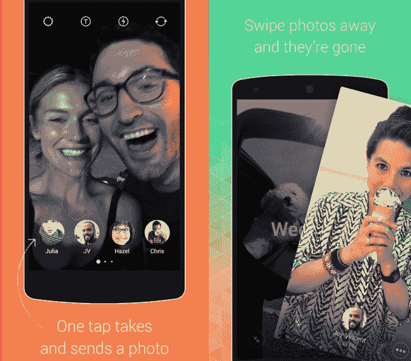

# 为什么独立应用会失败

> 原文：<https://web.archive.org/web/https://techcrunch.com/2014/08/04/why-standalone-apps-are-supposed-to-fail/>

搬十亿人的家具很吓人。这就是为什么产品经理 Michael Reckhow 告诉我脸书制造了纸张。这种担忧催生了 2014 年独立应用的繁荣。科技巨头们正在他们的主要应用的神圣大厅之外尝试新的用户体验，这些应用太重要了，不能干预。

但是，当媒体和公众仔细审视脸书[弹弓](https://web.archive.org/web/20230404165309/http://www.crunchbase.com/product/slingshot)，Instagram [Bolt](https://web.archive.org/web/20230404165309/http://www.crunchbase.com/product/bolt-3) ，以及 Dropbox [Carousel](https://web.archive.org/web/20230404165309/http://www.crunchbase.com/product/carousel) 等不同应用的成功时，他们可能忽略了一点。独立应用程序应该会失败，至少在大多数情况下是这样。

他们就像足球中的自由球员。裁判抛出了旗子，但会让比赛继续进行。如果这个队想要的话，他们会重新来过。与此同时，他们可以尝试一些没有后果的风险，但如果事情进展顺利，他们会收获好处。

## 冒险的重新设计

一句常见的格言是，10 个创业公司中有 1 个成功，但真正的全垒打就更少了。在消费者社交应用中，这种可能性甚至更大。你不仅需要一个有趣的、引人注目的、可立即获得的产品，而且你必须围绕它培养一个忠诚的社区。

在不破坏原有体验或埋葬新体验的情况下，在另一个应用程序中构建这种体验几乎是不可能的。大家伙很久以前就停止尝试了。乍一看，脸书和推特多年来都没变。导航系统变得更快，图像变得更大，但它们的外观和感觉都和 2010 年一样。

重新设计核心功能可能会不稳定。一个错误的举动可以赶走数百万用户，以及他们产生的美元。正如马克·扎克伯格在去年的一次台上采访中告诉我的那样，将强大的功能隐藏在一个主应用程序中会使它们降级为 [【二等】体验](https://web.archive.org/web/20230404165309/https://techcrunch.com/2014/01/29/one-app-at-a-time/) 。而且很少有功能重要到可以分拆成配套应用。

Facebook Messenger 已经将我们在手机上聊天的倾向变成了一个拥有 2 亿用户的现象，现在它已经从可选的方式变成了在手机上发送脸书消息的唯一方式。但是脸书的用户大多对纸张的高设计打呵欠，并坚持使用传统的新闻馈送。

当巨头们彻底检查功能或添加新功能时，他们会被远远地卡住，以至于被许多人遗忘或忽视。Twitter 对 Discover 的修改，或者脸书附近的朋友和附近的地方得到了以下的一小部分，因为他们的同伴成为了聚光灯的焦点。如果它们真的获得了牵引力，那也是在孤立的集群或特殊的人群中。Instagram Direct 在该应用的 2 亿多用户中拥有 4500 万每月“活跃”用户，但这只是至少打开直接消息的人。实际发送邮件的人数肯定要少得多。

## 昂贵的收购

虽然在已经存在的应用程序中构建这些新的应用程序很困难，但不构建它们的成本可能会非常高。

脸书是世界上最大的照片分享应用，但它不是为移动设备设计的。Instagram 将滤镜和脸书风格的 feed 结合起来，抛弃了除照片之外的一切，并获得了成功。在它造成严重问题之前，脸书将不得不花费 10 亿美元来收购这个新贵。自那以后，Instagram 的用户从大约 3000 万增长到超过 2 亿。如果脸书犹豫了，它将不得不为它支付更多的费用，或者更糟，看到应用程序落入竞争对手手中。

不是脸书、推特或谷歌发现了短暂信息的力量。是 Snapchat，它没有以前的产品来硬塞进自毁的照片。脸书花了一年时间才明白过来，而它在[只用了 12 天](https://web.archive.org/web/20230404165309/https://techcrunch.com/2012/12/21/facebook-poke-app/)就设计出的[浅层克隆戳](https://web.archive.org/web/20230404165309/https://techcrunch.com/2012/12/21/facebook-poke-vs-snapchat-what-is-the-difference/)失败了。当然，它允许发短信，Snapchat 最终会加入这一功能。但除此之外，Poke 没什么特别的，Snapchat 在孩子们中间已经被认为很酷了。

据报道，脸书试图以 30 亿美元收购该应用，但遭到拒绝。现在 Snapchat 据说正在以 100 亿美元的估值融资。脸书忙于建立时间线来永久记录我们的生活，它没有尝试不是每张照片都必须永远存在的想法。

## 那么，为什么不呢？

一旦明确了在现有应用中培养新的行为模式很难，但购买证明用户想要这些体验的新应用可能会很昂贵，那么构建独立应用的策略就成了焦点:

*   **便宜**:对于科技巨头来说，让几个设计师、工程师和产品经理来构思一个想法相对来说并不昂贵。
*   快速:因为他们不需要找出产品在现有应用中的位置，并且可以探索新的风格，所以开发很快。
*   **低风险**:科技巨头在其主要应用程序之外构建，不必担心改变会震惊、疏远或迷惑现有用户。

那么，为什么不呢？

最好的情况是，这款应用大受欢迎，一家科技巨头又增加了一款受欢迎的产品。该应用程序可以作为母公司主要品牌的延伸，推动其应用程序家族的锁定。例如，Dropbox 的独立照片备份应用 Carousel 在一定程度上是为了让人们购买更多的 Dropbox 存储空间。或者可以像 Instagram 一样，在母公司的幕后帮助下，在业务、招聘、工程、国际化等方面独立运营和盈利

即使这款应用还算成功，它也可以收集数据，了解用户，并将其应用于公司的主要产品。例如，脸书的第一个独立的照片应用程序脸书相机作为主要的脸书应用程序新功能的[测试场。在这里，脸书发现它的小豚鼠喜欢多镜头上传和过滤器，所以即使脸书相机最终将被关闭，它也通过独立的应用程序模型开发和完善了关键功能。](https://web.archive.org/web/20230404165309/https://techcrunch.com/2012/11/09/standalone-guinea-pigs/)

## 失败是一种选择

最坏的情况是，这款应用彻底失败。但是这到底有多糟糕呢？一些优秀的人才从重要的项目中流失，但是这些公司有钱雇佣大量优秀的设计师、工程师和产品经理。母公司可能已经推迟了将独立应用的用例纳入其主要产品的工作，但这些科技巨头足够大，足以拥有大量团队，他们应该并行工作，以对冲他们的赌注。这就是为什么脸书启动了它的[创意实验室计划](https://web.archive.org/web/20230404165309/https://techcrunch.com/2014/01/30/facebook-creative-labs/)，以培养小团队在其核心体验之外开发新的应用。

少数几个对独立应用程序有过糟糕体验的人可能会对母公司失去一些信心。如果这款应用被关闭，那些仍在使用它的人可能会有点恼火。但是大部分忘记使用脸书的独立 feed-reading 应用 Paper 或者忽略 Twitter #Music 并没有减少我使用脸书或者 Twitter 主要应用的可能性。这就是它“独立”的全部意义就像一个被捕的特工，母公司可以否认失败的独立应用程序，并继续发展其主要应用程序。

最终，建立独立平台更令人生畏的一个方面可能是，如果一个应用失败，公司会受到媒体的抨击。拿我来说，我要承担责任。看着价值数百亿或数千亿美元的成功公司在某件事情上失败，有一种令人不快的快乐。自 2012 年 12 月 Poke 推出以来，脸书的股价已上涨近两倍，但蓝色 Snapchat 克隆版仍是科技博客和硅谷场景中无数笑话的笑柄。

然而，也许我们记者和专家们忽略了这一点。独立应用注定会失败，至少在大多数时候是这样。当好处多，坏处少时，独立应用可能是明智的投资，即使它们的成功率很低。

通过这个镜头，让我们来看看最近的一些单机游戏:

*   Instagram 的 Bolt 是一款超快的照片和视频信息应用，你朋友的脸就是快门按钮。我不认为这一点点额外的速度值得我使用新的应用程序。但是也许它成为了人们给他们最亲密的朋友和家人发照片信息的方式。
*   [Dropbox Carousel](https://web.archive.org/web/20230404165309/https://techcrunch.com/2014/04/09/dropbox-debuts-carousel-aiming-to-be-the-go-to-storage-app-for-your-entire-photo-archive/) 自动将你所有的相机胶卷和新的手机照片同步到云端，方便存储和保存。虽然 Dropbox 的想法是很多人珍惜但不备份他们的手机照片，但它的牵引力很慢。但如果它失败了，也许它会成为 Dropbox 采用的巨大推动力。
*   [脸书的弹弓](https://web.archive.org/web/20230404165309/https://techcrunch.com/2014/06/18/facebook-slingshot-review/)利用了好奇心，允许你给朋友群发照片和视频，只有当他们给你回发一张照片和视频时，你才能看到。对于弹弓来说还为时尚早，但也许回复解锁只是引入了太多的摩擦。但也许这种机制是一种病毒式的感觉，而弹弓帮助脸书吸引了 Snapchat 的注意力或阻止了 Snapchat。
*   Twitter #Music 可以让你听和分享最热门的歌曲，或者查看你最喜欢的名人所追随的艺术家的歌曲。它从未获得牵引力，最终被关闭。但是 Twitter 确实学到了很多关于人们如何分享歌曲的知识。或许它可以让 Twitter 像电视一样成为音乐发现和交流的门户。

Twitter #Music 已死，Carousel 一直在稳步下滑，很多人都在赌弹弓不行，Bolt 可能还不够特别。不过没关系。如我所说，它们是自由发挥——万福玛利亚在旗帜后传递。如果 NFL 球队在没有任何反响的情况下触地得分，你不会看到他们受到抨击。因此，与其喋喋不休地抱怨独立应用程序的低下载量，或许我们应该鼓励更多的公司转向终端领域。他们会失去什么？

