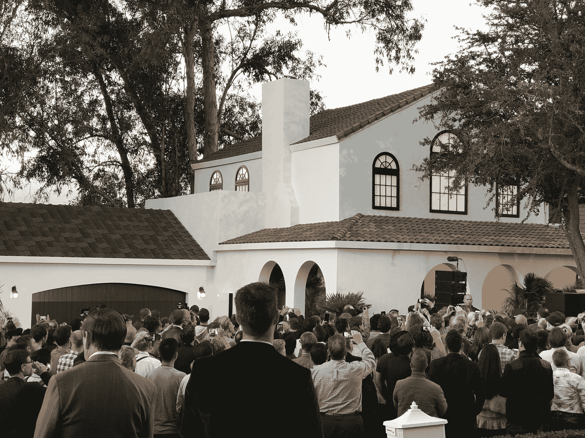
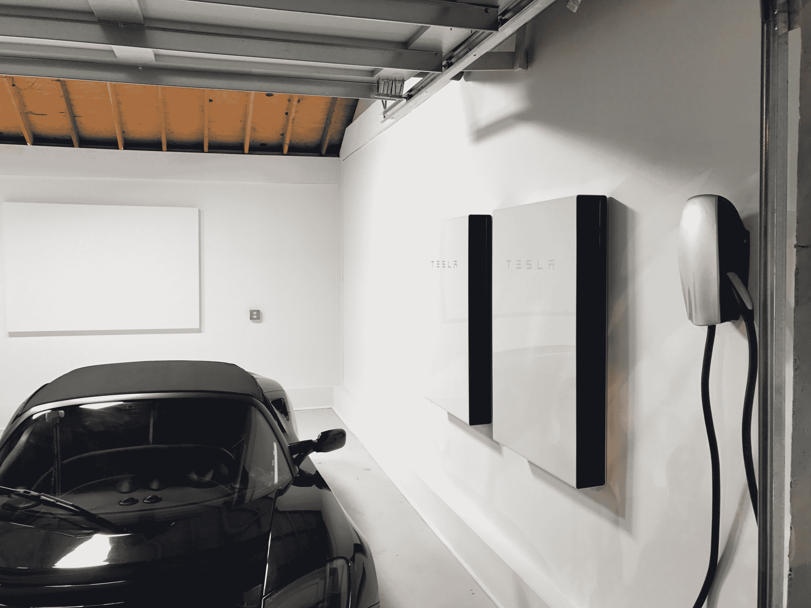
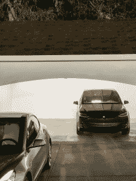

# 为什么特斯拉的新太阳能屋顶瓦和家用电池如此重要 

> 原文：<https://web.archive.org/web/https://techcrunch.com/2016/10/31/why-teslas-new-solar-roof-tiles-and-home-battery-are-such-a-big-deal/>

10 月 28 日，特斯拉发布了其新的太阳能屋顶瓦。在埃隆·马斯克(Elon Musk)说之前，我们当中很少有人意识到太阳能屋顶瓦实际上是功能性太阳能电池板。当然，这是一个巧妙的把戏，但有什么大不了的呢？

当重点是绿色能源和我们不那么依赖化石燃料的未来时，特斯拉发表时尚声明又有什么关系呢？

我从一些人那里听说这并不是什么新鲜事，因为之前还有其他类似的项目，例如包括[陶氏化学的罐装太阳能瓦片项目](https://web.archive.org/web/20230124230533/https://www.greentechmedia.com/articles/read/dow-chemical-sheds-solar-shingle-business)。其他人担心特斯拉用太阳能解决方案影响消费者的能力，听起来就前期(或有付款计划，延期但净)安装成本而言，太阳能解决方案仍然非常昂贵。还有一些人不清楚特斯拉这款产品的目标，也不清楚它如何融入该公司与电动汽车相关的整体战略。

## 外表很重要

人们很容易忽视特斯拉瓷砖外观的美学意义，但它实际上很重要，是那些想要建造新房或翻新旧房的房主真正需要考虑的问题。瓷砖有四种不同的风格(纹理玻璃、石板玻璃、托斯卡纳玻璃和光滑玻璃)，其外观将成为潜在买家的核心考虑因素，特别是那些处于目标市场高端的人，他们有可支配收入，可以尽一切努力确保自己的家看起来尽可能好。

与其他寻求从另类技术向主流技术飞跃的技术一样，太阳能在客户认知方面还有一个障碍要跨越。现有的太阳能设计，甚至所谓的使它们与传统产品更一致的尝试，如上面提到的陶氏化学项目，在创造可以被广泛描述为好看的东西方面还有很多需要改进的地方。

这就像虚拟现实耳机一样——Oculus 和谷歌可以声称他们使用的面料使他们的耳机更加平易近人，但这两者仍然只是具有利基吸引力的产品曲线上的一个选项。两者都不太可能让真正广泛的用户接受，太阳能电池板也不太可能完全伪装成这样。

## 光晕效果

不少分析师和媒体成员将特斯拉称为汽车界的苹果，如果有一件事苹果做得很好，那就是利用所谓的“光环效应”这是一种现象，其中一个业务线的客户可能成为其他一些业务线的客户；例如，iPhone 购买者往往会继续拥有一台 Mac 电脑。

对于特斯拉来说，这代表着一个通过特斯拉电动汽车销售火爆的连锁效应，包括 Model 3 的巨大预购兴趣，启动其家用太阳能业务的机会(如果其收购 SolarCity 的计划获得通过，它将认真开展这项业务)。想到包括汽车和家庭能源系统在内的大件商品的光环效应很奇怪，但特斯拉的粉丝群与苹果的粉丝群有很多共同特征，因为他们已经在整个汽车的层面上购买，所以构成有效光环购买的参考框架实际上是合适的。

像苹果一样，特斯拉在客户满意度和品牌承诺方面得分很高，这是任何试图大规模销售太阳能家庭能源系统的人都无法比拟的。听起来很奇怪，“因为你喜欢你的车而买一个屋顶”可能是新的“因为你喜欢你的手机而买一台电脑。”

## 基本太阳能之外的好处

特斯拉的太阳能瓦片声称能够为一个标准家庭供电，并通过新的 Powerwall 2 电池提供备用电源，以防恶劣天气或其他停电。马斯克表示，总成本仍将低于安装常规旧屋顶和向电力公司支付传统来源的电力。但是马斯克关于新解决方案的新好处的说法并没有就此结束。

特斯拉的瓦片实际上将比传统的屋顶材料更有弹性，包括赤陶、粘土和石板瓦。据马斯克说，这是因为他们的建筑中使用的玻璃的韧性，他用壶铃演示了从上面猛烈撞击的结果，正如你在下面的视频中看到的那样。

这应该使它们在理论上更能抵抗冰雹等因素的潜在破坏，甚至是像倒下的树枝这样的碎片。事实上，马斯克在活动中还表示，这些屋顶应该远远超过今天使用的屋顶材料常见的标准 20 年生命周期——两倍甚至三倍。更少的屋顶瓦片更换意味着更多的价值，前提是他的前期成本估算中没有考虑到这一点。

新的太阳能电池板也有可能比现有的太阳能电池板更加高效。虽然在目前的形式下，马斯克说他们达到了普通电池板 98%的效率。他说，该公司正在与 3M 公司合作开发涂层，可以帮助光线进入面板，然后在面板内折射，让它捕捉更多的潜在能量，将其转化为可消耗的能量。

## 一种新的生态系统

 特斯拉太阳能瓦片的公布并不能保证一场席卷全球的太阳能革命；事实远非如此，因为特斯拉表示，直到明年才会开始在任何消费者家中安装该产品，从现在到那时可能会发生很多事情。但马斯克也充满信心地表示，他最终预计 Powerwall 的销量将超过特斯拉汽车，而且很容易。

太阳能屋顶、Powerwall 和特斯拉汽车合在一起代表了消费科技领域的一种新生态系统，这种生态系统除了生态效益之外，还承诺实现自给自足。特斯拉已经透露了它打算如何让车辆所有权成为司机的收入来源，而不是成本中心。你可以看到它最终可能如何利用太阳能瓦屋顶和串联安装的电力墙来实现太阳能发电，为房主提供剩余的发电和存储，并提供一些不同的潜在选择来将多余的部分货币化(例如，作为其他特斯拉的增压站，或卖回给电网)。

看到特斯拉上周的亮相，人们很容易认为这更多的是家用太阳能行业的增量发展。但这更有可能是朝着个人对发电拥有更直接控制权的未来迈出的一步，导致我们对可再生能源的看法发生巨大变化。