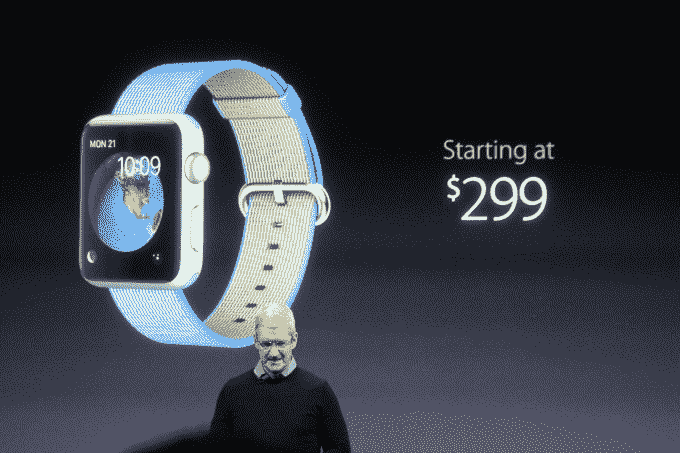

# 为什么 Apple Watch 降价是明智之举

> 原文：<https://web.archive.org/web/https://techcrunch.com/2016/03/22/why-the-apple-watch-price-cut-is-smart-thinking/>

上周，苹果联合创始人兼全面好人史蒂夫·沃兹尼亚克[通过](https://web.archive.org/web/20230326075302/http://www.dezeen.com/2016/03/17/steve-wozniak-criticises-apple-watch-jewellery-market-reddit-ama-interview/) [Reddit AMA](https://web.archive.org/web/20230326075302/https://www.reddit.com/r/IAmA/comments/4apj5f/im_apple_cofounder_steve_wozniak_ask_me_anything/) 登上了头条，他在文中批评苹果手表将公司带入了“珠宝市场”。

输入 Woz:

> 我有点担心——我是说我爱我的 Apple Watch，但是——它把我们带到了一个珠宝市场，在那里你会根据你认为自己作为一个人有多重要来购买 500 美元到 1100 美元之间的手表。唯一的区别是所有这些手表的表带。20 块手表从 500 美元到 1100 美元不等。乐队是唯一的区别？这不是苹果公司最初的样子，也不是真正改变了世界的公司。所以它可能会移动，但你必须跟随，你知道。你必须跟随市场的轨迹。

本周[苹果制造了一些自己的](https://web.archive.org/web/20230326075302/https://techcrunch.com/gallery/heres-everything-apple-announced-at-todays-event/)头条新闻，包括宣布智能手表降价[50 美元。购买苹果可穿戴设备的新入门级价格为 299 美元，适用于较小尺寸的运动机型。](https://web.archive.org/web/20230326075302/https://techcrunch.com/2016/03/21/the-entry-level-price-for-the-apple-watch-is-dropping-to-299/)

价格下跌是否意味着苹果已经意识到它手上有一个昂贵的哑弹，并拼命试图诱使买家改变想法？一句话，没有。

[苹果手表仍然是智能手表领域的类别领导者](https://web.archive.org/web/20230326075302/https://techcrunch.com/2016/01/13/apple-watch-scooped-up-over-half-the-smartwatch-market-in-2015/)。虽然“生活方式可穿戴设备”(如果我可以这样称呼它们的话)的长期可持续性在这个仍处于萌芽阶段的阶段仍是一个争论的问题，但公平地说，鉴于苹果公司过去的定价策略，苹果设备的早期降价并不出人意料。

如果你从销售设备和配件的互联生态系统中赚钱，这也是一笔聪明的生意，苹果确实是这样做的。

在降价方面，例如，最初的 iPod 在 2001 年秋季上市时售价约为 400 美元。在接下来的几年里，个别 iPod 型号的价格相当稳定地下降，即使有新的型号推出，这使得苹果公司能够为最新的顶级设备恢复更高的价格点。今天你可以花大约 150 美元买到一台 iPod nano(或者花大约 49 美元买到一台无屏幕的 shuffle)，与 400 美元的原价相差甚远。然而，这些(相对)便宜且令人愉快的 iPods 显然仍然值得苹果公司去制造和销售。

第一代 iPhone 在 2007 年发布后仅仅几个月就降价 200 美元，但这款设备仍然取得了巨大的销售成功，直到今天仍然是苹果业务的核心引擎。所以降价本身并不能告诉我们太多。

不过有趣的是，就 Apple Watch 而言，苹果并没有降低其销售的额外表带的价格。因此，虽然苹果的核心可穿戴设备现在便宜了一点，但苹果制造的手表配件保持稳定。

首席执行官蒂姆·库克昨天指出，大约三分之一的 Apple Watch 用户“定期”更换手环。这意味着大约三分之一的可穿戴用户已经支付(或被赠予)了第二个(或额外的)手环——扩大了苹果可以从可穿戴设备中获得的利润率。

苹果昨天为入门级 Apple Watch 推出了另一款表带；一款[编织尼龙选择](https://web.archive.org/web/20230326075302/https://techcrunch.com/2016/03/21/apple-shows-off-new-apple-watch-accessories-including-a-new-woven-nylon-band/)，也单独出售，售价 49 美元。其范围内的其他乐队包括 199 美元的米兰环路乐队；449 美元的链接手镯；149 美元的经典带扣皮筋；一条 149 美元的皮圈带；和 249 美元的现代带扣选项。当你看这些手表带配件的定价时，很明显苹果最大的硬件利润来自配件。

苹果已经在保护套和加密狗方面遵循了这一策略，例如，对官方连接器、替换电缆、花哨的皮革 iPhone 保护套或配备电池的变体收取令人瞠目结舌的价格。

因此，Apple Watch 显然是为了开辟一个全新的配件系列——表带，该公司可以对其收取溢价。

这些可穿戴配件的要点是，人们会为个性化支付更多费用。事实上，人们更愿意为个性化服务付费，而不是为他们可能真正需要但不会展示在自己身上的东西支付额外费用，比如更换充电器电缆。

毕竟，个人喜好是时尚产业的燃料——这也是苹果试图通过其可穿戴设备开发的冲动型商业。难怪苹果公司称 Apple Watch 为“有史以来最个性化的设备”。

因此，尽管沃兹可能会谈到对“珠宝市场”的蔑视——鉴于他的极客血统，他完全有权利对这种华而不实的东西不屑一顾——但那些花哨的苹果手环上厚厚的价格标签不应该被视为库比蒂诺从其硬件商业模式中获取更多利润的策略。

随着智能手机市场饱和，即使在中国这样的大规模市场，移动增长率也在放缓，平板电脑的更换周期似乎顽固地停留在远不如预期的轨道上，这种模式可能会受到质疑。可更换的表带可以抓住时尚的奇思妙想，而不会被升级必要性的限制束缚住，因此可以在消费电子设备不断扩大的升级弧之外盈利。

因此，通过让 Apple Watch 稍微便宜一点，苹果正在利用可穿戴买家的心理——不仅首先敦促他们采用其可穿戴产品，还含蓄地鼓励他们通过购买更贵的手环，在核心设备上花一点他们节省下来的钱。你知道，他们真正喜欢的那个。

谈到个人偏好，我的偏好是一家[支持隐私的消费电子公司](https://web.archive.org/web/20230326075302/https://techcrunch.com/2016/03/21/apples-tim-cook-on-iphone-unlocking-case-we-will-not-shrink-from-this-responsibility/)，它有能力表明立场捍卫客户数据，因为它通过销售硬件(是的，也通过#fashion)赚钱，而另一种类型的科技巨头的商业模式显然需要不断挖掘用户数据来推动广告收入。

从这个角度来看，珠宝市场对消费电子产品用户来说，可能包含比沃兹对其肤浅表面的侧视评估所显示的更多的价值和内容。隐私也可以拥有自己的时尚型溢价。