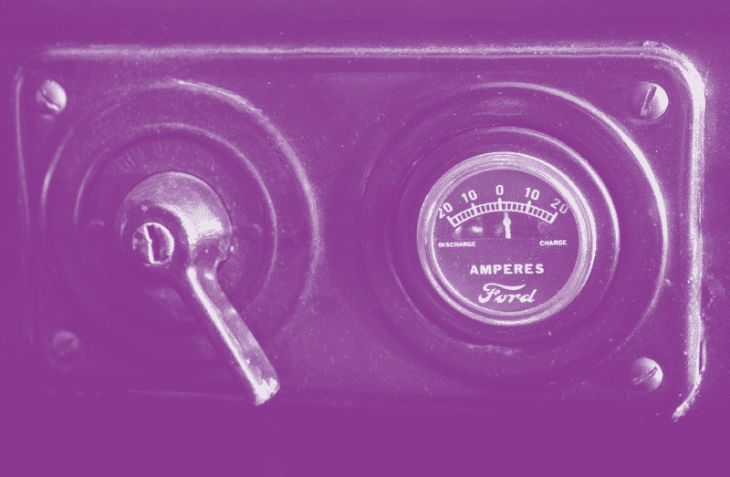

# 为什么汽车行业需要重新思考仪表板用户界面设计

> 原文：<https://web.archive.org/web/https://techcrunch.com/2015/10/08/why-the-car-industry-needs-to-rethink-the-dashboard-user-interface-design/>

科比·艾弗戴尔撰稿人

Cobie Everdell 是全球设计和战略公司的创意总监

[frog](https://web.archive.org/web/20230224202519/http://designmind.frogdesign.com/collections/the-ride-ahead/)

，专注于各行业的体验设计和产品策略。

去年在旧金山汽车展上，我想知道为什么汽车仪表板会错得这么离谱？每辆车——不管类别和价格如何——司机周围都有同样混乱的表盘、按钮、灯和屏幕。虽然有独特和引人注目的外观设计，仪表板都同样糟糕。

像大多数依赖当今数字设备的人一样，我期待日常生活中优雅而周到的用户界面(UI)设计。无论我是从 Lyft 订购汽车，还是在 Instagram 上发布照片，我都希望用户界面能够预测我的需求，让我的体验简单高效。然而，就用户界面而言，汽车仪表板似乎大大落后于时代；它们不直观，充斥着不必要的信息，最糟糕的是，让人分心。

事情并不总是这样。最初的福特 T 型车是 1908 年开始生产的汽车的转折点产品，仪表板上有一个操纵杆和一个仪表。这是一个简单而有目的的设计，不会分散司机安全驾驶汽车的注意力。当然，与今天的汽车相比，T 型车的引擎盖下的技术要少得多，但不知何故，在过去的 100 年里，我们已经接受了复杂的仪表盘——突出一辆车的所有功能和技术，单独控制——是必不可少的。

福特 T 型仪表板，经宝龙/Theo Civitello 许可使用— Theo Graphics。

事实上，作为司机和车主，我们生活在一个信息超载的世界里。我真的需要随时知道我的每分钟转数(RPMs)甚至速度吗？大概不会。我需要知道电池电量或发动机温度吗？不太可能。然而，所有这些信息都持续显示在我的仪表板上。在上下班途中，我更喜欢一个空白的仪表盘，它只在我需要的时候才会亮起来(例如，如果我的车过热了，或者如果我太快接近一个弯道，应该减速)。

所有这些复杂性是如何开始的？一个明显的影响是飞机在 20 世纪 30 年代进入主流。我们可以看到很多影响发挥在外部造型(尾翼，特别是)，但仪表板设计也受到影响。出于需要，飞机飞行员有复杂的驾驶舱仪表板，因为他们依靠多种仪表和控制来导航和安全。UI 模型是一种“直接控制”，其中飞行员有一个专用的仪表或按钮用于每个功能。

汽车设计师从这个主题中获得灵感，开始模仿直接控制的 UI 模式，在仪表盘上可见控件的数量与汽车的性能和豪华之间建立联系。你开始在 20 世纪 30 年代的汽车中看到这一点，这些汽车从单一规格发展到三、五和八规格。宾利鼓风机是一个很好的早期例子。

Bentley 鼓风机仪表板，经 Sergey Eremin 许可使用。

随着新技术被应用到汽车中，这种方法一直存在。20 世纪 40 年代出现了自动变速器和空调，20 世纪 50 年代出现了收音机。在每种情况下，更多的仪表板不动产用于控制和监控新技术，并且在大多数情况下，仪表板的复杂性是由风格而不是功能驱动的。复杂性等同于功能，功能就意味着奢华。这种趋势在很大程度上还在继续，在这一点上，我们大多数人都接受汽车仪表板的现状。

然而，如今汽车对技术的采用正遭遇拐点，我们已经习惯的 UI 模型无法应对。连接、智能手机集成、自动驾驶和增强现实显示——汽车技术的清单很长，而且还在不断增长。长时间的汽车设计周期跟不上数字技术的步伐，再加上传统的直接控制，导致了笨拙的仪表板设计。

> 作为司机和车主，我们生活在一个信息超载的世界。

违法行为就在我们身边:梅赛德斯-奔驰将平板设备固定在仪表板上，丰田的普锐斯在行驶过程中显示动画引擎操作图，福特的福克斯有一个中央按钮组，看起来像一个坏的电视遥控器。难道我们忘记了驾驶是一项危险的活动，不应该被分心所拖累吗？

我们似乎正处于变革的风口浪尖，尤其是苹果公司预计将进入汽车市场。直接控制和复杂的趋势不能继续下去；该行业需要一个新的仪表板愿景。制造商(和科技公司)肯定在考虑这个问题，但变化不会在一夜之间发生。消费者的期望也需要随着法规的变化而变化。

展望未来，该行业应该采用一种按需 UI 的模型，而不是直接控制。在这个模型中，信息和控制只在需要的时候提供。设计师可以考虑以下三个原则:

**隐藏:**隐藏仪表和控件，直到用户需要这些信息，而不是让它们持久存在。我的车的温度对我来说很重要，如果它朝着错误的方向发展的话。发生这种情况时提醒我；否则我不需要知道。

**预测:**地图应用已经擅长预测司机何时需要听到下一个方向。汽车的其他部分也应该以同样的方式运行。如果我快没油了，汽车会指引我去附近的加油站，而不是提醒我油快用完了。如果我正在进入一个限速区域，汽车应该突出显示我相对于限速的速度。

**个性化:**如今，仪表板用户界面在很大程度上是一种一刀切的模式。这有利于标准化，但不能反映驱动程序采用的不同模式。我的早晨通勤都是关于禅的，所以我的仪表板应该是空白的。周六的驾驶通常更多的是性能，所以我不介意看到我的速度和每分钟转数。我从来没有在我的通勤车上使用巡航控制功能，但控制总是在那里。我的汽车应该与我的地图应用程序相协调，并识别巡航控制可能适用的地方。

当今世界充满了设计良好的用户界面，它们非常善于简化我们的生活，预测我们的需求，让我们专注于重要的事情。汽车行业有望走上类似的道路，但它需要卸下多年的包袱。这种转变将类似于我们从带键盘的手机转向带触摸屏的手机时发生的事情:一个充满可能性的世界将会开启。

虽然未来肯定会包括自动驾驶汽车，但我们想要控制汽车的时刻应该更加丰富，并且希望更加安全和有趣。随需应变的用户界面将会给我们一种即时的体验。