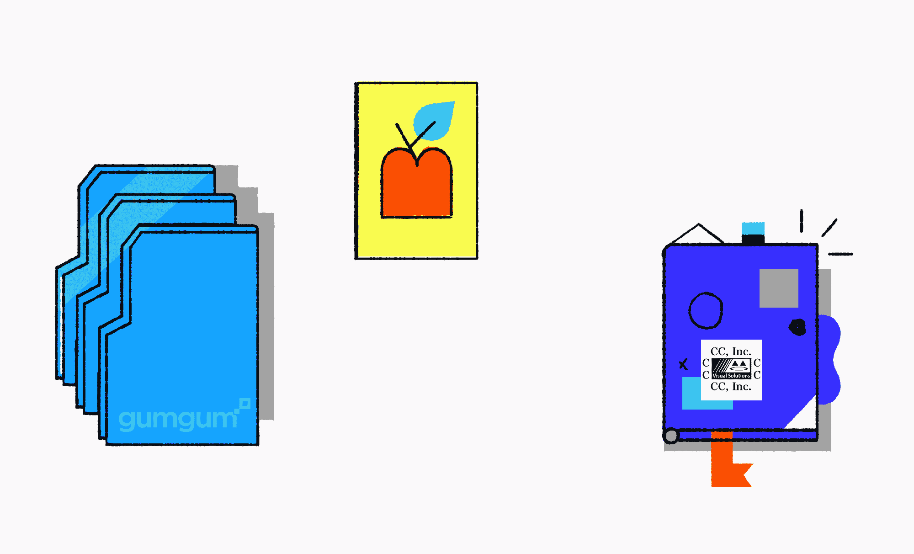
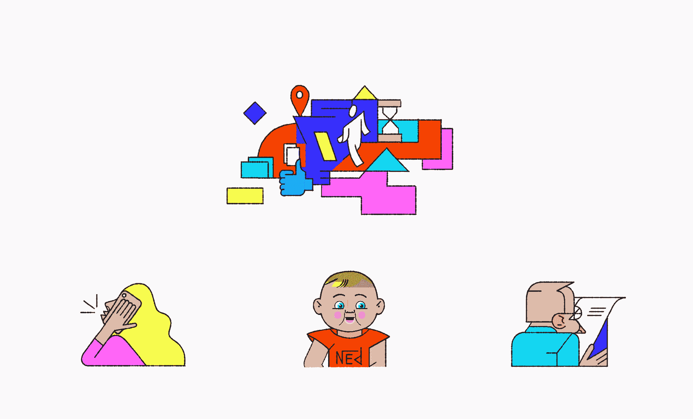

# 为什么深度学习的未来取决于找到好的数据 

> 原文：<https://web.archive.org/web/https://techcrunch.com/2017/07/21/why-the-future-of-deep-learning-depends-on-finding-good-data/>

[Ophir Tanz](https://web.archive.org/web/20230124042327/https://www.linkedin.com/in/ophirtanz/)

是的首席执行官

[GumGum](https://web.archive.org/web/20230124042327/http://gumgum.com/)

这是一家人工智能公司，在计算机视觉方面有着特殊的专长。GumGum 将其能力应用于各种行业，从广告到全球职业体育。Ophir 拥有卡内基梅隆大学的学士和硕士学位，目前居住在洛杉矶。

More posts by this contributor

坎布朗卡特撰稿人

[Cambron Carter](https://web.archive.org/web/20230124042327/https://www.linkedin.com/in/cambron-carter-5358a06a/)

领导图像技术团队

[GumGum](https://web.archive.org/web/20230124042327/http://www.gumgum.com/)

在那里，他为各种各样的应用设计计算机视觉和机器学习解决方案。Cambron 拥有路易斯维尔大学的物理和电气工程学士学位以及电气工程硕士学位。

More posts by this contributor

我们已经在之前的帖子中看了一下[神经网络和深度学习技术，所以现在是时候解决深度学习的另一个主要组成部分:数据——指的是用于训练神经网络的图像、视频、电子邮件、驾驶模式、短语、物体等等。](https://web.archive.org/web/20230124042327/https://techcrunch.com/2017/04/13/neural-networks-made-easy/)

令人惊讶的是，尽管我们的世界真的被数据淹没了——目前每天大约有 2.5 万亿字节，对于那些保持标签的人来说——但其中很大一部分没有标记或结构化，这意味着对于大多数当前形式的监督学习来说，它是不可用的。深度学习尤其依赖于好的、结构化的、有标签的东西的稳定供应。

在我们的“神经网络的无数学指南”的第二部分中，我们将看看为什么高质量的标记数据如此重要，它来自哪里，它是如何使用的，以及我们渴望学习的机器在不久的将来可以期待什么解决方案。

## 监督学习:我想握住你的手

在我们关于神经网络的帖子中，我们解释了数据是如何通过一个精心制作的香肠压榨机输入机器的，该压榨机可以即时解剖、分析甚至提炼自身。这个过程被认为是有监督的学习，因为输入到机器的大量数据已经被事先精心标记。例如，要训练一个神经网络来识别苹果或橙子的图片，需要给它输入标记为苹果或橙子的图片。这个想法是，通过找到所有分别标记为苹果或橙色的图片的共同点，机器可以被训练成理解数据，因此它们最终可以使用这些识别的模式来更准确地预测它们在新图像中看到的内容。他们看到的标签图片越多，数据集就越大(也越多样化)，他们就能更好地提高预测的准确性；熟能生巧。

这种方法在教授机器视觉数据，以及如何识别从照片和视频到图形和笔迹的任何东西方面非常有用。显而易见的好处是，在许多应用程序中，机器在图像识别方面与人类不相上下甚至比人类更好已经是相当平常的事情。例如，脸书的深度学习软件能够以与人类  相同的准确度匹配一个陌生人的两幅图像(准确率高于 97%)，谷歌在今年早些时候推出了一个[神经网络，它可以比病理学家](https://web.archive.org/web/20230124042327/https://research.googleblog.com/2017/03/assisting-pathologists-in-detecting.html)更准确地发现医学图像中的癌性肿瘤。

## 无监督学习:去西部吧，年轻人

正如你可能猜到的，监督学习的同伴被称为无监督学习。这个想法是，你放松对你的机器的束缚，让它自己潜入数据中去发现和体验，寻找模式和联系，并得出结论，而不需要监护人的指导。

这项技术长期以来一直受到某些人工智能科学家的反对，但在 2012 年，谷歌展示了一个深度学习网络，能够从一大堆未标记的图像中破译猫、脸和其他物体。这项技术令人印象深刻，并产生了一些非常有趣和有用的结果，但是，到目前为止，在许多目的上，无监督学习的准确性和有效性都不如有监督训练——稍后会详细介绍。

## 数据，数据，无处不在

正是在这两种技术之间的鸿沟中，我们遇到了被证明是令人困惑的更大的问题。把这些机器比作人类婴儿是有用的。我们知道，简单地让我们的宝宝自由，没有指导，它会学习，但不一定是我们想要它学习的，也不是以任何可预测的方式。但是既然我们也通过指导来教育我们的宝宝，那么我们就需要让他接触大量的物体和概念，这些物体和概念的主题基本上是无限的。

我们需要教我们的宝宝关于方向，动物和植物，重力和其他物理属性，阅读和语言，食物类型和元素，你知道——存在的非常重要的东西。随着时间的推移，所有这些或多或少都可以通过展示和讲述以及回答任何好奇的年轻人提出的无尽问题来解释。

这是一项艰巨的任务，但大多数父母以及普通孩子周围的其他人每天都在忙着完成这项任务。神经网络也有同样的需求，但它的关注点通常更窄，我们并不真正与它社交，所以标签需要更加精确。

目前，人工智能研究人员和科学家可以通过多种方式获取数据来训练他们的机器。第一种方法是走出去，自己积累大量带标签的数据。谷歌、亚马逊、百度、苹果、微软和脸书等公司恰好就是这种情况，所有这些公司的业务都产生了惊人数量的数据——其中许多是客户免费精心策划的。

试图在这里列出它们是愚蠢的，但想想上传到所有这些公司数据库的云存储中的数十亿张带标签和标记的图像。然后想想所有的文档、搜索查询——通过语音、文本、照片和光学字符识别——位置数据和地图、评级、喜欢和分享、购买、送货地址、电话号码、联系信息、通讯录和社交关系。

传统公司——以及任何规模巨大的公司——往往在机器学习方面具有独特的优势，因为他们拥有大量特定类型的数据(这些数据最终可能有价值，也可能没有价值，但往往是有价值的)。

## 艰难地收集数据

如果你没有碰巧拥有一家财富 100 强公司，拥有数万亿数据点的集合，那么你最好善于分享(或者财大气粗)。访问大量极其多样的数据是人工智能研究的关键部分。幸运的是，已经有大量免费和公开共享的标签数据集，涵盖了令人难以置信的一系列类别([这个维基百科页面上有许多](https://web.archive.org/web/20230124042327/https://en.wikipedia.org/wiki/List_of_datasets_for_machine_learning_research#Handwriting_and_character_recognition)的链接)。

根据你的喜好，有数据集显示从人类面部表情和手语到公众人物的脸和皮肤色素沉着的一切。你可以找到数百万张人群、森林和宠物的图片——各种各样的宠物——或者筛选大量的用户和顾客评论。还有由垃圾邮件、多语言推文、博客文章和法律案例报告组成的数据集。

新类型的数据正从世界上无数越来越普遍的传感器中涌现出来，例如医疗传感器、运动传感器、智能设备陀螺仪、热传感器等等。此外，还有人们拍摄的食物、葡萄酒标签和讽刺性标牌的照片。换句话说，最纯粹的数据是不存在的。

## 那么问题出在哪里？！？

尽管这些数据看起来很丰富，但实际上，事实证明这些数据并没有广泛的用途。要么是它们的收藏太少，要么是标签不好或部分标签，要么就是不符合你的需求。例如，如果你希望教会一台机器识别图像中的星巴克标志，你可能只能找到一个带有不同标签的图像训练数据库，这些标签包括“饮料”、“饮品”、“咖啡”、“容器”或“乔”。没有正确的标签，它们就没有用。一般的律师事务所或已成立的公司的数据库中可能有数百万份合同或其他文书，但这些数据是不可用的，因为它们可能是简单的无标签 PDF 格式。

在最佳数据方面的另一个挑战是确保所使用的训练集既大又多样。为什么？让我们通过一个简单的思维实验来探讨训练数据的想法。想象一下，我们给一个小孩，我们叫他奈德，任务是识别抽认卡上的西班牙语单词。当出示抽认卡时，奈德只需说“是的，这是西班牙语”或“不，这不是西班牙语。”

Having never seen nor spoken Spanish before, this kid Ned is given 10 random flashcards in order to learn what Spanish words do and do not look like. Five of the cards have the Spanish words: niño, rojo, comer, uno and enfermos, and the other five cards have words from other languages: cat, 猫, céu, yötaivas and नभ. Ned is told he can have a huge bowl of ice cream if he can pick out each of the Spanish words from a new set of flashcards. After an hour of studying, it’s time to test.

在第一次测试中，奈德看到一个西班牙单词:azul。因为字符“a”只出现在非西班牙语堆中，所以就 Ned 而言，azul 不是西班牙语单词。第二张卡片上有代表母亲的葡萄牙语单词:Ned 立刻喊道:“西班牙语！”同样，回答错误，但他的训练卡只包括一张有颚化符的卡，而且恰好在西班牙语那一堆。第三张卡上有火山。男孩注意到这个单词以“o”结尾，想起他的训练卡，他自信地说，“西班牙语。”第四张显示“منزل”的卡片看起来不像任何一张，我们可以看到当这个男孩看着他的冰淇淋融化时，眼泪越来越多。这是他的推理能力有问题还是他的训练数据有问题？

一个问题是:数据集大小。这个男孩花了所有的精力只记住了 10 张卡片。在训练复杂模型(如深度神经网络)时，使用小数据集可能会导致所谓的过拟合，这是机器学习中的一个常见陷阱。

从本质上来说，过度拟合是拥有大量与训练样本相关的可学习参数的结果——这些参数是我们在之前的文章中通过反向传播彻底调整的“神经元”。结果可以是模型已经记住了该训练数据，而不是从数据中学习一般概念。

想想我们的苹果-桔子网络。利用少量的苹果图像作为我们的训练数据和一个大型神经网络，我们有可能导致网络专注于特定的细节——红色、棕色和圆形——需要准确区分训练数据。这些细粒度的细节可以很好地描述特定的训练苹果图片，但当试图在测试时识别新的、未见过的苹果时，这些细节被证明是无关紧要的，甚至是不正确的。

另一个问题，也是一个重要的原则，是数据多样性。如果内德看到一个以“o”结尾的非西班牙语单词或更广泛的西班牙语重音符号，他会好得多。从统计学的角度来说，你积累的独特数据越多，这些数据跨越更多不同特征的可能性就越大。在苹果-橙子网络的情况下，我们希望它足够一般化，以便它能够识别苹果和橙子的所有图像，不管它们是否出现在训练集中。毕竟，不是所有的苹果都是红的，如果我们只根据红苹果的图像训练我们的网络(即使我们有很多红苹果)，我们就冒着网络在测试时不能识别绿苹果的风险。因此，如果训练中使用的数据类型有偏差，不能代表我们在测试时预期的数据，那就麻烦了。

偏见的问题开始在许多人工智能中出现。神经网络和用于训练它们的数据集反映了将它们放在一起的人或人群的任何偏见。再一次，通过仅用红苹果的图像训练我们的苹果-橙网络，我们冒着网络学习苹果只能是红的偏见的风险。青苹果、黄苹果、糖苹果呢？如果你推广到其他应用，如面部识别，数据偏差的[影响会变得非常明显](https://web.archive.org/web/20230124042327/https://theoutline.com/post/1439/machine-learning-is-racist-because-the-internet-is-racist)。俗话说:垃圾进来，垃圾出去。

## 建造一个能独立思考的捕鼠器

除了雇人给数据贴标签——顺便说一句，这是一件很贵的事情——或者世界上所有的公司突然同意开放他们所有的专有数据，并高兴地将其分发给全球的科学家(我们建议不要屏住呼吸)，那么解决好的训练数据短缺的答案就是根本不必依赖它。没错，深度学习的未来可能是朝着无监督学习技术的方向努力，而不是朝着尽可能多的训练数据的目标努力。如果我们考虑教婴儿和幼儿认识世界，这是有意义的；毕竟，虽然我们确实教了我们的孩子很多东西，但我们作为人类所做的许多最重要的学习都是经验性的、临时的——无人监督的。

