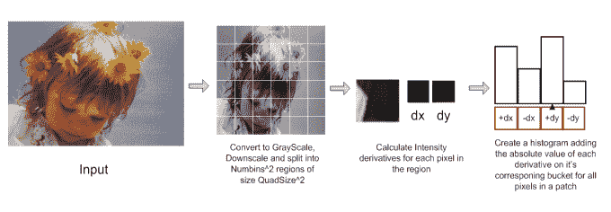
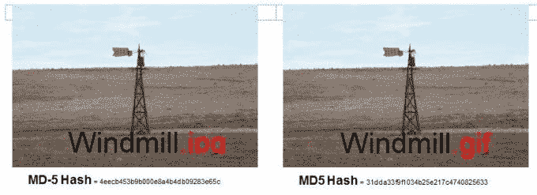

# 为什么导致一名男子因儿童色情被捕的 Gmail 扫描不是侵犯隐私 

> 原文：<https://web.archive.org/web/https://techcrunch.com/2014/08/06/why-the-gmail-scan-that-led-to-a-mans-arrest-for-child-porn-was-not-a-privacy-violation/>

> 没有人会反对一个案件的结果，在谷歌向当局报告在休斯顿嫌疑人的 Gmail 账户中发现非法图像后，一名男子因儿童色情指控被捕。但是这一发现的本质导致了一些关于幕后使用的方法论的问题。谷歌是否在积极扫描 Gmail 的非法活动？谷歌向当局泄露用户 Gmail 账户中的数据，是否超越了其作为服务提供商的角色？事件发生后不久，[问安全公司 Sophos](https://web.archive.org/web/20230123111958/http://nakedsecurity.sophos.com/2014/07/31/google-tips-off-cops-after-spotting-child-abuse-images-in-email) 。

然而，这些问题似乎误解了谷歌用来帮助逮捕的技术。

今天， [Gmail](https://web.archive.org/web/20230123111958/http://www.crunchbase.com/product/gmail) 的用户普遍知道谷歌使用一种自动技术来扫描你的电子邮件中的关键词和短语，以便显示相关的广告来支持这项免费服务，而且没有人会主动阅读你的个人电子邮件。

同样，谷歌的工程师也没有仔细阅读这个人的电子邮件账户，以便发现非法分享的图片。谷歌也不会主动或被动地(通过自动化手段)扫描用户的电子邮件账户，寻找其他类型的犯罪活动，比如策划抢劫。

这个案件，以及允许逮捕的技术，仅仅集中在儿童色情制品的识别上。

儿童色情是包括微软和谷歌在内的主要互联网公司多年来一直在解决的问题。事实上，用于识别和帮助杜绝这些非法图片在线共享的技术之一最初是由微软开发的。

## PhotoDNA 自动化儿童虐待图像检测

它是这样工作的:

微软的“PhotoDNA”技术就是要让这些特定类型的非法图像能够被计算机程序自动识别，而不是被人识别。(毕竟，这是一份糟糕的、令人心力交瘁的工作。)

PhotoDNA 将图像转换成常见的黑白格式，并将图像调整到统一的大小，微软去年解释道，同时[宣布](https://web.archive.org/web/20230123111958/http://www.microsoft.com/en-gb/news/Press/2013/Nov13/MicrosoftandGooglest.aspx)将加大与谷歌的合作力度，打击网上虐童行为。

然后，该技术将图像分成正方形，并分配一个数值，代表每个正方形内的独特阴影。结合起来，这些数值代表了图像文件的“光 DNA 签名”。这个独特的签名可以用来与网上的其他图像进行比较。

微软今天在必应、Outlook.com 及其云存储服务上使用该技术来识别虐待儿童的图像，并阻止它们在网上重新传播。

这项技术本身源于微软、国家失踪和被剥削儿童中心(NCMEC)和达特茅斯学院之间的合作。2009 年，微软还向 NCMEC 捐赠了 PhotoDNA，以帮助打击剥削儿童的行为。

当微软发现图像签名匹配时，它会报告给美国的 NCMEC，或者在英国的[这些报告会送到 CEOP](https://web.archive.org/web/20230123111958/http://www.microsoft.com/en-gb/news/Press/2013/Nov13/MicrosoftandGooglest.aspx) (儿童剥削和在线保护中心)。2012 年，微软还开始与包括执法机构在内的其他机构合作，将 PhotoDNA 整合到儿童虐待调查中使用的工具中，如瑞典执法机构经常使用的软件 [Netclean Analyze](https://web.archive.org/web/20230123111958/http://www.netclean.com/en/analyze/for-law-enforcement/overview/) 。

此外，国际失踪和被剥削儿童中心也与各执法机构开展了一个名为“Vic 项目”的项目，该项目使用 PhotoDNA 帮助执法机构自动筛选儿童性剥削调查中的大量图像，以识别新的罪犯。

## 微软、谷歌和其他公司联手

此外，微软、谷歌、[、IWF](https://web.archive.org/web/20230123111958/http://en.wikipedia.org/wiki/Internet_Watch_Foundation) (互联网观察基金会)和 CEOP 去年宣布了一项联合计划，删除滥用图片，包括微软必应搜索引擎屏蔽种子文件，否则这些文件将指向非法内容。

但是，虽然微软可能已经对 PhotoDNA 技术的使用进行了更多的公开宣传，但其他技术公司，包括谷歌、 [Twitter](https://web.archive.org/web/20230123111958/http://www.theguardian.com/technology/2013/jul/22/twitter-photodna-child-abuse) 和[脸书](https://web.archive.org/web/20230123111958/https://www.facebook.com/notes/facebook-safety/meet-the-safety-team/248332788520844)也在使用这一系统。例如，脸书在 2011 年[表示，在某些情况下，PhotoDNA 甚至可以阻止非法图片上传到其网站，并称该程序惊人地准确。](https://web.archive.org/web/20230123111958/https://www.facebook.com/notes/facebook-safety/meet-the-safety-team/248332788520844)

与此同时，谷歌自己开发了一种类似 PhotoDNA 的技术，采用类似的哈希技术，可以识别并帮助删除虐待儿童的照片和视频。

谷歌拒绝就休斯顿被捕事件的细节发表评论，但指出了谷歌首席法律官大卫·德拉蒙德去年夏天对其在这个问题上的立场的解释。在帖子中，Drummond 说谷歌共同资助 IWF 近十年，并与国际刑警组织和美国 NCMEC 合作打击儿童色情。

他说，虽然他的帖子没有点出微软的名字，但确实提到了谷歌对“哈希”技术的使用，谷歌随后开始将该技术纳入跨行业数据库。也就是说，谷歌将与业内其他公司合作，比如微软，正如微软在当年晚些时候的[公告](https://web.archive.org/web/20230123111958/http://www.microsoft.com/en-gb/news/Press/2013/Nov13/MicrosoftandGooglest.aspx)中更清楚地陈述的那样，解释了视频技术和 PhotoDNA 将如何一起使用。

## 谷歌自己的图像哈希技术

然而，在休斯顿逮捕的这个特殊案例中，PhotoDNA 并没有参与，尽管从我们所听到的来看，类似的事情是有的。

谷歌有自己的哈希技术，从 2008 年开始使用，用于检测在线性虐待图像。谷歌、微软和其他技术公司分享这样的技术来打击这种非法活动。虽然 PhotoDNA 可能不是指向这种特定逮捕的人，但它的开发和其他哈希技术旨在使滥用图像检测成为一种更加自动化的活动。

## 谷歌“主动删除”非法图像

微软此前详细介绍了哪些内容被屏蔽，在哪里被屏蔽，在某种程度上，谷歌现在也向我们提供了同样的信息，告诉我们谷歌“主动从我们的服务中删除非法图像——包括搜索和 Gmail——并立即向 NCMEC 报告滥用情况。”

该公司指出，这些证据通常会被用来给罪犯定罪。

有趣的是，也可能是这一轮引起科技媒体关注的是，人们并不太了解谷歌在 Gmail 中引入了这项技术。

事实证明，这可能是最近才加入的。非官方的谷歌博客[谷歌操作系统，](https://web.archive.org/web/20230123111958/http://googlesystem.blogspot.com/2014/08/gmail-policy-changes.html)谷歌几个月前才把它的使用条款从[这个](https://web.archive.org/web/20230123111958/http://web.archive.org/web/20140308043043/https://mail.google.com/mail/help/intl/en/program_policies.html)改成了[目前可用的版本](https://web.archive.org/web/20230123111958/https://www.gmail.com/intl/en/mail/help/program_policies.html)。这些变化包括添加了关于 Gmail 对虐待儿童图片的立场的文字，称其为“零容忍”并警告纪律处分:

> 谷歌对儿童性虐待图像采取零容忍政策。如果我们发现此类内容，我们将向相关部门报告，并可能对相关人员的 Google 账户采取纪律处分，包括终止使用。

这已经不是谷歌第一次因为帮助执法部门抓住那些参与儿童色情活动的人而受到媒体的关注，似乎每一次都有关于隐私的问题被提出来。

但这些问题似乎没有理解谷歌并没有在用户的 Gmail 收件箱中玩警察游戏，而是使用一种专门寻找儿童色情的自动检测系统，并且是从网络上删除这些图像的更大国际努力的一部分。

坦率地说，这是任何正常人都不应该反对的。如果你不介意谷歌自动扫描你的 Gmail 来帮助显示更好的广告，这样你就可以免费使用这项服务，那么允许它自动扫描你的 Gmail 来识别虐待儿童的图像并不是一个很大的信仰飞跃。