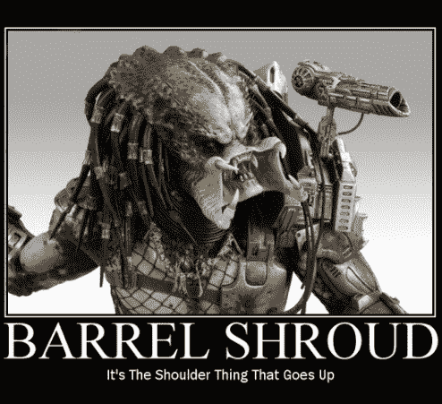

# 为什么全国步枪协会讨厌智能枪 

> 原文：<https://web.archive.org/web/https://techcrunch.com/2016/04/30/why-the-nra-hates-smart-guns/>

More posts by this contributor

随着[奥巴马总统又一次](https://web.archive.org/web/20221207044216/http://www.nytimes.com/2016/04/30/us/politics/obama-puts-his-weight-behind-smart-gun-technology.html?_r=0) 推动恢复开发“智能枪”技术的倡议，看起来是时候再次讨论这个问题了。

在回答我的[上一篇关于智能枪的许多问题的文章](https://web.archive.org/web/20221207044216/https://beta.techcrunch.com/2016/01/05/why-obamas-smart-gun-push-will-misfire/)时，我得到的最常见的问题是，“即使你正确地认为智能枪是一个坏主意，为什么全国步枪协会如此反对让市场去尝试让它变得正确？”

全国步枪协会的官方立场是，他们不关心智能枪技术的这种或那种方式，市场应该决定，但我们都知道这是胡扯。全国步枪协会根本不希望智能枪进入市场。

所以问题是，为什么？如果智能枪注定要失败，正如我之前所说的那样，为什么不让它们在市场上失败呢？为什么要阻止这项技术有机会呢？

这个问题的简单答案广为人知，但也广为误解。

大多数关注这个问题的人都知道，全国步枪协会讨厌智能枪，因为他们担心，一旦一种看似可行的智能枪技术存在，州和联邦级别的反枪立法者将试图通过将其与安全带、气囊和其他产品安全功能进行比较，在未来的所有枪支中强制使用智能枪。

如果你读过我之前关于智能枪支问题的文章，那么你就有希望理解安全带和智能枪支技术之间的区别，以及为什么智能技术被强制纳入所有新枪支的前景会让枪支爱好者中风。

但也许你在想，“那好吧。我们只是不会强制它。不会有任何命令。好了，你现在高兴了吧？我们能不能继续智能枪的创新，让它在市场上发挥作用？”

然而，事情是这样的:在这种情况下，全国步枪协会实际上是正确的。如果智能枪得到任何牵引，那么非智能枪将受到立法攻击。

我知道你们中的一些人在看到 TechCrunch 上出现的短语“NRA 实际上是对的”后感到震惊并停止了阅读，但如果你还在，那么请给我一点时间解释。

## 这一系列管子

枪支是一种技术，像大多数普通公众一样，枪支控制倡导者对好莱坞以外的枪支运作方式感到非常困惑，就像“[互联网是一系列管子](https://web.archive.org/web/20221207044216/https://en.wikipedia.org/wiki/Series_of_tubes)”一样困惑。我很难夸大那里的情况有多糟糕，即使是在许多拥有枪支的公众当中。

但也许你在农场长大，你有一把小猎枪，你去过几次靶场，开过手枪，等等。你看过很多很多有枪的电影。即便如此，除非你有军事、执法或行政保护方面的背景，或者在现实世界中接受过相当数量的自卫使用枪支的民事培训，否则你对枪支的了解就像一个拥有全新学习许可证的青少年在交通高峰时期驾驶 18 轮大卡车穿过芝加哥市中心一样多。

很糟糕的是，普通大众——包括大多数临时持枪者——对枪支如此困惑，以至于他们不知道自己不知道多少。但更糟糕的是，至少如果你是一个持枪者，那些对枪支一无所知的立法者和活动家经常会发现他们可以自信地将他们对技术的无知写入法律。

那么，这就是全国步枪协会害怕的:那些甚至不知道如何开始评估给定枪支的最小、最随机的特征对该枪支的有效性和功能性的影响的立法者，将会进入枪支设计的行业，这些用户在不同的环境下具有不同的训练背景。

他们害怕是有道理的，因为这种事以前也发生过。

## 垂直的前握:善意的精神错乱的案例研究

为了理解枪支控制倡导者对基本枪支知识的高压漠视如何导致支持枪支的人对智能枪支技术的本能反应，你必须回到最初的克林顿时代的攻击性武器禁令。无论你对 AWB 的优点有什么看法，你都必须承认这项禁令将立法者置于枪支设计的事务中。我不是在打比方——立法者正在进行枪支设计。

在禁止“攻击性武器”成为一个类别之前，立法者(或者更有可能是游说者和实习生)必须编制一份装饰性、人体工程学和功能性特征的清单，当它们单独或以特定组合出现在枪支上时，可以将普通步枪变成致命的攻击性武器。

如果你在雷明顿或史密斯威森公司从事产品设计工作，你会看到这些功能和功能的组合，并决定什么留下什么离开。但是将 AWB 的功能列表放在一起的人不仅不是专业的枪支设计师，而且他们甚至似乎对他们为公众使用而设计的枪支一无所知。

这篇文章不是要列举克林顿时代的 AWB 的疯狂之处，或者最近提出的试图取代它的 AWB，但是我想给外行人提供一个我正在谈论的具体例子，这样你就可以感受到这种由律师设计的过程的结果有多疯狂。

考虑低垂直前握(VFG)，一个简单的手柄，从步枪前面垂下，给武器的操作者一个地方放下他们的手。

一些射击运动员喜欢 VFG 的原因与 AWB 的作者可能讨厌它的原因一样——因为它在电影和暴力视频游戏中的军用枪上很常见。

另一方面，大多数竞技射击运动员 不喜欢垂直握枪，他们更喜欢将整只手握在枪前。(我的朋友汤姆最近因为在一次射击比赛中出现了一个 VFG 而被取笑。)

其他射手更喜欢一种称为“成角度的前握”的中途选择，这是一种放置在枪前部下方的小斜坡，可以固定手。

还有一些射手把枪放在垂直的前把手上，但实际上在射击时*并不握住它——相反，VFG 给这样的射手一个触觉标记，让他们每次不用看就能快速轻松地把他们的左手放在同一个地方。*

最后，有些人将 VFG 仅用作电池或清洁用品的小储物格。

像所有人体工程学的事情一样，决定去 VFG 还是不去 VFG 最终是一个射手偏好的问题…也就是说，除非你在最初的 1994 年 AWB 期间是一个射手，在这种情况下，你的偏好无关紧要，因为 vfg 是完全非法的。

是的，没错——有些人喜欢把一个*小塑料手柄*挂在枪的前面，因为他们觉得这样可以让他们更舒适地握住武器，这被认为是一个致命的特征，必须被取缔。将 VFG 添加到禁止功能列表中的立法者不仅拒绝为 VFG 如何使枪支更致命或更不安全提供任何理由，而且很可能他们甚至不知道它是什么，也不知道它是如何使用的。

这种对枪支相关事物的无知在下面的视频中得到了痛苦的展示，在视频中，年轻的塔克·卡尔森与前国会议员卡罗琳·麦卡锡(Carolyn McCarthy)一起列出了被禁的“攻击性武器”功能，前 AWB 的主要支持者，问她某些功能是什么，为什么必须被禁。

[https://web.archive.org/web/20221207044216if_/https://www.youtube.com/embed/ospNRk2uM3U?feature=oembed](https://web.archive.org/web/20221207044216if_/https://www.youtube.com/embed/ospNRk2uM3U?feature=oembed)

视频

这位参议员显然不知道任何被禁止的功能实际上是什么，当被问到一个特别的功能时——“桶形裹尸布”——她大胆猜测，结果大错特错，引发了一个互联网迷因:“肩膀向上的东西”。

举一个最近的例子，纽约人反对枪支暴力组织的执行董事 Leah Gunn Barrett 为纽约安全法案目前在 VFG 的禁令辩护:

> 例如，Gunn Barrett 说前倾的手枪握杆可以让一个大型射手更好地控制他的步枪。
> 
> “这把枪仍然是致命的，”甘恩·巴雷特说。“是的，它仍然可以杀人。但是，如果你有一个前倾的手枪式握把，就不那么容易操纵和准确射击了。”

上面引用的“前倾的手枪握法”是 Gun Barrett 谈论上述前握法时非常混乱的方式。

再说一次，她根本不知道自己在说什么。没有。然而，我们再次看到立法者和活动家从事枪支设计的景象，他们甚至对现实世界中的枪支在非好莱坞和非视频游戏环境中的实际操作一无所知。

自 2004 年 AWB 到期以来，即使是狂热的反枪人士，如加州大学洛杉矶分校的亚当·温克勒(Adam Winkler)和 NYT T2 大学的尼克·克里斯托夫(Nick Kristof)以及 T4 公共党的 T5，也认识到这是一个被误导的无用之举，不仅没有拯救生命，反而为全国步枪协会和共和党提供了强大的筹款援助。对于枪支控制运动来说，这是一个完全不合理的“乌龙球”，在圣贝纳迪诺枪击案发生后，这种情况在州和联邦层面再次发生。

关于 AWB 的疯狂已经说得够多了，它让我想起了太多关于“网络中立”的辩论，以至于我可以写一本书来讨论这个话题。我想你可以看到我在智能枪方面的进展。

## 不可避免的智能枪指令

鉴于枪支控制倡导者一再证明无意中滑稽的枪支无知和立法法令对枪支设计的高压热情的结合，枪支所有者完全有理由预期任何看似可行的智能枪支技术最终将被州和联邦级别的反枪支立法者作为必需的“安全功能”来推动。

我甚至不指望某个特定的智能枪支技术必须特别可靠，甚至完全成熟，才能吸引一位热心的加州国会议员的目光，他不会等到市场理清该技术的可行性，然后才坚持将它包括在该州未来出售的所有枪支中。(看看 CA 用他们的[微冲压法](//web.archive.org/web/20221207044216/https://www.sfgate.com/news/article/Gun-industry-balks-at-California-s-new-5177440.php%E2%80%9D)做了什么，授权一项在生产枪支中实际上不可用的技术。)在联邦层面上，可以肯定的是，那些在 1994 年禁止垂直前握的联邦立法者，目前正在试图再次禁止它，一旦他们有机会，就会试图通过一项同样毫无头绪的智能枪支授权。

那些珍视走进枪支商店并带着一把全新的非智能枪离开的自由的枪支购买者因此正确地得出结论，维护这种自由的最佳方式是在智能枪技术问世之前摧毁它。至于枪支制造商，即使他们想引入智能枪支技术(他们没有)，他们也不会碰它，因为害怕枪支社区看到墙上的立法文字后的反弹。

## 看不到尽头

只要我们生活在这样一个世界，一毫米的枪管长度将高度受限的“短管步枪”与普通步枪分开，一个塑料枪柄被故意错误地认为是大规模杀手的危险辅助工具——换句话说，对枪支一无所知的人仍然继续通过立法来设计它们——智能枪支技术将是对非智能枪支的真正威胁，不想购买智能枪支的人将尽一切努力将这种技术扼杀在摇篮中。

如果枪支控制的倡导者发誓在一代人的时间里不再设计枪支，而是专注于“谁”而不是“什么”，或许还有希望。不过，我没有屏住呼吸。对于一个对枪支知之甚少的人来说，他们不认为他们还有什么需要学习的，所以“什么”可能看起来是最容易立法的事情。但是，你对这个问题挖掘得越深，你就越会意识到，就像任何不断发展的技术一样，“是什么”是一个移动的目标，“是谁”开始看起来像是更可行的途径。

我的猜测是，在“谁”这个问题的各个方面，许多枪支拥有者会比你想象的更愿意妥协，以换取将大多数“什么”的限制扔出窗外。但是我们双方都离那还有很长的路要走。与此同时，我们将转动我们的集体车轮，因为一个阵营不断试图“修补”他们根本不了解的技术，而另一方试图阻止潜在的威胁创新。