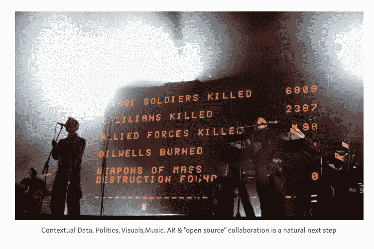

# 为什么 AR 的 YouTube 不会是 YouTube 

> 原文：<https://web.archive.org/web/https://techcrunch.com/2017/11/29/why-the-youtube-of-ar-wont-be-youtube/>

马特·米斯涅克斯撰稿人

马特·米斯尼克是首席执行官和联合创始人

[6D.ai](https://web.archive.org/web/20230122153312/https://www.6d.ai/)

.

More posts by this contributor

几年前，当我在三星工作时，大约在 GearVR 推出的时候，有很多关于该设备提供的服务的想法。

这些想法中的许多(大部分)都与托管 360 视频内容有关，我们的老板大卫·恩(前 YouTube)经常提醒大家， YouTube 将成为 VR 的 YouTube。他的意思是，这个新的虚拟现实平台上的内容提供了与现有视频内容足够相似的体验，新服务无法与现有服务竞争。事实证明他几乎是对的。

我不认为 AR 会出现这种情况。我认为真正的区别在于, AR 代表了一种新的大众媒体，而不是当前媒体的一种新形式。

这意味着 AR 的 iTunes，很有可能不会是 iTunes。这将是一个改变我们体验艺术娱乐方式的原生应用。iTunes 可能会适应，但这一点也不能保证…

#### 那么 AR 为什么和 VR 视频不一样呢？

不同的是，虚拟现实视频本质上是我们所知道的老 2D 视频&爱，但超宽的屏幕(宽到我们必须侧着看才能看到全部)。这不是什么新鲜事。AR 是一个新生事物。第一次，媒体作为真实世界的一部分被体验。上下文是新的属性。

它是多感官的、动态的、互动的**和**现在可以在我的客厅或街道上，环境的变化完全改变了体验。为了说明区别，如果你在电影院甚至 VR 中体验星球大战，你是在“逃离”到另一个星系，在那里你沉浸在那个宇宙中。但是，以一种并不新奇的方式将《星球大战》带入现实生活是一个真正的挑战，因为你需要以某种方式处理“为什么 R2D2 在我的厨房里”这种认知失调？

环境会改变体验。

# 

如果我们看看音乐，我们体验音乐的方式可能会因 AR 而改变，就像录音或随身听发明时音乐的改变一样。我们体验音乐的环境一下子就完全改变了。iPod、收音机或流媒体等发明除了增加数量之外，并没有真正改变媒体，但从现场到带回家(gramaphone)，或从在家到外出(walkman)完全改变了体验，因为我们体验音乐的环境发生了变化。

通过 AR，我们将在我们的生活环境中体验音乐和艺术(静态或互动)。AR 可以调整“现实世界”，让我们在听到最喜欢的歌曲时，沉浸在我们想象的情感景观中。凯蒂·佩里的粉丝可能会发现，当她的音乐响起时，他们的世界变得更加霓虹闪烁。当我们在那个地方附近时，或者如果类似的背景条件被触发(日期/时间，或者附近的人)，发生在我们生命中重要时刻的歌曲的低音线可能会微妙地在背景中播放？).

在之前的一篇帖子中，我谈到了 AR +区块链如何有潜力在数字世界中重新实现稀缺。这是 AR 将实现的最强大的经济颠覆者之一，仍然很少有人深入思考这个问题。这可以通过某些类型的数字街头艺术来实现，开始是像素化的，只有在一定数量的人看到它后才成为“高分辨率”(或者相反，随着更多人看到它，它会随着时间的推移而衰减，只有前 50 人才能获得完整的体验……)。数字绘画(或雕塑)可以被密码认证为限量版“原作”，所有复制品都略有退化。

这将彻底改变我们体验(和创造)艺术的方式。

## 将我们的音乐和视觉融入语境意味着什么？

当我们想到音乐或艺术和背景时，有一个我们都经历过的例子。比较一下在家听音乐和坐在沙滩上俯瞰日落之间的区别，然后选择一首最适合那个时刻的歌曲。这就是环境成为体验的一部分，并在情感上改善它的方式，在某种程度上，由此产生的体验是你和艺术家之间的合作。

AR 将这一点提升到了一个全新的水平。AR 设备将比任何智能手机都更了解现实世界。这意味着匹配(自动或手动)歌曲或图像(或视觉效果)的能力远远大于从播放列表中选择一首曲目。

艺术家现在能够给观众更多的控制权，因此体验可以更加个性化。这可能涉及词干，将专辑中的声音或视觉连接到单个对象，或者微妙地改变整个房间的氛围(想象一个 iPhoneX 风格的面罩，但应用于您的墙壁和天花板)。我们过去通过制作混合磁带(异步创建)或 Spotify 播放列表/提要(近实时)添加了上下文，但当上下文变得实时应用并被共享时，这是 ar 的固有功能，于是新形式的协作表达出现了。

我相信这为一种新型的开源运动的出现打开了大门。多年来，一个程序员(或公司)会写代码，并以他们的名义发布。你可以购买并使用它，但仅此而已。开源意味着创作者可以发布整个产品以及组成这些产品的组件。GPL 许可证意味着信用得到认可(尽管在比特币出现之前支付是个问题)。此外，当伟大的创造者(都是著名的匿名程序员)能够在彼此工作的基础上共同创造时，就会发明出好得多的产品。今天，开源软件几乎支撑了整个互联网。

今天，艺术和内容的创作方式与封闭源代码模式非常相似。艺术家或标签/工作室生产产品&我们按照被告知的方式消费它。观众很少有机会应用他们自己的上下文，或者在重新想象的表达中重用组件(抽样是一个例外，至少可以说信贷和支付也是一个挑战)。用户生成内容的网络平台在一定程度上使创作成为双向协作，而 AR 可以完成这一旅程。

艺术从一个只涉及艺术家的静态的“创作&完成”过程，变成了一个涉及艺术家*和观众*的活的过程。过程本身，系统或代码*和*资产，变成了艺术

今天，艺术家和观众几乎共同创造的一个领域是现场音乐会。这就是观众的背景、当前的社会环境、天气等等都聚集在一起的地方，让一些东西变得独一无二，比其各个部分的总和还要伟大。增强现实的巨大机遇是，今天没有办法在分享高度情感体验的时刻与观众建立数字联系。

人群都使用他们的通用相机应用程序，但信息是“单一用户”。使用支持 AR 的智能相机应用程序的潜力是非常引人注目的，这种应用程序可以提供额外的上下文层(实时数据馈送、对人群中或远程的其他人正在做的事情的响应、增强的舞台表演等)，然后捕捉所有相关数据，并将其打包成带回家的体验。

事实上，现实世界的背景是 AR 的定义特征，当应用于艺术内容时，创作者和观众之间的差异在未来将变得不那么明显。就像开源软件一样，让创作者能够轻松地建立在彼此的作品之上，将意味着创造出更伟大的东西。

#### 谁来解决这个问题？

我可以告诉你谁*不会*弄明白，那就是唱片公司和工作室的营销部门！到目前为止，我所看到的关于 ar 中的音乐/艺术的几乎所有东西都在使用媒体作为基于新奇的营销渠道来推广“真正的产品”，即 YouTube 视图或 Spotify listen。在我的卧室里回放的泰勒斯威夫特快照过滤器或钢琴演奏的立体视频只是试图将旧媒体挤压到新媒体中，就像维基百科出现之前在网络上发布的 enclyopedias 一样。这是面临冰河时代的恐龙。AR 哺乳动物有哪些？

我认为，随着艺术家直接在 AR 中进行实验，我们将会看到一些快速的演变。在接下来的几年里，艺术家和工具制造者之间的共生关系将会是一种非常重要的关系。我开始看到身临其境的工具制造商取代现有创意工作流程的步骤，或者艺术家努力用粗糙的工具表达他们的 AR 想法，或者(可悲的是)一些高调的艺术家让他们的标签为他们进行实验。偶尔我会遇到一些人，比如 Molmol Kuo &Zach Lieberman来自 yesyesno 既能创造工具又能创造艺术，他们正在做开创性的工作。

像Cameraiq.co这样的初创公司正在帮助艺术家在现场活动和日常生活中使用新的以相机为中心的工具。洛杉矶的 GlitchMob 也在推动围绕音乐、增强现实和融合媒体的新想法。TiltBrush 正在寻找从 VR 逃到 AR 的缝隙。我的妻子 Silka Miesnieks 也在探索这个世界，通过她领导 Adobe 设计实验室的工作来实现创意和艺术表达。现在是思想的寒武纪大爆发。

#### 幽灵

有一家初创公司比我见过的所有其他公司都更让我兴奋，那就是英国的 Fantom and Sons Ltd。在我看来，他们拥有适应这种新媒体的所有要素。对我来说，它们看起来像 AR 内容/艺术生态系统的第一个哺乳动物。

Fantom 去年推出了一款简单的智能手机应用，作为一项实验，验证了一些关于将视觉和音频组件融合到情感感官体验中的想法，并支持一些新音乐的预览。该公司仍处于半隐形模式，并将很快宣布一些更详细的计划，但我有权分享 Fantom 为什么让我个人感到兴奋(没有透露 2018 年将会发生什么的任何细节！).

 Fantom 由 Robert Del Naja 共同创立，他更为人所知的是 Massive Attack 的联合创始人。

虽然名人进入科技创业公司并不是一件新鲜事，但我最感兴趣的是 Fantom 打算实现的目标是听 Rob 分享他的愿景，很明显他对新媒体以及如何实现新的艺术表达形式感兴趣，以打破行业的权力平衡，更直接地将艺术家与观众联系起来(事实上模糊了界限)。这不是一次营销活动，整个团队有一个非常成熟的&现实战略，这个战略雄心勃勃。AR 不是一个噱头，而是一个关键的推动者，与 music stems、区块链和其他几个人一起，建立一个可以成为这种新媒体平台的产品，让所有艺术家都可以使用。音乐家、视觉艺术家和编码员。

另一个给人以可信度的方面是，罗布的职业生涯被定义为惊人的合作、极小的自我、强烈的政治价值观以及融合不同的音乐风格和媒介来创造引起全球共鸣的艺术。视觉艺术从一开始就是 rob 生活的一个重要部分，这一事实增加了 AR 和 Fantom 之间的自然契合。AR 周围的知名音乐人有很多兴趣，但对我来说，他们中的许多人似乎在追逐下一个闪亮的东西，而 Fantom 感觉像是漫长而成功的创作生涯中的自然下一步。而 Rob 是 Fantom 的创意总监(也不在遗嘱里。我是英特尔 sense 创意总监，但实际上是亲自动手创作和指导其他出色的艺术家！)，这不是一个名人项目，马克·皮肯、安德鲁·梅尔基奥尔、罗贝尔·托马、耶尔·萨夫、 The Nation 和整个团队正在建立一个创业公司，无论有没有任何一个人，都可以成功，并为整个行业服务。Fantom 的使命是建立一个平台，使艺术家能够在这种新的媒介中创造伟大的艺术，确保所有贡献者都得到认可，而不限制创造性的表达。Massive Attack 刚好是第一个搭建在平台上的乐队。

对这个项目感兴趣的合作者和朋友的名单确保了令人惊叹的最初几年即将到来。远远超过大规模攻击。不仅仅是在保证曝光率方面，而是在世界上最伟大的视觉和音乐艺术家亲自定义这种新的绿地媒体的能力方面，以及新的和新兴的艺术家能够不受限制地使用相同的工具和资产工作。对于试图通过名人授权和商业杠杆获得成功的 AR 来说，这不会是一个潮流，而是一个艺术家们想要定义一种风格的地方，他们可以找到志同道合的合作者和最好的工具制造商来实现他们。

包括 6D.ai 在内的主要行业合作伙伴共同支持推动 AR 体验的极限。Fantom 正在积极寻找优秀的技术人员(要么是像 Zach & Molmol 这样的程序员艺术家来集成他们的工具，要么是英国的工程师，他们可能想全职加入这个团队)和有创造力的艺术家，他们希望在这个平台上创作，并探索 AR-Native 对他们的艺术意味着什么。

AR 作为一种新的媒介，既是视觉的，也是听觉的。很少有世界级的艺术家能两者兼得

当一种新媒体出现时，就像网络一样，是艺术家定义了早期的互动和成功，而不是 MBA。Fantom 的特殊之处在于，编码员和音乐家或画家一样，都是艺术过程的一部分。

2018 年将是激动人心的一年。作为一名企业家，我对 YouTube 或 Spotify 等占据主导地位的大公司面临新形式的争夺人心的竞争感到兴奋。

但更令我兴奋的是，我们体验艺术和我们热爱的艺术家的方式将会更多地融入我们的日常生活。曾经我们与艺术家的“合作”仅限于选择在哪里听歌，现在它将变得更加个性化和强大。创造和体验他人创造的行为是 AI 和机器人无法取代的成为人类的核心方面之一。这是一个 AR 真正可以改善人类的领域，通过我们在 Fantom 这样的平台上所做的工作，我们的生活将变得更加丰富。

*感谢**Silka Miesnieks**帮助准备本文*