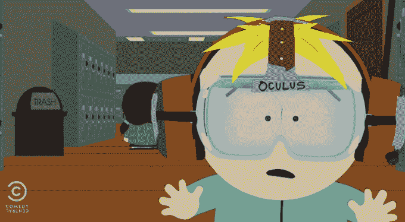
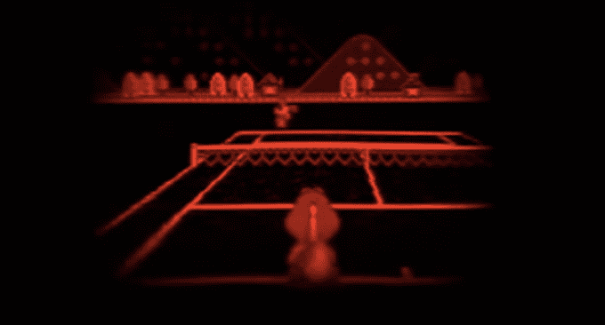

# 为什么虚拟现实正在发生 

> 原文：<https://web.archive.org/web/https://techcrunch.com/2014/11/24/why-virtual-reality-is-happening-now/>

自从 Oculus Rift 第一次凭借其成功的 Kickstarter 掀起波澜以来，一直有一种批评的观点，即“为什么这次会成功？”

这是一个公平的问题——你可以回到几十年前，看到无数次失败的尝试为大众制造虚拟现实设备。

“许多非常聪明的人都试图这样做！有哪些是他们没有看到，而今天 Oculus 及其同胞看到的？人们在 1995 年不想要一个[虚拟男孩](https://web.archive.org/web/20221207012418/http://en.wikipedia.org/wiki/Virtual_Boy)，为什么他们会在 2015 年买一个 Rift？”

这种观点忽略了技术中最重要的(而且事后看来几乎总是显而易见的)因素之一:构成产品的实际技术。

这是二十年前消费级虚拟现实的样子。

看一看实际的部件，当它们以正确的方式组合在一起时，就形成了 Oculus 耳机。你有一个高像素密度的 LCD 屏幕，一个陀螺仪和一个用于位置跟踪的摄像头，以及一个由台式电脑或(在 Oculus 兼容的 [Gear VR](https://web.archive.org/web/20221207012418/https://beta.techcrunch.com/2014/11/12/samsungs-gear-vr-headset-will-cost-200-ship-in-early-december/) 的情况下，一部手机)实时处理的 3D 环境！).

由于几十年来其他领域的进步，特别是智能手机和视频游戏，所有这些东西都只能以消费者可以承受的价格提供。

硬件厂商甚至在十年前有可能为 VR 头戴设备打造分辨率大于 1080p 的显示器吗？不——对于消费者来说，它会非常昂贵，而且如果没有令人讨厌的大型外部电池组，便携式设备会消耗太多的电力。

例如，假设要获得最佳的虚拟现实体验，你的 5.5 英寸屏幕必须是 4K，每秒刷新 120 次。在 2003 年，一个大约有那个分辨率的屏幕将会花费你 8400 美元，并且每秒只会刷新 12 次。哦，对了，它的耗电量相当于一台小型台式电脑。

目前的 Oculus dev 套件使用三星 Galaxy 3 的 1080p [屏幕，每秒钟可以刷新 75 次。Gear VR 使用的是 Galaxy Note 4 的 1440p 屏幕。进步！](https://web.archive.org/web/20221207012418/https://beta.techcrunch.com/2014/07/31/oculus-rift-dk2-gets-torn-apart-revealing-its-samsung-innards/)

三星 Gear VR 使用你的手机为整个虚拟现实体验提供动力……并暗示未来每当我们获得新手机时，VR 都可以向前飞跃。

实时计算机图形的进步也是提供对消费者有吸引力的 VR 体验的关键。虽然研究表明，图形[不一定要“逼真”才能在虚拟现实中提供存在感](https://web.archive.org/web/20221207012418/http://media.steampowered.com/apps/abrashblog/Abrash%20Dev%20Days%202014.pdf)，但它们必须*平滑。即使是图形滞后于输入的一瞬间——在这种情况下，移动你的头四处看看——也会导致严重的晕动病，破坏用户的沉浸感。对此，你唯一能做的就是用更强大的硬件和更智能的代码优化来解决这个问题——热衷于硬件的制造商和游戏开发者已经努力了几十年。*

这些改进发生在虚拟现实的背景之外，但 Oculus 以一种在许多投资者和早期采用者眼中使该领域合法化的方式包装了它们。围绕构建将使虚拟现实真正成为主流的界面和配件，一个新的生态系统正在兴起，这不仅仅发生在 Oculus HQ 内部——或者像过去几十年那样，发生在大学研究实验室的范围内。

在谷歌上搜索“虚拟现实 Kickstarter”，会出现一个又一个项目，这些项目可能是虚拟现实应用的杀手级控制机制。如果你去参加 VR meetup 或 Oculus 的会议，你会看到数量多得离谱的开发人员在研究他们认为正确的做事方式，他们的想法从安装在房间周围的摄像头到全方位跑步机和美化的 Wii 控制器。

从现在起的六个月内，那些开发者将会比他们现在更了解什么可行，什么不可行。自 Oculus 登陆 Kickstarter 以来的过去六个月和一年多时间里，情况也是如此。虚拟现实空间中的事物以一种前所未有的方式运动着。