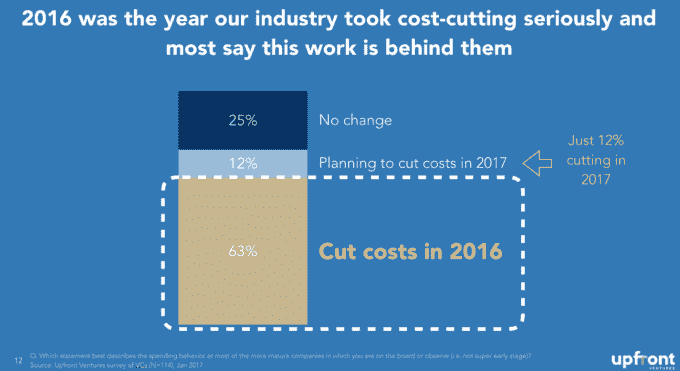
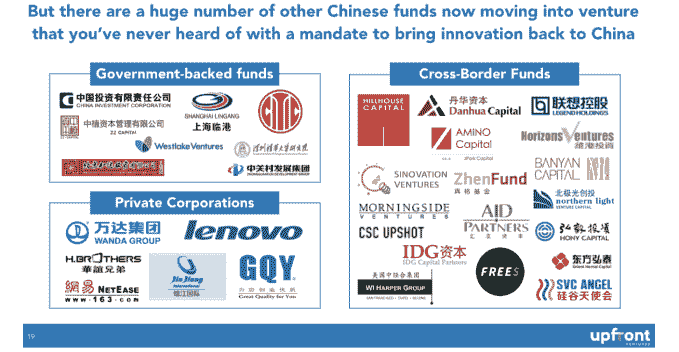
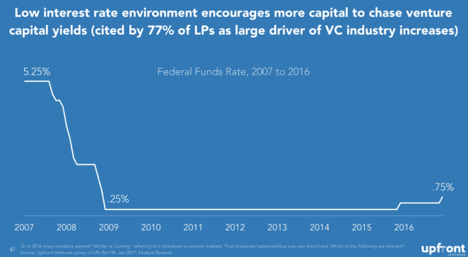
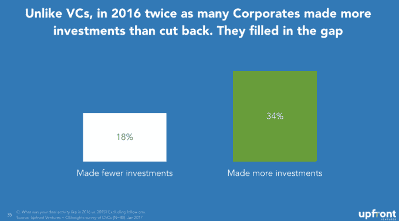
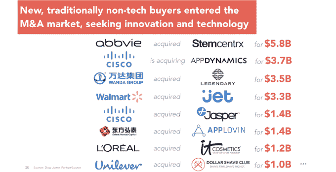
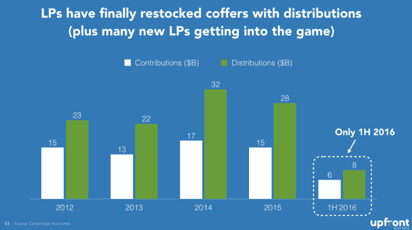
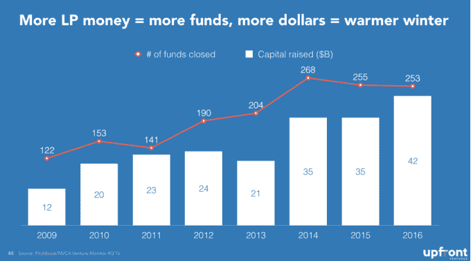
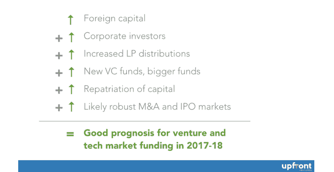
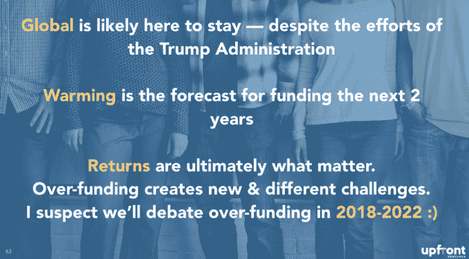

# 为什么风险投资的冬天如此短暂？

> 原文：<https://web.archive.org/web/https://techcrunch.com/2017/02/06/why-was-the-winter-for-venture-capital-funding-so-short/>

More posts by this contributor

仅仅一年前，风险投资行业的许多人还在预测“冬天即将来临”，公平地说，这篇文章的作者是其中的佼佼者。然而，当我们进入 2017 年 2 月时，风险投资市场正在蓬勃发展，Snap，Inc 已申请 IPO，AppDynamics 刚刚被思科以 37 亿美元收购，唯一可以找到的冬天是在加州史诗般的多雪多雨的 1 月之后的滑雪胜地。

好吧，苏斯特。所以 WTF 发生了？为什么没有冬天？

事实上，冬天确实来了，我有数据显示它。但现实是，“全球变暖”大大减弱了冬季的影响，我对 2017-2018 年企业家风险投资的预测现在确实非常乐观。当然，除非是我们的好天气。

### 冬天

首先，当我们在 2016 年 12 月进行年度风险投资和有限合伙人调查以准备年度风险投资行业状况报告时，我们发现 2016 年削减投资的风险投资是 2015 年的两倍，超过 30%的风险投资削减了投资。

不仅是风投降低了投资速度，他们还表示，绝大多数投资的估值已经下降，76%的受访风投认为 2016 年的估值低于 2015 年。

因此，相对于 2015 年，风投以更低的价格和更有利于投资者的条件进行了更少的投资。过去的一年也是初创公司董事会在控制烧伤率和推动公司更加务实地运营方面变得更加自律的一年。近三分之二的风投将 2016 年的成本削减作为常态——这清楚地表明冬天已经来临。

那么，如果风投融资放缓，估值下降，烧钱率大幅降低，WTF 会再次遭遇寒冬吗？

### “全球”变暖

首先清楚的是，来自中国、新加坡、阿联酋、沙特阿拉伯、日本和其他地方的全球投资者介入，填补了最初由风险投资者撤出造成的缺口。

会让你对这幅画有所了解。2016 年，随着中国投资者在国内市场之外寻求多元化，中国的外国直接投资(不包括房地产)飙升。虽然这是外国直接投资总额，而不仅仅是风险投资，但它应该给你一个国际趋势的指示。

美国有方(脸书、亚马逊/苹果、网飞和谷歌)，而中国有 BAT(百度、阿里巴巴和腾讯)。仅百度就用一只 A 轮基金和一只后期基金筹集了 32 亿美元的风险投资基金。如果你在家里记账的话——这大约相当于一家公司管理的 65 只美国种子期基金的规模。

阿里巴巴仅在一笔交易中就投资了 8 亿美元——Magic Leap 和 Temasik(新加坡主权财富基金)向 Verily 投资了 8 亿美元。这两笔投资相当于另外两笔交易中 32 只美国种子期基金的投资。

WeWork 从中国投资者那里融资 6.9 亿美元，NextVR 8000 万美元，Meta AR 5000 万美元。事实上，现在有如此多的中国风险投资基金追逐回报，同时也肩负着将美国的创新带回中国的使命，以至于光是谈论它们就需要一场完整的演讲。

但不仅仅是中国和新加坡。沙特的 PIF +阿联酋的 Mubadala 联手日本软银，推出新的 1000 亿美元基金。随着油价下跌，很明显，该地区还必须分散资产，并将创新带回自己的家门口。也许这就是科威特投资局向 Jawbone 投资 1.65 亿美元，沙特的 PIF 向优步投资 35 亿美元的原因。

全球似乎会一直存在，除非有什么愚蠢的事情发生。

### 全球“变暖”

但是“全球”不是唯一的故事，警告至少是等式的一半。

推动风险投资市场的一个重要因素是，坦率地说，鉴于利率一直很低，许多其他资产类别没有资产管理公司期望的回报，我们调查的 77%的有限合伙人和风险投资公司认为这是风险投资市场蓬勃发展的一个重要因素。

尽管风投在 2016 年撤出了投资，但填补缺口的不仅仅是外国投资者。加大风险投资的一个主要群体是企业。当然，通常会有像谷歌、英特尔、Salesforce.com 和高通这样的嫌疑人，但在过去的 4 年里，企业风投的总数已经翻了一番多，从 61 个主要项目增加到 131 个。

因此，通用汽车向 Lyft 投资了 5 亿美元，宝马启动了 5.3 亿美元的风险基金，康卡斯特/NBCU 向 BuzzFeed 投资了 2 亿美元，甚至芝麻街现在也有了风险投资基金！

尽管 2016 年撤回投资的风投数量是 2015 年的两倍，但填补市场缺口的企业风投(CVC)却恰恰相反。超过 50%的 CVC 表示，他们计划在 2017 年投入更多资金。

在过去的 18 个月里，企业不仅加大了风险资本投资，而且还加快了收购初创公司的大型交易的步伐，这些交易通常来自不总是与大型科技收购相关的公司，如联合利华以 10 亿美元收购 dollars have club(go LA！)或者沃尔玛以 30 亿美元收购 Jet。我们都知道 M&A 吸引了更多的风险投资。

虽然 M&A 的故事被广泛报道，但可能很少有人知道，在过去 4 年里，有限合伙人(LP)，即资助风险投资公司的人，终于能够重新充实自己的金库，分配给他们的资金远远多于为风险投资公司投资筹集的资金。这张图表最让我吃惊。

当有限合伙人收回分配时，他们会以多样化的方式将其再投资到新的资产项目中，但当风险投资的回报高于其他资产类别时，甚至这一比例也会变得更大，因此风险投资不仅能够更容易地筹集资金，而且还能获得一大块蛋糕。因此，基金的数量和筹集的资金都翻了一番也就不足为奇了。

虽然这位作者会发现很难对美国现任总统说任何积极的话，但他可能会做出一个可能有利于美国科技行业的决定——对外国资本汇回的免税期。许多科技公司在海外赚取了巨额利润，由于把利润带回美国需要缴税，他们把利润留在了海外。我们估计，美国五大科技公司在海外拥有超过 5000 亿美元的现金，如果这些现金回到美国，可能会增加:研发支出、M&A 交易和风险资本融资。

因此，如果我必须为你总结我对未来两年风险投资融资的看法，以及为什么 2017-2018 年可能是在美国成为一名企业家的好时机，那就是:

但是，尽管风投和科技初创公司的融资应该保持强劲，但融资和回报不是一回事。如果这个行业变得资金过剩，我怀疑这将导致初创公司的不良行为，风投的不良行为，从而导致相对于较小的融资周期而言的整体回报下降。但这是被称为“经济周期”的正常业务。

如果你想阅读完整的报告，请点击 SlideShare 查看。我们还将在接下来的几周内发布完整的风险投资调查和有限合伙人调查。

[slide share id = baw 9 dps ni 9 gdzq & w = 595 & h = 485 & FB = 0 & MW = 0 & MH = 0 & style = border:1px solid # CCC；边框宽度:1px 边距-底部:5px 最大宽度:100%；& sc =否]

**风投的前期状态&Tech Industry 2017**from**[Mark Suster](//web.archive.org/web/20221207055433/https://www.slideshare.net/msuster)**