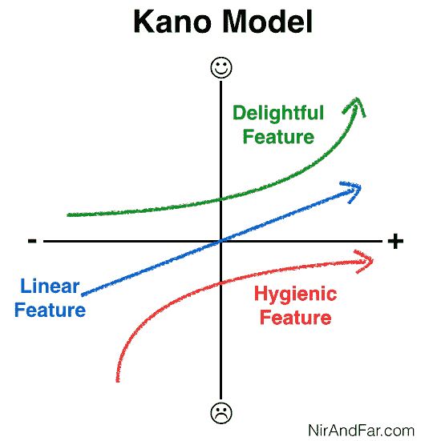

# 为什么你会讨厌 Apple Watch 以及你需要学习的重要商业课程 

> 原文：<https://web.archive.org/web/https://techcrunch.com/2015/04/21/why-youll-hate-the-apple-watch-and-the-important-business-lesson-you-need-to-learn/>

More posts by this contributor

**编者按:** *Nir Eyal 著有* [*Hooked:如何打造形成习惯的产品*](https://web.archive.org/web/20230102131608/http://www.nirandfar.com/gethook) *以及关于产品心理学的博客在*[*NirAndFar.com*](https://web.archive.org/web/20230102131608/http://www.nirandfar.com/)*。*

如果你是[1900 万](https://web.archive.org/web/20230102131608/http://www.slashgear.com/analysts-apple-watch-could-top-19-million-in-2015-08372629/)人中的一员苹果预计会购买苹果苹果手表，我有一些坏消息要告诉你——我敢打赌手表缺少了重要的功能，这会让你抓狂。

这并不意味着你不应该买。事实上，我自己也点了一个。然而，这个悖论说明了公司设计产品的一个重要的教训。

很少有 v.1 产品非常好。那么，为什么有些产品尽管有明显的缺点，却能茁壮成长呢？

## 见见卡诺先生

为了找出为什么你ll可能会对苹果 手表失望，去见见 Noriaki Kano 教授。20 世纪 80 年代，卡诺教授开发了一个[模型](https://web.archive.org/web/20230102131608/http://en.wikipedia.org/wiki/Kano_model)来解释顾客满意度理论。

Kano 认为产品有特定的属性，这些属性直接影响用户的幸福感。他发现有些品质比其他品质更重要。Kano 描述了三种产品属性类型(从日语大致翻译为):愉悦、线性和卫生特征。

令人愉快的特征是顾客喜爱但不期望的产品属性。例如，如果苹果 手表每天早上为你煮咖啡，那将是一个令人惊喜的功能。

另一方面，线性特征是用户所期望的。更多的质量会增加满意度。电池寿命是苹果 手表线性特征的一个例子。你相信它可以持续一整天，但是电池的电量越多，你就越不需要给它充电，你就越快乐。客户通常能够清楚地说出产品的线性属性(“我希望它有长的电池寿命”)，而根据定义，他们只有在看到它的实际应用后才能说出他们想要的令人愉快的功能。就像知道一个笑话的笑点:如果你T21知道该期待什么，那就不会高兴。

最后，卫生或“基本”功能是必备的。客户不仅期待这些属性，而且依赖它们。例如，如果苹果手表不知道时间，你无疑会非常生气。

艾伦·德杰尼勒斯在推特上发布了一条讽刺性的评论，完美地展示了当我们让一个基本功能听起来像一个令人高兴的东西时会发生什么。

玩笑归玩笑，苹果公司首席执行官蒂姆·库克知道 T2 告诉时间对于一款昂贵的手表有多重要。库克强调，该设备在 50 毫秒内是准确的。此外，当电池几乎耗尽时，手表会进入“电力储备”模式，关闭除了看时间以外的所有功能。

显然，苹果明白看时间是一个卫生的特性。但是，说到这个基本特性，还是少了点什么。这让我想到了关于苹果手表可能会惹恼你的事情。

## 不显眼的消费

任何手表的一个基本属性是，它允许佩戴者随时看到时间*。有了普通的手表，查看时间再简单不过了。你只需要向下瞥一眼就知道几点了——而苹果 手表就不一样了。*

为了节省电池寿命，当手表认为你没有使用它时，它会变暗。要重新打开它，你必须用足够的力度摇动设备，用苹果的话说，“手腕抬起时激活。”

> 如果在你的苹果手表上显示时间需要痉挛的手腕晃动，你会诅咒它。

早期苹果 手表评测者[约翰·格鲁伯](https://web.archive.org/web/20230102131608/http://daringfireball.net/2015/04/the_apple_watch)在与一位朋友的会议结束时写下了他戴着这款设备的经历。“时间到了 3:00 左右，我开始每隔几分钟瞥一眼我的手表。但它总是关着……我查看时间的唯一方法是人工轻弹我的手腕或者用我的右手轻敲屏幕——无论哪种情况，这都比我用普通的手表仅仅看一眼要重得多。”

谁没有坐在一位过于健谈的同事对面，担心你下次开会是否会迟到？如果我们懒得戴手表，我们希望能够一眼看到时间。但是如果在你的苹果 手表上显示时间需要痉挛的手腕晃动一下，你就会’ll诅咒它。

格鲁伯继续说道:“……对于经常佩戴手表的人来说，这需要一些时间来适应，而且与总是一目了然的手表相比，这总是有点不方便。这是一个根本性的冲突:普通的手表永远不会关闭，但像苹果 手表这样的显示屏不可能一直开着。"

这个问题非常严重，以至于其他智能手表制造商已经将苹果的失败视为一个机会。例如，最近宣布的 [Pebble Time](https://web.archive.org/web/20230102131608/https://www.kickstarter.com/projects/597507018/pebble-time-awesome-smartwatch-no-compromises) 使用低功耗彩色电子纸显示器，永远不会变暗。

## 你还会买吗

当然，这一切并不意味着你不会买手表。苹果很可能将唤醒功能做得如此敏感，以至于很少有人会被它困扰。毕竟，即使是明显的手腕抖动也比掏出手机看时间的不便要好。然而，更高的开启灵敏度将以电池寿命为代价，这是消费者不会高兴的妥协。为了避免失望，保持较低的期望值，做好错过一些基本功能的准备，即使是便宜的手表也会有这些功能。

记住，iPhone [一开始就有它的问题](https://web.archive.org/web/20230102131608/http://www.roughlydrafted.com/2008/08/18/inside-the-iphone-3g-dropped-call-complaints/)。苹果选择 AT & T 作为 iPhone 最初几代的独家服务提供商意味着[更多的电话掉线和接收不良](https://web.archive.org/web/20230102131608/http://www.cnet.com/news/at-t-still-no-1-on-dropped-calls-but-iphone-owners-seem-satisifed/)。这款设备经常被人讨厌，因为它无法提供消费者最期待的基本 Kano 功能——即完成通话。

随着时间的推移，技术进步了，但为什么人们要忍受这些看似致命的缺陷这么久？在这里，卡诺模型帮助我们更好地理解消费者的心态。

人们一直在使用(并且经常称赞)iPhone，因为它的愉悦因素弥补了它缺乏基本属性的缺陷。主要是，苹果的应用商店和它几乎无限的各种漂亮的解决方案提供了一系列令人愉快的功能，甚至史蒂夫·乔布斯都无法想象。

iPhone 仍然不能煮咖啡，但它可以做很多其他令人惊讶的事情你不知道知道当你买它时它可以做的事情(从检查你的[心跳](https://web.archive.org/web/20230102131608/https://itunes.apple.com/us/app/instant-heart-rate-heart-rate/id409625068?mt=8)到识别[星座](https://web.archive.org/web/20230102131608/https://itunes.apple.com/us/app/skyview-free-explore-universe/id413936865?mt=8))以至于你忽略了它的缺陷。

> 为了避免失望，保持低期望值。

至于苹果苹果手表，随着时间的推移苹果无疑会在第一代产品中解决一些问题，就像它在随后的 iPhone 版本中所做的那样。最终，更长的电池寿命或替代屏幕将使未来的版本全天发光。但是像 iPhone 一样，苹果手表背后真正令人高兴的是应用程序。库克最近[给苹果员工发了一封电子邮件](https://web.archive.org/web/20230102131608/http://9to5mac.com/2015/04/06/tim-cook-apple-employees-will-get-50-off-apple-watch-1000-apps-submitted/)，宣布已经提交了 1000 多个应用。

期待苹果手表 手表的未来几代会有更多消费者目前没有预料到的令人愉快的功能。我在苹果手表 上的钱 2 包括一个前置摄像头，佩戴者会发现它比使用手机拍照更容易、更快。每当他们拍出令人惊讶的好照片时，这就增加了一份喜悦。

我们与科技有着爱- 恨的关系，苹果苹果手表也不会例外。通过应用 Kano 的模型，公司可以通过内置持续给人惊喜和印象的功能来克服新产品不可避免的缺陷。