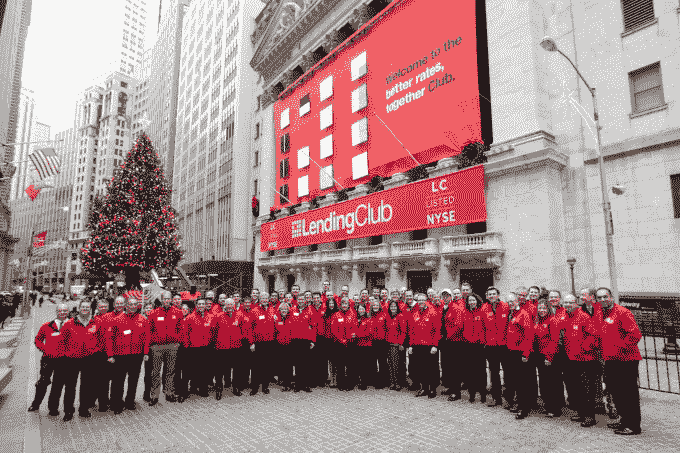

# 为什么你的钱包会成为下一个平台

> 原文：<https://web.archive.org/web/https://techcrunch.com/2016/04/24/why-your-wallet-is-becoming-the-next-platform/>

[Alex Rampell](https://web.archive.org/web/20230402005110/http://a16z.com/author/alex-rampell/)

是 Andreessen Horowitz 的普通合伙人，曾担任首席执行官和联合创始人

[TrialPay](https://web.archive.org/web/20230402005110/https://www.trialpay.com/)

.

现代意义上的“钱包”即“装纸币的扁平盒子”可以追溯到大约 200 年前。这个词本身可以追溯到 700 年前，这个概念(不包括纸币)可以追溯到几千年前。

当然，皮革钱包并不“聪明”；他们是原子不可知论者，甚至是支付类型不可知论者，因为信用卡之类的东西在 20 世纪中期开始激增。但是今天支付类型几乎是一个指针——在计算机科学术语中——指向钱的来源。钱包本身是主指针，用于打开和关闭交易，并选择分配哪个子指针。

因为拦截付款会导致整个下游的商品宝藏，钱包——曾经是鞣制过的兽皮——将成为最终的金融平台。随着数字钱包越来越多地成为消费者支出的起点，它们将成为下游金融服务的平台——为初创公司创造机会，为老牌公司带来问题。

问题当然是支付类型可以变成钱包，钱包也可以变成支付类型。那么哪个是哪个？如果一家拼车公司有 1 亿个凭证，他们就解决了作为支付公司的一半网络效应问题——所以你可以想象在沃尔玛把那个应用程序当作你的钱包。或者，星巴克是最大的钱包之一，它的钱包内有一个指向 Visa Checkout 的指针，另一个钱包指向一种卡类型(Visa 卡，甚至万事达卡/美国运通/发现卡)，指向“贷款”(信用卡的“信用”部分)，最终指向一个银行账户。

作为一个堆栈，我们的硬件——你的手机——在最上面，而拥有实际财富的银行账户在最下面。但是最好把这个“栈”看作是一个指针系统，在这里是向下的。企业的目标是在这个堆栈中找到并占据一个可防御的位置，使他们能够拦截支付，捕捉和控制价值，成为最终的金融平台。

在我的苹果 iPhone 上，我可以运行优步应用程序，并通过贝宝支付，贝宝从我的美国运通卡中扣款。对于堆栈的前四个组件(硬件、操作系统、应用和云骨干网)，成功获取价值的试探法是集成的数量(即人们可以使用钱包的地方的数量)和凭证的数量(提交了一种以上投标类型的用户)。

考虑到他们拥有的大量凭证以及作为“起点”的控制地位——与其他玩家不同，苹果既有硬件*又有*操作系统——苹果的钱包平台可能会对所有人造成致命打击。

尤其是因为这个堆栈中的流程只有一个方向:下面的玩家无法访问堆栈中的资源。

在一个只有手机的世界里，一个协调良好的努力，让你在任何电子商务网站或应用程序上只需用拇指触摸你的 iPhone 就可以支付，这可能会在一夜之间抹去 PayPal 约 20%的收入[PayPal 三分之二的收入是易贝以外的商业服务；假设 25%的 iOS 份额]。

然而，在这个堆栈中占据一个可防御位置的真正价值甚至不在于处理支付。Capital One 每年都会花很多钱说服你申请并使用它的信用卡。然而，一旦归入数字钱包，这一“使用”部分就会越来越脱离 Capital One 的控制，对下游利息(贷款)收入产生巨大影响。

苹果产品设计的一个变化——例如，像字母排列这样简单的事情，一个皮革钱包做不到！—可能会让美国银行(Bank of America)领先于 Capital One 成为“违约”，让更多购买朝着这个方向发展。

这整个指针系统的“最终结果”通常是循环信贷工具——信用卡——的余额增加。以 LendingClub 和 Prosper 这两家最大的市场贷款公司为例。

LendingClub 大约一半的贷款来源于信用卡债务再融资，这些贷款来自美国邮政服务邮件广告、谷歌广告等。但是，控制采购堆栈中的一个位置可以并且可以说是*应该*取代他们正常的客户获取过程；与其等着消费者在一系列购买中积累大量余额(以高得离谱的信用卡利率)然后再融资，不如在余额来自购买时抓住它。

下一家大型消费金融公司可能会打断这一系列问题。但是在堆栈的哪一点呢？攻击栈顶将非常具有挑战性，因为这将需要大量采用*和*大量支付凭证的硬件+操作系统钱包。攻击堆栈的底部也很有挑战性…而且相对来说无利可图。

现在，LendingClub 将把你 18%的年利率大通/花旗/等利率再融资到 10%。但在一个 ApplePay 控制前端，而 WellsFargo 等现有银行在末端提供资金来源的世界里，没有理由不“自动化”信贷选择过程。为什么他们不直接跳到 LendingClub 会给你的利率，或者甚至跳到最好的“市场贷款”利率？

一旦发生这种情况，最大的混乱将是你的“信用卡”将不再是中长期信贷的默认来源。这对所有的消费金融都有重大影响。

**未来:钱包应用、奖励、洞察力**

对于信用卡公司来说，他们能做的最聪明的事情是*而不是*建立自己的云钱包，这就产生了一个不必要的“子指针”。然而，他们中的许多人这样做是因为他们没有全面了解价值在堆栈中的位置以及如何更好地利用他们在堆栈中的位置。

对于云钱包来说——它们正面临着被夹在中间的生存挑战——最聪明的做法是，如果它们在自己获得足够的凭证方面失败，那么它们可以与一个获胜的应用钱包结盟。因为支付公司(如大通、花旗等。)冒着被抽象成无关紧要的风险，将自己与获胜的**应用**钱包(如亚马逊、Lyft、星巴克、优步等)联系在一起。)是将他们现有的“指针”相对于其他指针进行优先排序的唯一方法之一。

那么这一切对创业公司来说意味着什么呢？好吧，解决最有利可图的部分——贷款——将变得更容易，而无需进入庞大而不切实际的支付路径。像 8 年前的 PayByTouch 和最近的 T2 Powa 这样的公司在破产前总共蒸发了 5 亿多美元。如今，关键基础设施的许多其他部分可以通过数字钱包平台的访问来重写:奖励、PFM(个人财务管理器)、商户推荐、优惠等。

还有整整一代人——千禧一代——他们不理解平衡支票簿的概念，因为他们甚至没有支票簿。

这是一个时代错误，就像围绕这个概念成长起来的 PFM 一样，包括在购买出现在“现代”PFM 之前的长时间延迟。

这是因为购买是从商家、商家银行、网络、发行银行、聚合商、PFM 进行的。但是在数字钱包中，购买会立即显示出来——允许即时推荐、报价和折扣。数字钱包可能最终会让人们寻找已久的“味觉图”(所有“买这个的人，也买那个的人”之母)得以建立。

所有这些都需要“顶层”开放——让苹果、谷歌和其他玩家认识到他们正在构建一个*金融*平台，就像所有平台一样，当开发者能够访问时，这个平台最有价值。鉴于市场的规模，这只是一个时间问题，而不是是否会发生的问题。一旦这样，对于几十年来一直依赖分支机构和消费者品牌的银行来说，以及对于那些最终会发现自己拥有扰乱消费者金融的资本高效切入点的初创公司来说，这可能会改变游戏规则。