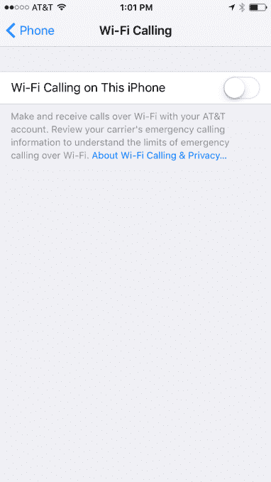

# 美国电话电报公司用户的 iPhone 终于可以使用 Wi-Fi 通话了 

> 原文：<https://web.archive.org/web/https://techcrunch.com/2015/10/08/wi-fi-calling-finally-comes-to-att/>

# 美国电话电报公司用户终于可以在 iPhone 上使用 Wi-Fi 通话了

在被苹果公司承诺 Wi-Fi 通话一年多之后，在 T2 的 T7，它终于到来了。

它适用于使用 iOS 9 的 iPhone 6、6+和 6S 以及 6S+美国电话电报公司客户。你必须进入手机设置(*设置>手机*)并手动开启:

然后你必须输入一个紧急地址，以防你需要帮助。Wi-Fi 不像你的手机连接那样可追踪，所以如果你拨打 911，美国电话电报公司需要额外的信息来识别你。

当你有 Wi-Fi 连接但手机信号很差时，这个功能非常方便。手机会自动切换到无线网络。