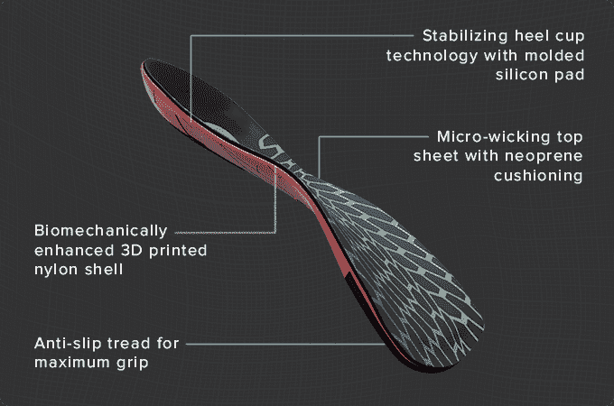

# Wiivv 筹集了 350 万美元，将 3D 打印鞋底带到了 Maasses 

> 原文：<https://web.archive.org/web/https://techcrunch.com/2015/12/03/wiivv-raises-3-milllion-to-bring-3d-printed-iinsoles-to-the-maasses/>

# Wiivv 筹集了 350 万美元，将 3D 打印的鞋底带到了马赛

随着人类和机器不可避免的融合，我们将需要更多的辅音和元音。这就是为什么 [Wiivv](https://web.archive.org/web/20221210034142/http://www.wiivv.com/) 在这个案子上。Wiivv 是一家极具颠覆性的公司，如果没有自动更正功能，你就无法输入它的名字。该公司利用在家中进行的扫描制作 3D 打印鞋垫，他们已经筹集了 300 万美元的种子资金，让你的脚感觉更好。

Shamil Hargovan 和 Louis-Victor Jadavji 在 3D 打印公司工作后，成立了他们位于温哥华的公司。Hargovan 和 CTO Ben Wynne 都曾在惠普的 3D 打印部门工作，后来离开并创建了这家公司。

【T2

他们从包括加拿大政府在内的种子投资者那里筹集了 350 万美元。

该公司目前正在扫描足部和运输鞋垫，并将在 1 月份推出 Kickstarter。包括 Wiivv 100 在内的 1000 人已经试用了该产品，其中包括一群护士、消防员和搜救人员。

“新百伦和阿迪达斯吹捧的 3DP 鞋类产品仍然是概念，还没有准备好大规模生产，”Hargovan 说。"我们成功地掌握了耐久性和生物力学的材料特性."

鞋垫只是一个开始。Hargovan 认为运动员将会成为 3D 打印垫、护腿和头盔。由于扫描系统非常精确，齿轮可以与身体一起成型，防止受伤和摩擦。

“Wiivv 计划将人们的寿命延长 10 年，”Hargovan 说。也许他们会成功:他们已经在名字中添加了两个重复的字母。