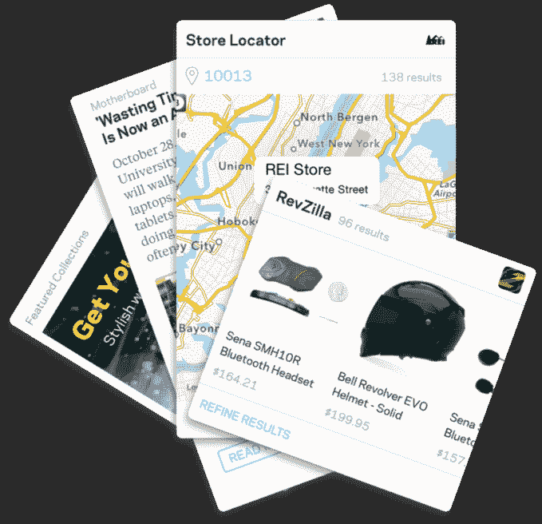
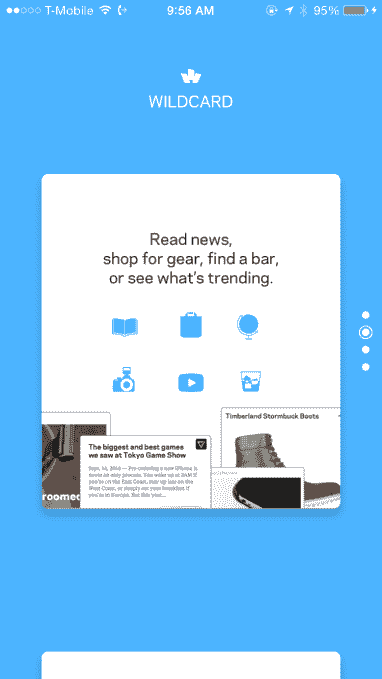

# Wildcard 筹集 1000 万美元，推出专为移动网络打造的浏览器 

> 原文：<https://web.archive.org/web/https://techcrunch.com/2014/11/13/wildcard-raises-10-million-launches-a-browser-built-for-the-mobile-web/>

一家名为 [Wildcard](https://web.archive.org/web/20221206151632/http://trywildcard.com/) 的公司今天在[推出了一款面向移动时代的浏览器](https://web.archive.org/web/20221206151632/https://itunes.apple.com/us/app/wildcard-browse-better-mobile/id930047790?ls=1&mt=8)，它是专为支持更新的“卡片”格式而设计的。卡片是一种新的设计趋势，出现在移动应用程序中，作为一种在设备的小屏幕上更好地展示内容的方式，包括照片和视频等富媒体。

Wildcard 还宣布，它已经获得了由 General Catalyst Partners 牵头的 1000 万美元的资金——对于一家还没有启动的小公司来说，这是一大笔钱。

其他投资者包括(去年筹集了 300 万美元和 700 万美元)Lerer Ventures、软银资本、SV Angel、贾里德·赫克特(Jared Hecht)和史蒂夫·马托奇(Steve Martocci)、戴夫·蒂施(Dave Tisch)和加里·维纳查克。

在某种程度上，投资者押注于 Wildcard 背后的团队和大创意，而不是面向消费者的 Wildcard 应用。

创始团队包括首席执行官乔丹·库珀(Jordan Cooper)、工程副总裁道格·佩特卡尼斯(Doug Petkanics)和首席技术官埃里克·唐(Eric Tang)，他们之前创建了 Hyperpublic，后来卖给了 Groupon。Wildcard 的副总裁 UX·科荣(音译)曾在《纽约时报》和 Mixel(已被 Etsy 收购)工作，并经营着流行的设计博客 Subtraction.com。

Lerer Ventures 的合伙人库珀解释说，他决定开发通配符，因为他最大的挫折之一是网络基本上不能在他的手机上很好地工作。“每个 iPhone 用户主屏幕上最糟糕的用户体验是他们的浏览器，”他说。

库珀补充说，当时，原生应用将在手机上战胜网络并不是一个必然的结论。现在，超过 90%的互联网消费发生在移动应用程序中，但他认为这不再是一场本地应用程序“赢”而网络输的战争，反之亦然。

“他们走到了一起，”库珀说。“卡技术代表了这种新的第三种选择，它位于这两种以前互不关联的生态系统的交汇处。”

在某种程度上，通配符浏览器以消费者可以理解的方式展示了卡技术。与此同时，Wildcard 业务更直接可行的一面——不涉及在手机上篡夺谷歌 Chrome 或苹果 Safari 是 Wildcard 为移动开发者开发的 SDK。该工具集将允许开发人员使用通配符的“卡片平台即服务”一次性创建卡片，然后在任何其他支持类似卡片界面的服务上工作，包括 Twitter、Pinterest，以及即将推出的脸书，此外还有通配符自己的移动浏览器。

如今，许多技术公司正在与通配符相邻的领域工作，通过名为 deeplinks 的原生移动应用程序创建路径，这些应用程序旨在使在应用程序中浏览页面更像是在网上冲浪。卡片也可以包含深度链接，但它们更多的是关于富媒体或应用程序工作流程的一部分应该如何呈现给最终用户，而不是链接应该如何操作。

但是卡片的问题在于它们只是一种设计模式——而不是一种标准。这意味着当像脸书和推特这样的公司实现信用卡时，他们是以一种专有的方式来实现的。这使得一些业内人士宣称“是时候建立一个开放的卡标准了”。“没有标准，脸书和 Twitter 的卡就不能互操作，这只会让试图支持每个服务的实现的开发人员头疼。推出基于卡片设计的服务数量也在增长。

这就是为什么卡翻译服务在短期内会对开发者有用，如果有可能的话，Wildcard 可以参与到卡技术标准化的讨论中来。

与此同时，想象一个真正的移动网络如何通过通配符浏览器运行是很有趣的，在这个浏览器中，用户可以搜索时事，阅读新闻，轻松购物和结账，观看视频，收听音频等等。Yelp 是浏览器的早期合作伙伴，而其他卡通配符自己构建。使用通配符制作名片的应用发行商和品牌也将在浏览器中展示他们的服务。

[合作伙伴和开发者可以在这里报名](https://web.archive.org/web/20221206151632/http://www.trywildcard.com/partners)。与此同时，这款应用在 iTunes 上可以免费下载。