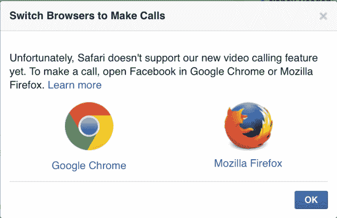
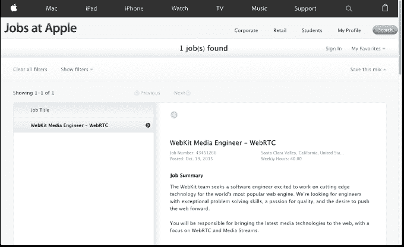

# 无论你怎么划分，苹果和 WebRTC 都需要对方

> 原文：<https://web.archive.org/web/https://techcrunch.com/2016/04/05/will-an-apple-a-day-keep-webrtc-away/>

伊泰·罗森菲尔德撰稿人

伊泰·罗森菲尔德是

[Voxbone](https://web.archive.org/web/20230320003331/https://www.voxbone.com/)

并且在电信行业拥有超过 15 年的经验。

More posts by this contributor

被称为 WebRTC 的开源 VoIP 引擎和标准倡议终于开始获得一些支持。本月早些时候，Slack 效仿 Facebook Messenger，推出了基于 WebRTC 的语音通话功能。虽然令人兴奋，但这一推出是有限的——它只适用于 Slack 的桌面应用和 Chrome。

我们可以假设它只是在 MVP 模式下，Firefox 支持将很快到来，只要支持该平台的努力增加到最小。对于 Slack 用户来说，Internet Explorer 和 Edge(其支持 WebRTC 的升级版)可能不是一个考虑因素。这使得对苹果 Safari 浏览器的支持成为下一个目标。

Safari 不支持 WebRTC 有关系吗？Safari 在网络上已经落后了一段时间——苹果会在意吗？

## WebRTC 需要苹果吗？

Safari 一直是 WebRTC 的眼中钉。作为一个苹果的忠实用户和 WebRTC 的粉丝，我对这两者没有越来越接近感到有些失望。根据不同的统计，Safari 在桌面和移动浏览器市场上大约占有[10-15%的份额。统计数据并没有表明这种情况会随着时间的推移而发生很大变化。一成不变的 10-15%并非无关紧要，但在开发一个新的 web 应用程序时，这还不足以获得最初的优先权。当您的用户群增长并且您有能力提供更广泛的支持时，这种情况会改变吗？](https://web.archive.org/web/20230320003331/http://gs.statcounter.com/#all-browser-ww-monthly-201510-201512-bar)

脸书显然不在乎。尝试使用 Safari 通过网页上的 Messenger 界面拨打电话，您会看到:

他们甚至没有试图隐藏通话按钮，以防止用户试图在 Safari 上拨打电话。他们把电话和视频通话按钮放在那里，诱使你点击，这样他们就可以试图说服你使用另一个浏览器。如果脸书不在乎为其 8 亿多 Messenger 用户支持 Safari，很难证明其他人也应该这样做。

然而，Safari 并不是 WebRTC 开发者最大的问题:苹果的 iOS 政策才是。苹果要求你使用它的网络渲染引擎。不管你是一家小型创业公司还是谷歌的 Chrome 浏览器:如果你想建立一个渲染网页的应用程序，你需要使用苹果的 WebView API。

> 苹果可以通过应用商店将应用货币化；它不能通过浏览器赚钱。

iOS 的移动 web 上没有 WebRTC 这种东西。这意味着谷歌和其他开发者无法在 iOS 设备上支持 WebRTC，除非它内置在原生 iOS 应用中。这是对网络支持者的一个严重打击，他们的愿景是为所有设备建立一个无处不在的万维网。来自 App Store [审核指南](https://web.archive.org/web/20230320003331/https://developer.apple.com/app-store/review/guidelines/):“浏览网页的应用必须使用 iOS WebKit 框架和 WebKit Javascript。”

## 苹果需要 WebRTC 吗？

苹果有自己的网络电话应用程序，安装在所有设备上——face time。FaceTime 应用在没有 WebRTC 的苹果设备上运行良好。史蒂夫·乔布斯在 2010 年提到苹果将会把 FaceTime 变成一个开放标准。这原本可以减轻对 WebRTC 标准的需求。然后，在 2012 年，苹果被一个专利流氓起诉并败诉。从那以后，苹果一直对开放 FaceTime 保持沉默，没有理由认为这种情况会改变。

苹果在 iOS 上的 web 渲染器政策迫使 WebRTC 开发者为他们的设备创建 iOS 应用。苹果可以通过应用商店将应用货币化；它不能通过浏览器赚钱。

WebRTC 并不是苹果政策的唯一受害者(参见完整列表对比 Firefox [这里](https://web.archive.org/web/20230320003331/http://caniuse.com/#compare=chrome+49,safari+9,safari+9.1,ios_saf+9.0-9.2,ios_saf+9.3))。尽管支持许多现代网络功能的市场风险较低，但 Safari 仍远远落后。苹果当然有资源做它想做的任何事情。其庞大且不断增长的积压显然表明网络还没有成为重中之重。即使这种情况突然改变，WebRTC 也只是争夺内部注意力的众多特性之一。

> 苹果就是苹果，我们永远不会真正知道发生了什么，直到他们准备好宣布一些事情。

从历史上看，世界上最有价值的公司没有太多动力去做任何不同的事情。如果苹果可以通过忽略 web 而生存，为什么它会关心像 WebRTC 这样的单一 web 标准呢？

## 苹果能永远反抗现状吗？

简短的回答是“不”。苹果拖累网络、让开发者的日子更难过的策略不可能无限期持续下去。如果它对市场其余部分的现状推波助澜，它就有疏远其成员而不是赢得他们的风险。

多亏了 WebRTC，VoIP 通话已经从一个很少有人能掌握的神奇的技术壮举，变成了一个易于添加到任何应用程序的功能。如果 Safari 不支持 WebRTC，开发者很可能会像脸书一样，将这些客户引向 Safari 以外的东西。苹果可能没有创造第一浏览器的野心，但我肯定他们仍然希望 Safari 有竞争力。随着 Google、Amazon、Snapchat 和现在的 Slack 提供 WebRTC 作为一项功能，我们正处于许多开发人员想要做同样事情的时刻。

苹果在 iOS 应用开发方面也面临压力。从源代码库构建用于 iOS 的 WebRTC 比以前容易多了，但是仍然没有使用 web APIs 那么简单。为了达到这一点，WebRTC 确实需要添加到 iOS 的原生 web 视图中，就像它在 Android 中与谷歌一样。

当然，在此期间总会有第三方库提供帮助，但第三方和商业对开发者来说永远不如免费和原生的有吸引力。希望苹果能理解解决 WebRTC 的战略需求。留住忠实的用户和开发人员关系重大，我不是唯一一个考虑转向 Android 的人。

## 苹果要改变吗？

你猜怎么着？苹果已经被发现为 WebKit(其网络渲染引擎)宣传 WebRTC 开发者角色。

看来苹果真的*是*感受到了压力。对于 web 和 WebRTC 的拥护者来说，这无疑是个好消息。像[webrtcinwebkit.org](https://web.archive.org/web/20230320003331/http://www.webrtcinwebkit.org/)这样的社区努力应该会让苹果新的 WebRTC 工程师在被雇佣时变得更加容易。

苹果就是苹果，我们永远不会真正知道发生了什么，直到他们准备好宣布一些事情。尽管如此，看起来 WebRTC 对通用浏览器支持的最初设想将在不久的将来成为现实。这正好说明，你不能永远忽视客户的需求。