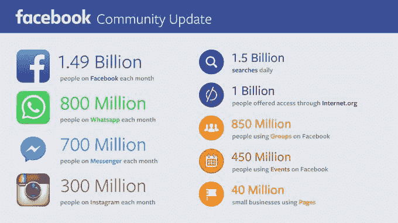
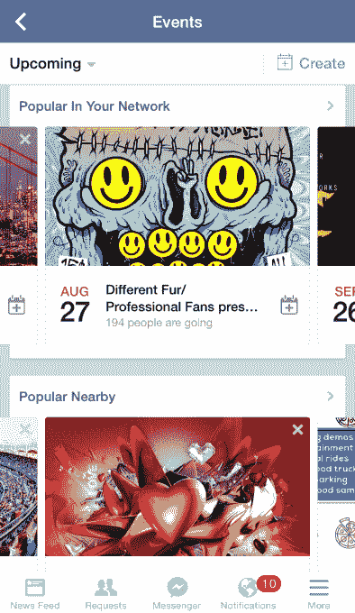

# 拥有 4.5 亿用户的脸书活动已经准备好了一个独立的应用程序

> 原文：<https://web.archive.org/web/https://techcrunch.com/2015/07/29/will-facebook-launch-an-events-app/>

# 拥有 4.5 亿用户的脸书活动已经准备好了一个独立的应用程序

马克·扎克伯格表示，脸书活动已经达到了 4.5 亿活跃用户的全球规模，同时指出，团体现在有 8.5 亿用户。脸书已经很久没有分享活动的用户数了。

他在今天的收益电话会议上提到的“全球规模”可能预示着一个增强的活动功能或一个独立的活动应用程序的推出。脸书最近开始向用户发送提醒，提醒他们当天有多少活动。它还刚刚推出了一个[门户网站，教人们投掷项目的最佳实践](https://web.archive.org/web/20230317182841/http://events.fb.com/)，这是它更认真地组织 IRL 聚会的另一个迹象。

2013 年末，我在脸书大学与扎克伯格进行了一次谈话，我询问了他关于独立应用的策略。他告诉我，“我们刚刚发布了这个大型 Messenger，Instagram 的到来确实塑造了我们的想法，即如何建立这些社区，并在全球范围内最大限度地发挥一个应用程序的影响力，而不是本地影响力。因此，我认为我们在脸书移动应用程序中已经有一段时间的想法是，我们可能添加的体验，无论是团体还是活动或类似的事情，都可以让很多人受益。

自那以后，脸书实际上推出了一个独立的群组应用，以及其创意实验室倡议，以试验新的应用设计，如新闻阅读的纸张和私人照片分享的时刻。但还是没有活动应用。

那里有巨大的机会。现在，Events 很适合组织生日聚会、抗议和俱乐部之夜，并且很容易邀请人们。但是有了所有正在进行的活动的数据和我们过去回复的所有信息，脸书可以帮助人们发现他们没有被邀请的活动。

它一直在尝试在其网站和应用程序中嵌入一些发现模块，包括“附近受欢迎”和“在你的网络中受欢迎”。但它们是随意的，无序地随机显示接下来几周的事件。

脸书可以回答的问题是“今晚我该做什么？”无论是使用独立的应用程序还是更深入的发现功能，它都可以根据位置、类型和参加的朋友列出一个建议日历。有了这些建议，就有了插入“促销活动”的机会

人们经常嘲笑社交网络疏远人们，而不是真正培养友谊。一种更好的方式来了解你的城市正在发生什么，可以证明脸书实际上正在连接人们，而不仅仅是在线。