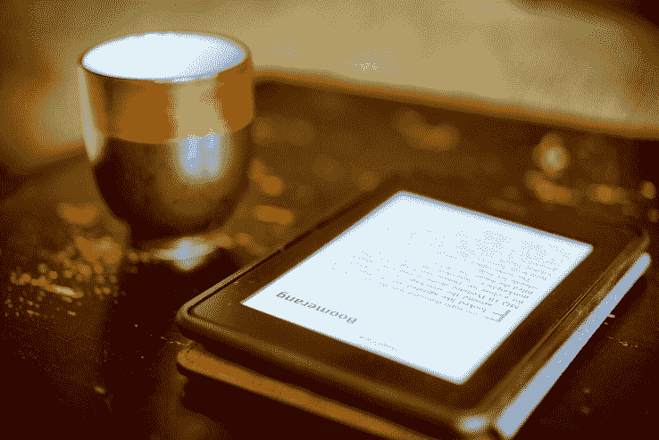
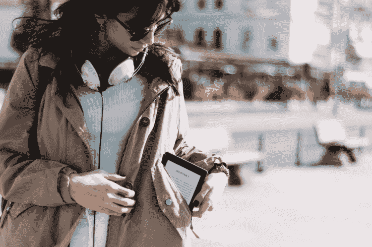

# 电子书不仅仅是数字传真，出版商需要意识到这一点

> 原文：<https://web.archive.org/web/http://techcrunch.com/2016/03/26/will-nobody-think-of-the-trees/>

亚马逊的 Kindle 和它不太受欢迎的电子阅读器兄弟，对于小说来说是很棒的，但是试图消费那些不打算从头到尾都喜欢的内容是一种烦恼、沮丧和痛苦的练习。这是一种耻辱，因为它不一定是这样的。

以旅游书籍为例。当徒步环游世界时，背着 4 . 5 磅重的导游书简直是一件痛苦的事情。将书架上的旅游书籍加载到电子阅读器上更有意义。

“为了胜利的电子书，”我听到你低声说。但遗憾的是，挑战不在于重量，而在于旅行者使用指南的方式。在旅途中，你会永远发现自己在概览地图、本地地图、你在哪里的“做什么”部分、你要去哪里的“住在哪里”部分、“我饿了，但我们落后于计划，所以我们没有在我们计划的地方”页面和“哦，不，有人偷了我的护照，现在我该怎么办？”章。

## 纸质书在这方面做得很好

偶尔令人沮丧并不是电子书的错。事实证明，纸质书实际上有一个非常高效的用户界面。你可以用手指或便利贴作为书签，比其他任何技术都要快。你可以在页边空白处写笔记。如果你愿意，你可以圈出、突出显示和撕掉页面。你甚至可以做我的一个朋友为了减肥所做的事情:把六本《孤独星球》指南拆开，用胶带粘回一份定制的旅行路线。

在阅读小说时，电子阅读器可以完全取代平装书。

还有其他类型的书籍也有类似的非线性问题。我最近发现自己打算重返校园，参加 GRE 考试。官方指南在同类畅销书中排名第八，但作为学习指南来说，简直是一无是处。这本书充满了有用的信息，但 Kindle 版本绝对，完全无法使用。当然，格式有问题，但这还不是最大的问题。

这本书提到了“得分见第 29 页”这样的话，忽略了大多数电子阅读器没有页码的概念。包含这些交叉引用的唯一作用是告诉读者他们买错了这本书的版本:“如果你买了纸质书，这里我们会给你一些有用的信息。相反，好吧，在这里——有一个对你完全没用的参考。”

另一个面对面的时刻与示例问题和答案有关。它们在书中是分开的，但它们之间没有快捷方式/超链接。这太愚蠢了。结果，你会发现自己点击后退 25 次来重读问题，然后前进 25 次来阅读答案。或者现实一点，你发现自己*没有*那样做，而是叹了口气，拿出手机，在谷歌上搜索“如何获得 Kindle 图书的退款”

## 不使用电子书技术是一种可怕的浪费

即使出版商没有意识到使用电子书出版商可用的智能技术的可能性(这可能只是一个解释，但这是一个非常尴尬的解释)，也有其他方法来避免这个问题。例如，在问题/答案的情况下，简单地重复问题将是一个解决方案:这不像他们会招致额外的印刷成本或耗尽电子书的空间。

对于“关于 X 的更多信息，请参见第 26 页”的挑战，出版商可能会说“我们将在本书的后面更多地介绍 X。”不如*有用*，但至少不会主动与之对抗。

一些书籍类型——尤其是那些包含大量图形主题的书籍，如摄影——在电子墨水阅读器上效果不佳。

在平衡出版商的评论时，我自己也不能逍遥法外。我自己的很多书都有电子书，我的畅销书《摄影法则和何时打破它们》可能是最愚蠢的例子。正如你从它的标题可以想象的那样，它充满了照片。Kindle 版本是存在的，但它根本没有意义:这本书大量基于例子，试图在黑白设备上理解这本书的核心概念将是徒劳的。

## 出版商:适应还是灭亡

事实是，电子书对某些事情来说是很棒的。电子阅读器非常适合带着小说去度假:你可以在一个电池寿命长达数周的设备上携带图书馆的书籍。另外，没人能看出你在读《五十度灰》。完美。

电子阅读器内置的技术正在迅速成熟。高亮显示，书签和处理脚注，结尾注释和交叉引用都是标准的。与五年前最大的变化是，我现在可以看到自己在电子阅读器上阅读学术著作，没有大问题。

总的来说，技术是有的。通过使用像 [iBooks Author](https://web.archive.org/web/20230129220605/http://www.apple.com/ibooks-author/) 或[亚马逊自己的出版指南](https://web.archive.org/web/20230129220605/https://kdp.amazon.com/help?topicId=A12NQC9HQPI9CA)这样的平台，有很多技术和功能可供出版商使用——其中大部分很少使用。女士们先生们，这是一个小小的悲剧。

Kindle 非常适合旅途中的旅行者——但是出版商需要接受这项技术。

对于其他用途，如依赖图形和照片的旅游指南和书籍，定制应用程序或(gasp)网站可能是更好的解决方案。对于一些旅行者来说，像猫途鹰或 T2 这样的应用可能会很好，但这两个应用都依赖于永远在线的互联网连接，对许多旅行者来说，不能联网要么是旅行吸引力的一部分，要么是技术/经济的需要。

话虽如此，将旅游指南引入手机和平板电脑还是很有意义的。除了漂亮的视网膜彩色显示屏，大多数便携式设备都有 GPS、摄像头和大量功能，使它们更适合手头的任务。

最终，技术将继续前进，电子墨水、电子书和其他出版技术将继续变得更好。与此同时，如果出版业想作为一个行业生存下去，他们最好不要继续出版未经改编的木浆书的电子版。如果这种情况继续发生，最好的情况是读者容忍被光顾——但更现实的是，读者会记住永远不再在电子阅读器上购买旅游指南、学术书籍或摄影作品。

出版商们，如果你想继续做生意，就不要再骗你的读者的钱了，而是拥抱电子书技术的优势。为了几美元的短期利润让你的客户失望是不值得的。