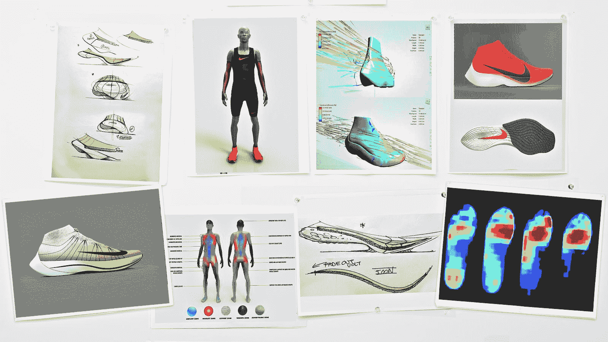

# 科学和好鞋会有助于打破本周末两小时马拉松的障碍吗？

> 原文：<https://web.archive.org/web/https://techcrunch.com/2017/05/05/will-science-and-good-shoes-will-help-break-the-two-hour-marathon-barrier-this-weekend/>

本周末，埃鲁德·基普乔格、莱丽莎·德伊莎和泽森内·塔德塞将尝试在两小时内跑完马拉松。这是一个大胆的——有些人说是不可能的——目标，也是耐克营销活动的地狱，几年来，耐克一直在周六的活动上投入时间、金钱和资源。

打破常规的比赛(不要与 80 年代中期的霹雳舞续集[混淆，同名的](https://web.archive.org/web/20221003020355/https://www.youtube.com/watch?v=bsaA903oxvc))于去年年底宣布，但它的时间在本周早些时候才公布，原因是为三名参赛者创造完美的条件涉及到多种因素。活动将于当地时间早上 5:45 在意大利米兰郊外的蒙扎举行。实际的比赛将不对公众开放，自然，耐克将在[直播比赛](https://web.archive.org/web/20221003020355/https://www.nike.com/events-registration/event?id=76095)，比赛将于太平洋时间晚上 8:45，东部时间晚上 11:45 开始。

那么耐克在这里带来了什么呢？环境是故事的一部分，从赞助运动员名单中挑选三名运动员也是故事的一部分。65 名员工一直在从事这个项目，与该鞋业巨头的运动研究实验室的一组研究人员一起，根据跑步经济性和最大摄氧量等因素，戳戳激励了大约 20 名候选人，以确定谁最适合实现这个目标。最大摄氧量是测量锻炼期间的摄氧量——当跑步者在跑步机上戴着带管子的面罩时，他们会计算这个值。

https://www.youtube.com/watch?v=hm37fUTvovc

很自然，他们都会穿耐克鞋。所有三名参赛者都将驾驶一辆不同型号的 [Zoom Vaporfly Elite](https://web.archive.org/web/20221003020355/http://news.nike.com/news/nike-zoom-vaporfly-elite) 。这款鞋在三月份首次发布，将在下个月左右上市。如果三人组中有任何一人的成绩低于两小时，很难想象还有比这款售价 250 美元的鞋子更好的广告了。当然，每个跑步者都会有自己特别定制的鞋子，但基本原理或多或少是相同的。

这双鞋拥有一个巨大的一英寸厚的鞋底，里面有新创造的泡沫和碳纤维板。据该公司称，

> 除了提供向前运动的感觉之外，碳纤维板还起到了增加弯曲刚度的关键作用，通过调整提高了三名运动员的步幅效率，并最大限度地减少了比赛过程中的能量损失。

该公司的下一代研究总监布拉德·威尔金斯在本周的一次谈话中向 TechCrunch 声称，这种鞋能够减少跑步时消耗的能量——这是跑这些距离的一个关键因素。

他解释说:“我们已经看到，在我们所观察的速度下，他们可以让你跑步所需的能量减少 4%。”“这种情况是否会持续到比赛结束，这仍然是我们知识中的一个漏洞。我们有一些想法，我们现在正在努力超越这一点，并在降低这一运行经济价值方面带来更多的百分点。”

克利普索格、德西萨和塔德斯都在 11 分钟内完成了比赛。肯尼亚的基普卓格是三人中最接近的，他在 2016 年伦敦马拉松比赛中的 2:03:05 成为有史以来第三快的马拉松时间。耐克投入了相当多的资金，以确保条件是理想的，从温度到天气，当然还有角度，最终在一级方程式意大利大奖赛的家乡意大利的赛道上设置。

就耐克而言，暗示演出公司最终可以大大提高三位世界上跑得最快的人的成绩似乎有点傲慢——该公司似乎接受了这一事实。

“我们从来没有自负或天真地认为我们可以进来说，‘嘿，这样做，你会很棒的，’”威尔金斯补充道。“因为这些家伙太棒了。我们没有采取这种方法来接管。这些教练训练了很多非常优秀的跑步者，所以我们不会改变这一点。”

这件事之前有很多疑问。虽然人们普遍认为两小时的障碍最终会被打破，但大多数预测都认为它会发生在更远的地方，尽管许多跑步距离这个数字似乎很近。《跑步者的世界》做了一项全面的研究，看看怎样才能达到这个数字，[落在了 2075](https://web.archive.org/web/20221003020355/http://rw.runnersworld.com/sub-2/) 年，这是它下降的大概年份。

经过三年的准备，该公司终于将 8 亿美元的广告预算付诸实施。“这是过去 30 年来围绕打破两小时马拉松的潜力的所有工作和科学理论的应用，”威尔金斯说。“这确实是科学的一种应用。我们已经停止谈论，并试图把所有这些放在一起，看看会发生什么。”