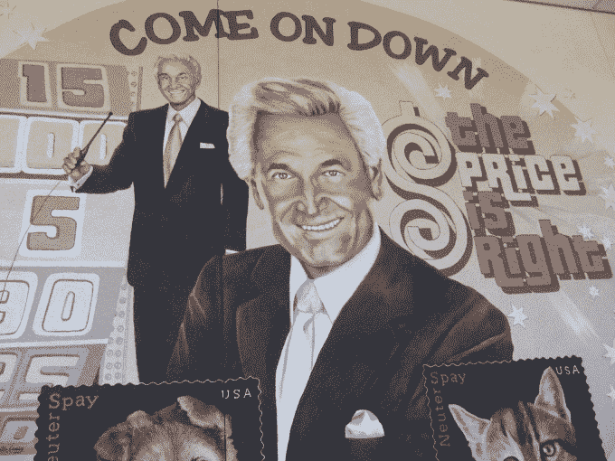

# 真的会有万物优步吗？

> 原文：<https://web.archive.org/web/https://techcrunch.com/2015/02/08/will-there-really-be-an-uber-for-everything/>

布莱恩·阿舍尔是

[Venrock](https://web.archive.org/web/20221206122635/https://www.venrock.com/)

在那里，他广泛投资于企业和金融科技，并在多家公司的董事会任职，包括 Personal Capital、6Sense、Socrates AI、Dynamic Signal、Retail Solutions、SmartBiz Loans 和 Inrix。

More posts by this contributor

**编者按:** *[布莱恩·阿谢尔](https://web.archive.org/web/20221206122635/http://www.venrock.com/teammember/brian-ascher/)于 1998 年作为考夫曼研究员加入文洛克，目前是文洛克帕洛阿尔托办事处的合伙人。*

虽然人们最近开始使用它们，但是我喜欢使用优步。

[从第一次](https://web.archive.org/web/20221206122635/http://blog.uber.com/2010/12/22/ubers-founding/)(确切地说是 2010 年 9 月 28 日)我看到小城市汽车图标在地图上爬行向我的小绿点时，我就知道出租车、机场汽车服务和旧金山市中心的停车场服务员将会很少看到我。

全球数千万骑行者非常喜欢这项服务，它已经成为了自己的动词。估值达到 400 亿美元，难怪将其他按需移动服务(ODMS)描述为“X 的优步”已经成为陈词滥调。任何可以被预订，或实际交付给你，或通过你的智能手机虚拟传输给你的离线服务，似乎都有一家或几家初创公司试图[成为那个特定垂直行业的优步](https://web.archive.org/web/20221206122635/http://schlaf.me/post/81679927670)。

其中一些将成为非常大和成功的全球互联网品牌，从他们创新的线下竞争对手那里夺取主要市场份额甚至更大的市场资本。然而，大多数公司将在更有限的范围内取得成功，仅在他们的行业中做出微小的让步，并服务于有限的地理市场。

我自己试图确定哪些市场和哪些公司将真正转型的框架很简单。从一项服务开始，在这项服务中，绝大多数顾客对现有的服务提供商非常不满意。对企业家和投资者来说幸运的是(但对消费者来说不幸的是)，许多服务部门面临着可用性、质量、透明度和定价方面的重大挑战。

然而，并不是所有的问题都同样痛苦。大多数人并不认为按摩或参加瑜伽班的后勤工作与家庭装修或试图私下出售旧车的痛苦和沮丧程度差不多。当询问一个人多久需要一次服务时，与一次性试用相比，频繁使用的服务更有可能成为习惯。比起偶尔的痛苦，我们更有动力去寻找日常痛苦的解决方案。

接下来，问问自己，按需移动服务如何利用智能手机技术、网络效应、规模经济、丰富的数据、众包和科技企业家武库中的其他工具，来构建真正让客户满意并在客户体验方面“弯曲曲线”的服务。

这显然是真正困难的部分。

一般来说，很难始终如一地提供优质服务，但有些服务天生就更具挑战性(如房屋或汽车维修，服务的本质是诊断和修复让消费者措手不及的特殊物理问题，导致最初的沮丧和财务担忧)。

尽管认为 ODMS 甚至可以修复最脆弱的服务行业是一种抱负，但往往最艰难行业的痛苦症状可能需要随着时间的推移逐步得到治疗。因此，它是典型的现有服务水平和重新定义的 ODMS 服务水平之间的总距离，而不是绝对范围内的起点或终点，这创造了创造真正伟大业务的机会。

*相对于线下的现有服务，按需移动服务如何创造愉悦？*

**即时性和可靠性**

大多数 ODMS 的要点是用智能手机作为你生活的遥控器，这样当你按下按钮时，你的 ODMS 的事情就需要发生，尽可能快和一致。优步利用司机和乘客之间的本地网络效应，并在[数据科学和人工智能模拟](https://web.archive.org/web/20221206122635/http://blog.uber.com/aisimulation)方面投入巨资，以确保乘客等待时间尽可能短，司机尽可能忙，以便他们能赚到最多的钱。如果没有短暂的等待时间，优步就不会是我们都喜欢的神奇体验。

另一个即时实现的例子是 [Doctor on Demand](https://web.archive.org/web/20221206122635/http://www.doctorondemand.com/) *，这是一项提供与委员会认证的医生进行即时智能手机视频访问的服务，这样您就不必等待几天或几周才能预约看医生，或者在下班后前往诊所或急诊室进行常规医疗需求。显然，如果你有严重的胸痛或大量出血，你不会按需使用医生，但有大量[不同的用例](https://web.archive.org/web/20221206122635/http://www.doctorondemand.com/when-to-use/)，你不需要与你的医生在同一个房间，并且立即预约的便利性(平均费用是办公室就诊的三分之一)是如此引人注目，以至于雇主们将 DoD 作为员工的[福利](https://web.archive.org/web/20221206122635/http://www.doctorondemand.com/telemedicine-solutions-for-employers)。

对于大多数无法虚拟交付的服务，如按需医生，逐个城市推出的行为既昂贵又耗时。它们需要在“实地”进行投资，以招募和培训工人，向新用户营销，并确保新城市的质量。

如果你通过革命性的服务突破做出改变，你可以获得更高的增长率；这吸引了资本，甚至使像优步或 Airbnb 这样的全球扩张战略成为可能。

对于许多只在逐步改善传统服务模式的 ODMS 来说，地理扩张可能会更加缓慢，最终可能会在地区或美国主要城市达到极限。这未必是一件坏事，因为许多持久的企业可以成为一个地区技术最先进的企业。

就我个人而言，我们仍然喜欢 PurpleTie 的干洗送货上门服务，这是一项由风险投资支持的努力，旨在通过在线全国干洗服务做大，但失败了，并被 bootstrapped 的 CleanSleeves 收购(显然他更喜欢 PurpleTie 的名字)。

15 年后，PurpleTie.com 只在圣马特奥和圣荷西之间的 T2 湾区运营，而且看起来生意不错。或许新一代提供干洗和洗衣服务的 ODMS 初创公司将比 CleanSleeves 走得更远。如果他们做到了，那将是因为他们发现了如何创造更多的客户愉悦，而不仅仅是移动应用程序下单和高效交付。我的妻子非常渴望尝试一下 [Wash.io](https://web.archive.org/web/20221206122635/http://www.wash.io/) ，但她是否会继续忠于他们而不是下一个更便宜的版本将取决于他们如何将相对商品化的服务类别转化为真正的差异化体验。

**质量**

服务企业如此难以建立，是因为它们依赖人与客户互动的程度不亚于或超过依赖计算机代码。管理人员，尤其是管理独立承包商而不是全职员工的队伍，比执行软件例程更具变数。招聘、选择、培训和管理员工是任何 ODMS 的核心要素。背景调查、执照验证、详细的申请和面对面的面试都是选拔过程的一部分。

大多数服务依赖于他们的客户对服务提供商进行评级，并倾向于无情地淘汰那些低于评级阈值的司机/医生/水管工等，这通常是一个相当高的标准。按需医生在每次虚拟轮班前检查每个医生的灯光、声音和外观。有些服务甚至对完成的工作提供满意保证，比如红色灯塔的 500 美元。

服务质量往往是个人喜好的问题。例如，在家庭清洁类服务中，像 Homejoy 这样的服务可能会让 90%的顾客满意，但当涉及到像干净的家这样主观的事情时，要取悦最挑剔的消费者将是一场无休止的艰苦战斗。质量不仅仅是没有问题，还包括那些意想不到的惊喜。

例如，当我们第一次开始这项服务时，好鸡蛋会出乎意料地免费赠送一两次美食。一旦我们成为回头客，免费赠品就停止了，但令人惊叹的质量、友好的服务和手写便条等个人关怀让我们变得忠诚。在提供始终如一的高水平服务方面，没有捷径可走，最终质量会决定一家企业的成败，不管他们是否拥有最好看的移动应用。

**价格**

在通过数字渠道、病毒式营销和高度可见的品牌获取客户和聚集需求方面，技术支持的服务通常远比传统企业更有效。这通常能够省去价值链中的层层中间商。此外，与线下同行的次规模店面和昂贵的主要街道位置相比，ODMS 可以依靠大型区域设施和更便宜的房地产进行实物商品加工。将这些节省的很大一部分传递给消费者，可能是最聪明的方式来产生试用，快速增长，并吸引客户使用你的服务。

[BloomThat](https://web.archive.org/web/20221206122635/https://www.bloomthat.com/) 是一家鲜花和礼物递送服务公司，它在管理他们的选择和提供当天递送方面做得非常好，但他们相对于 1-800-FLOWERS 的价格优势非常显著，以至于他们在客户中大幅增加了送礼物的频率，远远超过了传统的母亲节和情人节假期高峰。一些最聪明的定价计划仍然包括溢价和超溢价水平，如优步黑色或优步力士，用于真正对价格不敏感的细分市场，但大众市场几乎总是欣赏好的价值，特别是当被要求通过新媒体尝试全新的服务时。

从长远来看，人们希望在你的 ODMS 中有足够的技术被利用、规模经济和非中介化，成为你所在行业中利润更高、成本更低的提供商，而不仅仅是最愿意无限期补贴亏损的公司。

**支付**

走出你的 UberX 路边，不需要在你的钱包里摸索现金，也不需要等待你的信用卡通过移动销售点，这简直令人上瘾。

让像 [DoorDash](https://web.archive.org/web/20221206122635/http://www.doordash.com/) 或 [Seamless](https://web.archive.org/web/20221206122635/http://www.seamless.com/) 这样的服务送餐，而不需要和送披萨的人进行尴尬的眼对眼[小费程序](https://web.archive.org/web/20221206122635/http://tipthepizzaguy.com/)是很容易习惯的。客户只是希望轻松支付是这项服务的魅力之一，这项服务被重新定义为按需服务和移动服务。

好的一面是，这也解决了许多商业模式问题，包括你的员工处理现金或信用卡号码、赖账的客户，以及你的员工试图将你排除在他们向客户提供的附带交易之外。theODMS 的缺点是，对于低价交易，这些信用卡支付的交换费可能会对您的利润产生重大影响，而另一方面，某些需要现场评估的大额服务，如[家庭装修](https://web.archive.org/web/20221206122635/http://www.sweeten.com/)可能不容易进入支付流程。然而，随着时间的推移，我们将看到绝大多数 ODMS 在后台处理支付，作为消费者体验的一部分。

那么，每个服务行业都会有一个优步吗？将会有一些，但不是很多全球性的，占主导地位的，极具价值的标志性品牌。一些行业对于我们的日常生活来说并不重要和/或不够频繁，或者今天存在的情况并不令人愉快，而其他行业面临的服务挑战从根本上来说很难解决，因此我们需要很长时间才能看到 ODMS 真正解决这些问题。

就像 20 世纪 90 年代末的 B2B 市场热潮一样，我们将看到消费者服务领域的大量实验。我们还将看到传统的线下服务企业被迫升级游戏，变得更加技术复杂。因此，虽然可能只有少数几个优步规模的赢家，但会有许多较小的 ODMS 获得一定程度的成功，而最大的赢家将是消费者自己。

**目前或以前的 Venrock 投资*