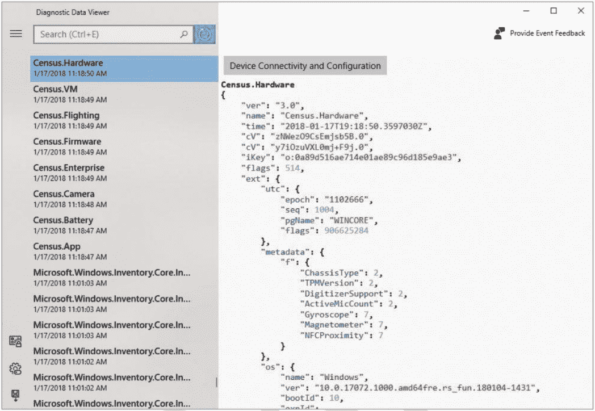

# Windows 10 现在可以向您显示它发送回 Microsoft  的所有数据

> 原文：<https://web.archive.org/web/https://techcrunch.com/2018/01/24/windows-10-can-now-show-you-the-telemetry-data-its-sending-back-to-microsoft/>

# Windows 10 现在可以向您显示它发送回微软的所有数据

微软及其合作伙伴的工程师使用来自 Windows 10 的遥测数据来诊断崩溃，了解其用户的硬件配置等。默认情况下它是打开的，虽然微软告诉你它收集这些数据，并让你在基本(默认设置)和“完整”诊断之间进行选择，但它从来不允许你实际看到什么被发送回 Redmond。不过，现在这种情况正在改变。 [Windows 10 内部人员](https://web.archive.org/web/20230311081128/https://insider.windows.com/en-us/)将很快能够从微软商店安装一个新程序，即“Windows 诊断数据查看器”，让他们能够完全访问 Windows 设备上的所有诊断数据。

正如微软 Windows 和设备部门的隐私官玛丽莎·罗杰斯(Marisa Rogers)告诉我的那样，这里的想法是让用户可以选择看到“微软的下一层透明度”，并允许他们验证该公司正在做它的文档所说的事情。用户可以下载这个免费的工具，而不需要一个微软帐户。

【T2

当然，微软自己很早就有了在内部查看这些数据的工具，但是 Data Viewer 工具将一个用户友好的界面放在了这些数据之上。

你希望看到什么样的数据？以下是微软的列表:

*   常见数据，如操作系统的名称、版本、设备 ID、设备类别、
    诊断级别选择等等。
*   设备连接和配置，如设备属性和功能、首选项和设置、外围设备和设备网络信息。
*   显示设备健康状况、性能和可靠性数据、设备上的电影消费功能以及设备文件查询的产品和服务性能数据。值得注意的是，该功能并不是为了捕捉用户的观看或收听习惯。
*   产品和服务使用数据包括有关设备、操作系统、应用程序和服务使用情况的详细信息。
*   软件设置和清单，如已安装的应用程序和安装历史记录、设备更新信息。

虽然微软希望这个工具能够让用户验证和核实它一直告诉他们的东西，但对于一些人来说，微软在默认情况下收集这些数据可能仍然会感到震惊，即使这只是关于他们设备的技术数据。罗杰斯说:“我希望人们已经注意到我们在过去几个月里提供的信息。”但是在微软爱好者的世界之外，很少有人完全了解这个遥测程序，所以观察人们的反应会很有趣。

除了这一新工具，微软还推出了一个对其隐私仪表板的小更新。在这里，当你在 Bing 上搜索、与 Cortana 对话以及使用其他微软服务时，如果你是一个经过认证的用户，该公司将提供一个类似新闻供稿的视图，显示它收集的所有数据。到目前为止，这些数据被组织成不同的类别，很难快速了解该公司跟踪的活动。新的所谓“活动历史”视图使这变得容易多了。