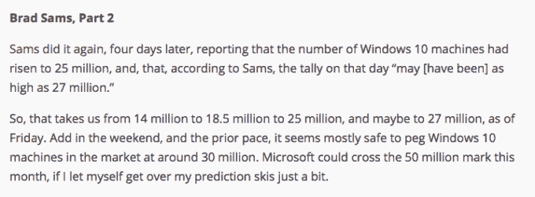

# Windows 10 现在运行在 7500 万台设备上 

> 原文：<https://web.archive.org/web/https://techcrunch.com/2015/08/26/windows-10-now-runs-on-75-million-devices/>

# Windows 10 现在运行在 7500 万台设备上

微软距离其在未来几年内运行 Windows 10 的设备达到 10 亿台的目标还有 7.5%。今天软件巨头[宣布](https://web.archive.org/web/20221208094857/https://twitter.com/yusuf_i_mehdi/status/636525672475693056?ref_src=twsrc%5Etfw)其最新的操作系统 Windows 10 正在 7500 万台机器上运行。

该公司还在 tweet storm 上发表了一份有趣的声明，该声明因其条目编号两次而闻名，内容如下:

这两个数字是微软对开发者的宣传:Windows 10 正在扩大市场份额，该代码的用户正在下载更多的应用程序。或者更简单地说，逻辑似乎是，你越早为 Windows 10 开发产品，你就能越早进入一个不断增长的、积极参与的用户群。

我怀疑 Windows 10 的早期用户比普通 PC 用户更懂技术，所以在操作系统生命周期的早期看到更高的人均应用下载率并不奇怪。然而，从某种意义上来说，我们注意到的比率可能与隐含的差异相差甚远，足以让我们适度乐观。这是你的电话。

尽管如此，我还是想在我们走之前开自己的玩笑。这个月早些时候，我和我的同事罗恩·米勒写了一篇关于 Windows 10 的文章。以下摘自那篇文章:

我太保守了。我认为我已经受到了足够的惩罚。

在 Windows 10 发布之前，我们就知道微软不能*也不能*发布 Windows 10 下载和参与人数。你可以根据今天的新闻来下自己的赌注。不到一个月 7500 万是一个绰绰有余的开始，但我没有每天激活的数据，所以我不能说 Windows 10 生态系统在一年内会是什么样子。