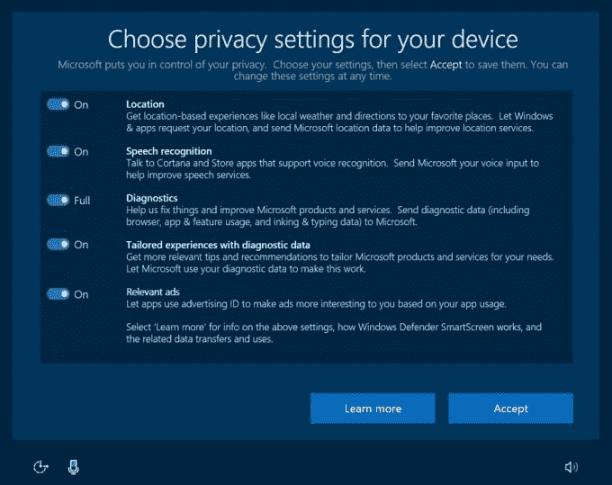

# Windows 10 隐私设置仍令欧洲监管机构担忧 

> 原文：<https://web.archive.org/web/https://techcrunch.com/2017/02/21/windows-10-privacy-settings-still-worrying-european-watchdogs/>

欧盟数据保护当局继续对微软的 Windows 10 操作系统存在隐私相关的担忧，尽管该公司在去年提出批评和担忧后，对该操作系统的用户隐私设置进行了一些调整。

人们关注的焦点是 Windows 10 默认收集的数据量，以及微软是否获得了用户的完全知情同意来收集和处理他们的数据。

上个月，Redmond 调整了 Windows 10 的设置，声称它“简化了诊断数据级别，并进一步减少了在基础级别收集的数据”。

该操作系统的现有用户将通过平台的未来更新获得新的隐私设置结构(如下图): [Windows 10 创建者更新](https://web.archive.org/web/20221207113143/https://blogs.windows.com/windowsexperience/2016/10/26/empowering-a-new-wave-of-creativity-with-the-windows-10-creators-update-and-surface-studio/#ZSkqIsxV0KZk1S6J.97)。

【T2

然而，在上个月发给微软的一封信中(昨天发表在 WP 29 的网站上)，在该公司发表关于这些变化的博客两天后，欧盟数据保护监督组织表示，它仍然对微软如何收集和处理用户的个人数据感到“严重关切”。

该组织继续要求微软提供更多信息。它写道:

> 工作小组非常关注微软在 Windows 10 操作系统中收集和进一步处理的一些个人数据，特别是默认设置或明显缺乏对用户的控制，以防止收集或进一步处理此类数据。
> 
> 因此，工作小组特别要求作为该个人数据的数据控制者的微软提供进一步的解释信息，说明在安装 Windows 10 操作系统期间出现的退出、默认设置和其他可用控制机制如何为根据数据保护指令 95/46/EC 处理个人数据提供有效的法律依据。
> 
> 当微软将同意作为处理个人数据的法律依据时，这一点尤其令人担忧。工作组此前发布了关于同意的定义的第 15/2011 号意见，强调同意必须是完全知情、自愿和具体的，才被视为有效。

[Windows 10 于 2015 年 7 月推出](https://web.archive.org/web/20221207113143/https://beta.techcrunch.com/2015/07/28/the-windows-10-era-is-now/)，而[几乎立即](https://web.archive.org/web/20221207113143/https://www.theguardian.com/technology/2015/jul/31/windows-10-microsoft-faces-criticism-over-privacy-default-settings)因使用默认设置收集大量用户数据而受到批评，如网页浏览历史和 wi-fi 网络名称和密码——目的包括在用户浏览网页时显示个性化广告，甚至是内置纸牌游戏中显示的广告。

用户数据也被用于训练微软的 Cortana 数字助理——该公司在推出 Windows 10 时将其带给了桌面用户。

虽然用户可以选择退出数据收集，但这样做的过程被批评为复杂和不透明——显然包括 45 页的隐私政策文件，选择退出设置分布在 13 个不同的屏幕上，并位于一个外部网站上。

欧洲数字版权组织总结了他们当时的观点:

> ……可以说，微软基本上授予自己非常广泛的权利来收集您在您的设备上做的、说的和写的一切，以便销售更有针对性的广告或向第三方出售您的数据。该公司似乎是在授予自己分享你的数据的权利，无论是在你同意的情况下还是在必要的时候。

对这些显然不太注重隐私的默认设置的批评，引起了欧盟数据保护监督组织“第 29 条工作组”(Article 29 Working Party)的注意，随后几个国家的数据保护机构展开了调查，其中包括法国的 CNIL，该机构去年夏天下令该公司停止过度收集数据。

CNIL 指控微软的[违规行为包括:数据比例要求；未能获得数据传输通知；违反 cookie 法律要求；对个人数据的安全保护不足；未能提交授权请求以防止欺诈为目的处理个人数据；以及违反跨境数据传输限制，继【2015 年 10 月宣布安全港框架](https://web.archive.org/web/20221207113143/https://www.huntonprivacyblog.com/2016/07/26/cnil-serves-formal-notice-to-microsoft-to-comply-with-french-data-protection-law/)(CNIL 称微软的隐私声明中仍提及该框架)无效之后。

微软向 CNIL 提交回复的最后期限是上个月底，DPA 的一位女发言人告诉 TechCrunch，目前正在分析该公司的回应。如果发现微软不合规，监管机构有权对其进行罚款。法国立法者最近加强了其征收罚款的能力——因此它现在可以对违反国内隐私法的行为处以高达 300 万€的罚款。

即将出台的欧盟[通用数据保护条例](https://web.archive.org/web/20221207113143/https://beta.techcrunch.com/2015/12/16/gdpr-agreed/)——将于 2018 年 5 月在整个地区生效——也增加了对违反欧盟数据保护法的公司的潜在处罚，被发现违规的企业将被处以高达年营业额 4%的罚款。

在发给 TechCrunch 的一份关于对 Windows 10 数据收集和处理的持续担忧的电子邮件声明中，微软发言人表示:“我们正在认真听取第 29 条工作小组成员的意见，我们将继续与工作小组和国家数据保护机构合作。我们 1 月[发布的 Windows 10 隐私设置变更](https://web.archive.org/web/20221207113143/https://na01.safelinks.protection.outlook.com/?url=https%3A%2F%2Fblogs.windows.com%2Fwindowsexperience%2F2017%2F01%2F10%2Fcontinuing-commitment-privacy-windows-10%2F%23eESAvXqVXkW8TBqT.97&data=02%7C01%7Crobink%40064d.mgd.microsoft.com%7Cdd322dd7ea904fad761308d45689f1f1%7C72f988bf86f141af91ab2d7cd011db47%7C1%7C0%7C636228597856704890&sdata=Ygqds3zy1lvtYzQltaO0%2BqX1JxjKFRmoMeC1itRuoek%3D&reserved=0)反映了我们对保护用户个人数据的承诺。"

在调整 Windows 10 设置以应对隐私问题的同时，该公司推出了一个基于[网络的隐私仪表板](https://web.archive.org/web/20221207113143/https://account.microsoft.com/privacy/about?refd=blogs.windows.com)，供微软账户用户查看和修改与几项不同微软服务的数据收集相关的隐私设置，包括位置、搜索、浏览和 Cortana Notebook。

最近几个月，共享用户数据的知情同意问题也导致脸书和 WhatsApp 与欧洲监管机构发生冲突。去年[11 月](https://web.archive.org/web/20221207113143/https://beta.techcrunch.com/2016/11/08/facebook-whatsapp-data-sharing-now-on-pause-in-uk-at-regulators-request/)两家公司被迫暂停数据共享，此前他们修改了 WhatsApp 的隐私政策，迫使用户同意与该即时通讯应用的母公司共享数据，比如他们的手机号码。在这种情况下，用户只能选择部分退出——选择退出数据共享的窗口在他们接受应用程序的更新条款 30 天后关闭。