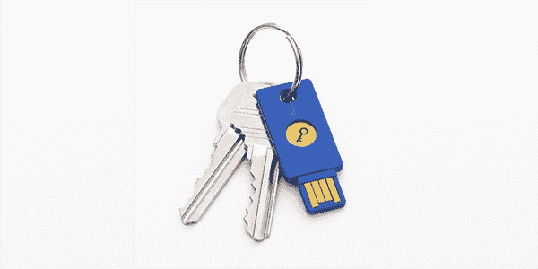

# Windows 10 将很快通过 Yubico 的安全密钥 实现无密码登录

> 原文：<https://web.archive.org/web/https://techcrunch.com/2018/04/16/windows-10-will-soon-get-passwordless-logins-with-yubicos-security-key/>

# Windows 10 将很快获得使用 Yubico 安全密钥的无密码登录

上周， [Yubico](https://web.archive.org/web/20230403113117/https://www.yubico.com/) ，流行的 YubiKey USB 认证加密狗背后的公司，[宣布](https://web.archive.org/web/20230403113117/https://www.yubico.com/2018/04/new-security-key-fido2/)推出其 20 美元[安全密钥](https://web.archive.org/web/20230403113117/https://www.yubico.com/product/security-key-by-yubico/)，支持 [FIDO2/WebAuthn 标准](https://web.archive.org/web/20230403113117/https://techcrunch.com/2018/04/10/fido-alliance-and-w3c-have-a-plan-to-kill-the-password/)。幸运的话，FIDO2 可能预示着密码的终结，正如该公司今天宣布的那样，微软正在通过宣布即将为 Windows 10 和 Azure Active Directory 用户提供 Yubico 安全密钥支持来支持这一点。

这一新功能目前处于有限的预览阶段，仅面向 Windows 技术采用计划用户。对 FIDO2 无密码登录的更广泛支持将在下一次 Windows 10 更新中推出。不过，这一天何时到来仍然是个谜。一旦成功，你就可以登录到由 Azure Active Directory 管理的设备，而无需输入密码。

“微软使用 Yubico 的安全密钥实现 FIDO2 只是一个无密码世界的开始；Yubico 的首席执行官和创始人 Stina ehrensvrd 在今天的声明中说:“这项技术可以把我们带往无限的地方。“对于个人和组织来说，密码一直是一个古老的难题，现在，我们开发了一个统一的开放标准，最终可以大规模解决这个问题。”

目前，这里的重点主要是企业用户。值得注意的是，微软已经提供了一种无需密码即可进入 Windows 10 的解决方案，这要归功于 [Windows Hello](https://web.archive.org/web/20230403113117/https://support.microsoft.com/en-us/help/17215/windows-10-what-is-hello) ，它使用面部识别、虹膜扫描仪或 Windows 机器上的指纹读取器来登录。

在今天的声明之前，Yubico 还推出了其[开发者计划](https://web.archive.org/web/20230403113117/https://www.yubico.com/why-yubico/for-developers/developer-program/)，面向那些希望实现对其 FIDO2 和其密钥支持的 U2F 等其他协议的支持的公司。