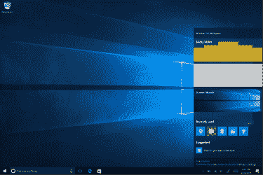
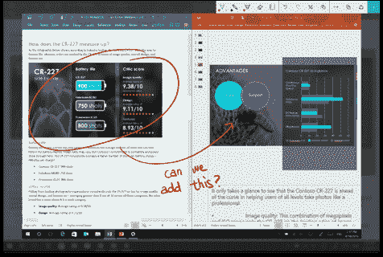
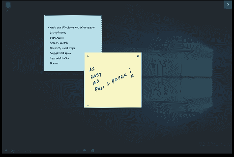
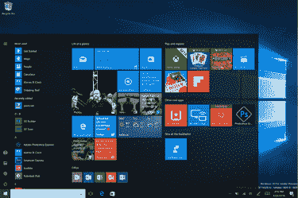
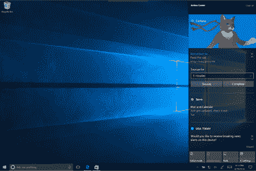

# Windows Ink、Cortana 改进和更多功能将在最新的 Windows 10 版本中推出 

> 原文：<https://web.archive.org/web/https://techcrunch.com/2016/04/22/windows-ink-cortana-improvements-and-more-arrive-in-the-latest-windows-10-build-out-now/>

对于那些测试 Windows 10 操作系统最新版本的人来说，这将是一个好周五，因为[微软今天推出了其 PC 和移动操作系统的新版本](https://web.archive.org/web/20221210032707/https://blogs.windows.com/windowsexperience/2016/04/22/announcing-windows-10-insider-preview-build-14328-for-pc-and-mobile/)，这将允许用户首次尝试新发布的 Windows Ink 体验。上个月在 Build 2016 活动上宣布的【Windows Ink 为 Windows 10 PCs 提供了改进的笔支持，包括创建便笺、在白板和素描本上绘图、在 Microsoft Edge、地图等网页上批注和绘图的能力。它还与 Office 集成在一起。

通过此次更新，那些使用 Surface Pro 4 或 Surface Book 等带活动笔的设备的人将能够使用[新的 Windows Ink 工作区](https://web.archive.org/web/20221210032707/https://blogs.windows.com/windowsexperience/2016/04/22/a-closer-look-at-windows-ink/)，该工作区现在将默认启用。微软解释说，这可以在任务栏的通知区域访问，但只有当你有一个与你的设备配对的活动笔时。(如果您有兴趣，也可以通过右键单击任务栏来手动启用它。)

在工作区，你可以在空白画布上画出草图和想法，拉起一把数字尺来画直线，然后保存并分享你的作品。

新的屏幕草图功能允许您在桌面的屏幕截图上绘图，这非常适合在文档或照片上进行协作。有了这个功能，你可以绘制、裁剪和标记图像，然后与他人分享。

今天到来的还有一个新的便签体验，你可以自定义大小和颜色，然后保存。但微软表示，由于与 Cortana 和 Bing 的集成，这些笔记将很快变得更加智能。

在不久的将来，你将能够写下电话号码，然后准备好打电话，将项目变成清单，写下航班号，然后从 Bing 等获得航班信息的更新。

最后，工作区将显示一个“Get Pen Apps”链接，因此您可以更容易地找到哪些应用程序是支持笔的。(你可能还记得，[来自 Build](https://web.archive.org/web/20221210032707/https://beta.techcrunch.com/2016/03/30/microsoft-is-bringing-improved-pen-support-to-windows-10/) 的重大消息是，微软允许任何开发者通过添加两行代码来启用他们的应用。)

Windows Ink 将是今天推出的一系列新功能中的亮点，但它远不是唯一的亮点。

## 其他变化

新版本还引入了更新的开始体验、Cortana 和搜索改进、对操作中心和通知的更改、对任务栏和设置应用程序的更新、锁屏改进等等。在引擎盖下，该版本还将为可以在“连接待机”模式下运行的计算机提供电池改进。

**开始**

在这些变化中，最值得注意的是 Start 体验的新的可视化布局，现在可以看到“最常用的”应用程序列表和所有应用程序列表合并到一个视图中，并移动到用户界面的顶部。微软表示，这将减少滚动和点击。

它还围绕其他关键功能移动，包括电源、设置和文件资源管理器，因此它也可以在开始菜单中看到。

这里的几个其他调整包括对最近添加的部分的更改，以显示三个条目而不是一个，以及扩展它的方法；与此同时，您配置在这里显示的其他文件夹现在将在开始时立即可用，而不是需要您打开汉堡菜单才能访问它们。

该公司指出，平板电脑用户也会很高兴地知道，全屏所有应用程序列表在这个版本中又回来了，这是一个受欢迎的要求。还有许多其他针对平板电脑的调整。你可以在微软博客上找到详细信息[。](https://web.archive.org/web/20221210032707/https://blogs.windows.com/windowsexperience/2016/04/22/announcing-windows-10-insider-preview-build-14328-for-pc-and-mobile/)

**Cortana**

此外，这个 build 现在将微软的虚拟助手 Cortana 放在了锁屏上，这意味着你可以与她交谈并问问题(例如，交通怎么样，我的日程安排如何，提醒我…)等。)而无需解锁您的设备。

锁定屏幕还将提供对您的媒体控制的访问，出于隐私原因，它将不再显示您的电子邮件地址。

此外，微软表示，Cortana 现在对新用户来说更容易试用。

你可以马上开始使用 Cortana 来问她问题、执行网络搜索、让她给你讲笑话或在你的设备上查找文档，而不必运行设置或登录。这项 onboarding 改进将让用户体验一下 Cortana，他们可以在以后通过登录来选择改进和个性化。

Cortana 提醒也变得更容易了，跨设备功能(比如打电话，跨设备共享地图)现在应该可以在这个版本中正常工作了。您可以在 OneDrive 中搜索云中的文件，而不仅仅是设备上的文件。

**还有更**

剩下的许多变化都是对用户界面的视觉调整或调整，比如在操作中心引入 Cortana 通知，或者添加、重新定位或更改图标和菜单项。一些操作也进行了更新，例如 Wi-Fi 快速操作不再关闭 Wi-Fi，而是带您查看可用的网络。Windows 博客上有完整的列表。

与其他版本一样，这个内部预览版(14328)可供数百万选择在更广泛的版本发布之前测试该操作系统的用户使用。然而，微软提醒用户，早期访问也意味着这些构建有缺陷——这一个有很多“粗糙的边缘”，它说。这就是为什么这一个是推出给那些在“快”环。该公司表示，如果你想避免这些问题，就换成“慢”铃声。