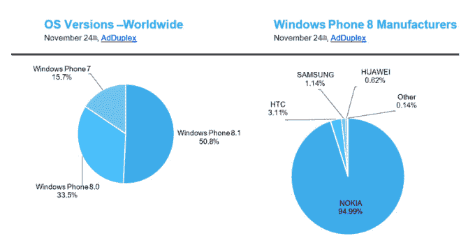

# Windows Phone 8.1 终于突破 50%的市场份额门槛 

> 原文：<https://web.archive.org/web/https://techcrunch.com/2014/11/27/windows-phone-8-1-finally-breaks-the-50-market-share-threshold/>

# Windows Phone 8.1 终于突破了 50%的市场份额门槛

11 月份，Windows Phone 8.1 占所有 Windows Phone 使用量的 50%以上。它在 10 月份以 46.7%的市场份额收盘。

其前身 Windows Phone 8 仍然控制着 33.5%的 Windows Phone 用户群。随着越来越多的运营商更新最初销售的 Windows Phone 平台早期版本的手机，这一数量将会下降。

下面是图表【数据:[ad duplex 11 月预告](https://web.archive.org/web/20221209160007/http://blog.adduplex.com/)。Via: [Neowin](https://web.archive.org/web/20221209160007/http://www.neowin.net/news/adduplex-report-lumia-630-is-winning-and-three-new-lumias-show-up) :

在上述数据中值得注意的是，微软控制了 95%的市场。微软希望其总销售额上升，同时降低其在 Windows Phone 市场的份额。微软会更乐意销售两倍的手机，占 80%的市场份额，而不是多卖几部，控制 95%的市场份额——第三方 OEM 支持对 Windows Phone 的长期健康至关重要。那不是猜想。如果该公司不想看到一个更加多样化的平台制造商基础，它就不会努力扩大 OEM 对 Windows Phone 的接受。

与此同时，对于我们这些书呆子来说，95%的数字——以及它在 12 月份可能仅有的微小变化——意味着我们将能够快速估计当前日历第四季度(微软的第二财季)售出的 Windows Phone 手机总数。微软的个人市场份额越大，从其原始报告的单位销量推断整个市场的规模就越简单。

展望未来，HTC 能否在 2015 年上半年将自己的 Windows Phone 市场份额扩大到 5%将是一件有趣的事情。已经完成了 62%。或者，如果另一家原始设备制造商能够抢占先机并取得胜利。我们走着瞧。

现在，停止阅读博客文章，去拥抱你爱的人。