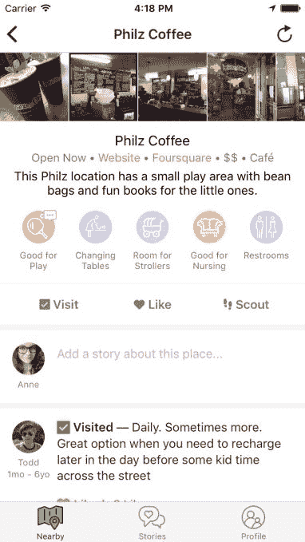
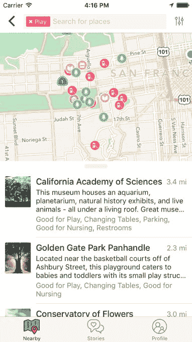

# Winnie 帮助父母寻找适合家庭的地方，分享他们的经验 

> 原文：<https://web.archive.org/web/https://techcrunch.com/2016/06/09/winnie-helps-parents-find-family-friendly-places-share-their-experiences/>

一个名为 [Winnie](https://web.archive.org/web/20221210015450/https://winnielabs.com/) 的新移动应用程序今天发布，通过提供附近适合孩子的地方的信息，以及详细说明一个地方可能为家庭提供的设施，如婴儿车通道、安静的哺乳区、换衣桌、洗手间等，让父母的生活变得更轻松。这个想法是为了让你和你的小家伙们外出时压力更小，无论你只是在镇上跑腿还是去一个新的城市旅行。

如今，这种对父母有用的信息不是以结构化的方式收集的。当然，你可能会在 Yelp 评论或谷歌商业列表的评论中找到细节，但你必须通读每一条，才能知道是否有人提到你感兴趣的具体信息——例如，餐厅的浴室是否有换衣桌。

(我个人回忆起一个特别有趣的 T2 之夜，当时我发现自己跪在浴室的地板上，试图在女儿离开垫子之前给她换尿布。那时温妮当然可以帮忙！)

这家初创公司的联合创始人是首席执行官萨拉·莫斯科普夫(Sara Mauskopf)，她曾在包括 Postmates、Twitter、YouTube 和谷歌在内的公司从事消费技术和产品管理工作；与安妮·k·哈尔萨尔一起，CPO 是一名产品设计师和开发人员，也在 Postmates 和谷歌以及 Quora 和 Inkling 工作过。

两位创始人本身都是父母，他们出于自己的个人需求开发了这款应用。

顺便说一下，这就是为什么我们需要多样化的工程师来创建科技公司——20 岁刚从大学毕业的年轻人可能不会创建像 Winnie 这样的应用程序。

正如 Mauskopf 在一篇介绍 Winnie 的博客文章中解释的那样，“……有了孩子改变了我看待周围世界的方式。我害怕去任何地方，因为我不知道他们是否有合适的设施让我照顾我的女儿，或者我们在那里是否受欢迎，”她说。

任何带着新生儿呆在家里的人——以及随之而来的压力——都会有同感。

两位创始人联手，于 2016 年初创建了 Winnie。直到今天，这款应用一直在旧金山进行私人测试，大约有 400 名测试者。

在发布时，Winnie 提供了全国 100，000 多个地点的信息。

它帮助你发现带孩子玩耍的地方，比如公园、游乐场和图书馆；列出家庭友好型餐厅，提供诸如换衣桌、儿童菜单和高脚椅等服务；此外，它还能帮助你找到最近的浴室、换衣桌或哺乳场所等。

莫斯科普夫说，这些数据来自多种来源。“元数据”的位置(例如，改变表格等。)已经被手动输入，并且来自实际呼叫和研究地点的团队本身。与此同时，其他数据来自众包。

家长可以在应用程序中留下评论和建议，也就是“故事”另外，他们可以在 Winnie 中“搜索”他们想要包含的地方。

故事将允许父母将他们的个人经历与一个地方联系起来，无论是好的还是坏的，这使该应用程序具有“Yelp for parents”般的吸引力。

[gallery ids="1334340，1334339，1334338，1334337，1334336"]

然而，在某种程度上，温妮似乎对初为人父母者最有用。

第一次做父母的人常常害怕带着他们的宝宝去探索世界，温妮可以让他们放心，离开家是没问题的。但是，即使是那些孩子已经摆脱了尿布和厕所紧急状态的人也可能会发现这个应用程序很有用，因为它可以帮助你找到你可能不知道的带孩子去你所在城镇的有趣地方。

当然，像当今应用商店中推出的任何社交应用一样，Winnie 需要达到临界质量，才能真正对广阔的市场有用。

Winnie 是 iTunes 应用程序商店上的免费下载，而且在很大程度上，随着时间的推移，将保持免费。

“目前这款应用是免费的，我们的首要任务是开发一些对父母真正有用的东西，”莫斯科普夫指出。她表示:“未来，我们将从产品的某些方面赚钱，但核心产品将永远是免费的。”。

[Winnie](https://web.archive.org/web/20221210015450/https://winnielabs.com/) 是一个四人团队，仅有少量“种子前期”资金支持。