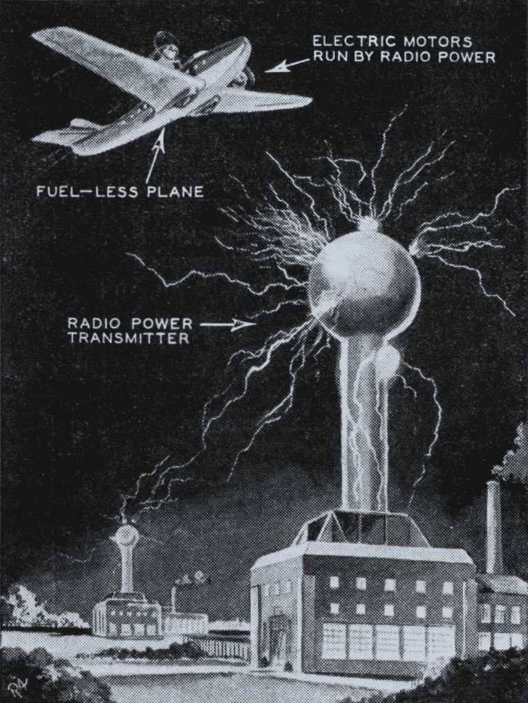

# 无线电源和电池寿命焦虑

> 原文：<https://web.archive.org/web/https://techcrunch.com/2015/07/07/wireless-power-and-battery-life-anxiety/>

多克托尔·古森撰稿人

多克托尔·古森是

[Doblet](https://web.archive.org/web/20230316161016/https://www.doblet.com/)

.

张信哲是的 CTO

[Doblet](https://web.archive.org/web/20230316161016/https://www.doblet.com/)

.

电池寿命是移动技术领域最令人头疼的问题之一。事实上，智能手机用户一直将电池续航时间视为头号抱怨。消费者想要[更好的电池，而不是可穿戴设备](https://web.archive.org/web/20230316161016/http://t.signauxhuit.com/e1t/c/5/f18dQhb0S7lC8dDMPbW2n0x6l2B9nMJW7t5XZs5v_LJ4W7gsh4l6443-FW2z8P1C56dB9sf6FKgpP02?t=http%3A%2F%2Ffortune.com%2F2015%2F01%2F07%2Fwhat-do-consumers-want-better-batteries-not-wearables%2F&si=5910137715294208&pi=7d28504c-78f2-4906-ba02-9c1faca307ca)。因此，苹果最近的声明并不令人惊讶:iOS 9 将有一个低功耗模式，这可以提供额外的三个小时的电池寿命。

但这并不能解决续航问题。为什么？移动应用和操作系统的功耗持续上升，超过了电池容量的逐步改善。自 2007 年第一代 iPhone 以来，以 iPhone 待机时间[衡量的净电池寿命一直保持平稳](https://web.archive.org/web/20230316161016/http://t.signauxhuit.com/e1t/c/5/f18dQhb0S7lC8dDMPbW2n0x6l2B9nMJW7t5XZs5v_LJ4W7gsh4l6443-FW2z8P1C56dB9sf6FKgpP02?t=http%3A%2F%2Fwww.huffingtonpost.com%2F2015%2F02%2F19%2Fiphone-battery-life_n_6705328.html&si=5910137715294208&pi=7d28504c-78f2-4906-ba02-9c1faca307ca)，你会注意到，我们大多数人给手机充电的频率比我们第一部智能手机时更高。据我们所知，在可预见的未来，这种趋势将在所有手机平台上持续。

我们看更多的视频，玩游戏，听播客，允许多个应用程序跟踪我们的位置，使用蓝牙配件和可穿戴设备，并同时打开几十个应用程序——所有这些行为都会消耗更多的电力。

我们手机的锂离子电池通常只能充电 300-500 次，并随着年龄的增长而失去容量。为电池充电是整个移动生态系统的关键:从供应商和制造商，一直到应用程序开发者和移动商务初创公司。

这就是无线电源的用武之地。

制造商感受到了需求。到 2020 年，无线电力发射器和接收器的全球收入预计将超过 120 亿美元，高于去年的 7.5 亿美元。无线电力的范围远远超出了智能手机——它包括我们即将添加到我们世界中的每一项便携式或嵌入式技术。

无线信号将管理数据和电源，连接思科预计在物联网(IoT)中的 500 亿个设备。在今年的 CES 上，思科首席执行官约翰·钱伯斯预测，5 年内万物互联(IoE)的市场规模将达到 19 万亿美元。市场研究公司 Gartner 预计将有 3000 亿美元的服务市场来支撑 IoE 的繁荣。

> 当技术最终好到可以摆脱阻碍的时候，那就是它开始让人们的生活变得更好的时候。

但是无线电力是一个宽泛的术语，涵盖了一系列技术——这很大程度上取决于*哪里有可用的*和*它实际工作得如何。目前，我们正在努力解决这两个问题，因为只有两种相同的电感耦合技术在商业上可用，手机的实际充电范围可达 4 英寸。*

从长远来看，我们都希望在咖啡馆、餐厅、酒吧、酒店、办公室、机场、健身房、体育场，甚至是优步和 Lyft 的汽车和公共公园中持续无线充电。永远不要停下一天的工作来再次“充电”——无论您走到哪里，您的设备都会自动充电。

问题是:我们如何以及何时从这里到达那里？需要哪种技术组合？(*例如，目前正在开发的技术没有一项能够成功地为大型户外空间供电*)。

让我们来看看无线充电技术的现状，包括哪些技术可能会在未来几年内实现。有许多技术、监管和营销方面的挑战需要克服。但有希望的是，我们将在未来 10-15 年内淘汰电源线和电池充电盒。

## 电感耦合

自 19 世纪以来，感应电能传输就一直存在。1892 年，它首次获得了为铁路列车无线供电的专利，今天它也是为电动牙刷供电的技术。无线电源联盟(WPC)成立于 2008 年，其 [Qi](https://web.archive.org/web/20230316161016/http://t.signauxhuit.com/e1t/c/5/f18dQhb0S7lC8dDMPbW2n0x6l2B9nMJW7t5XZs5v_LJ4W7gsh4l6443-FW2z8P1C56dB9sf6FKgpP02?t=http%3A%2F%2Fwww.wirelesspowerconsortium.com%2F&si=5910137715294208&pi=7d28504c-78f2-4906-ba02-9c1faca307ca) 感应电源标准，至今仍是制造商中最受欢迎的充电线圈。

LG、HTC、和索尼等品牌的手机都内置了 Qi 线圈。[宜家](https://web.archive.org/web/20230316161016/http://t.signauxhuit.com/e1t/c/5/f18dQhb0S7lC8dDMPbW2n0x6l2B9nMJW7t5XZs5v_LJ4W7gsh4l6443-FW2z8P1C56dB9sf6FKgpP02?t=http%3A%2F%2Fwww.today.com%2Fhome%2Ftoss-cords-ikea-creating-furniture-charges-your-devices-t6136&si=5910137715294208&pi=7d28504c-78f2-4906-ba02-9c1faca307ca)最近发布了内置 Qi 线圈的全系列家具。从历史上看，Qi 基于简单的电感耦合，这意味着它的范围非常小。就像电动牙刷一样，手机的线圈必须直接放在充电线圈上才能工作。进步依赖于*磁共振*，这是最典型的紧密耦合线圈的方式。这允许在更远的距离上高效的功率传输。

[Powermat](https://web.archive.org/web/20230316161016/http://t.signauxhuit.com/e1t/c/5/f18dQhb0S7lC8dDMPbW2n0x6l2B9nMJW7t5XZs5v_LJ4W7gsh4l6443-FW2z8P1C56dB9sf6FKgpP02?t=http%3A%2F%2Fpowermat.com%2F&si=5910137715294208&pi=7d28504c-78f2-4906-ba02-9c1faca307ca) 成立于 2006 年，是最早将电感耦合用于手机的无线充电初创公司之一。它在 2009 年推出了第一批产品，并在 2012 年与 P & G 成立了权力事务联盟(PMA ),星巴克和 AT & T 也是该联盟的董事会成员。

9 年后，Powermat 在美国和伦敦的数百家星巴克推出了线圈加密狗。但是软件狗必须在充电圈上近乎完美地对齐(在 1 厘米以内)，而且每个场馆的安装成本仍然相当高。实际上，电话还不如用电缆插上。事实上，如果它们只是插上电源，在充电时使用手机和通话会容易得多。

这个领域的另一家早期创业公司是成立于 2007 年的 WiTricity。它是由麻省理工学院从一种先进的谐振电感耦合中分离出来的，范围可达 8 英尺，尽管这一距离已被证明很难商业化。

WiTricity 可以在 1-2 英尺的范围内为电动汽车无线充电，使用足够大的线圈；这是目前推向市场。最近的演示还在 2-4 英寸的距离为手机充电。

然而，如果我们想在 4 英尺的理想范围内(比如说，手机离地面的典型距离)为手机自动充电，就需要在脚下嵌入无数 1 英尺长的线圈，并在手机内嵌入更小的线圈。我们会看到超过 95%的能量损失，安装费用将是天文数字。这很难成为持续充电的解决方案，尽管随着 R&D 时间的延长，效率会逐渐提高。

2013 年，WiTricity 加入了一个竞争标准，Alliance 4 Wireless Power (A4WP)，其成员包括高通和三星。PMA 和 A4WP 在 2014 年合并了标准，采用了 A4WP 的谐振标准和 PMA 的开放网络 API。这两个标准组织在今年早些时候完全合并。

在过去的三年中，Qi 也开始采用谐振电感耦合模式，尽管这取决于制造商是否采用他们认为合适的方式。首款双模 PMA/Qi 芯片于去年年初问世，三星 S6 等手机支持这两种标准。

## 无线电频率

射频(RF)包括一系列电磁波。然而，大多数无线充电领域的射频初创公司都专注于 2.4GHz 和 5.8GHz ISM 频段，因为这些 ISM 频段无需许可证即可使用。从历史的角度来看，我们的 2.4GHz 标准之所以存在[，主要是因为](https://web.archive.org/web/20230316161016/http://t.signauxhuit.com/e1t/c/5/f18dQhb0S7lC8dDMPbW2n0x6l2B9nMJW7t5XZs5v_LJ4W7gsh4l6443-FW2z8P1C56dB9sf6FKgpP02?t=http%3A%2F%2Fwww.wired.com%2F2010%2F09%2Fwireless-explainer%2F&si=5910137715294208&pi=7d28504c-78f2-4906-ba02-9c1faca307ca)消费者微波炉的工作频率为 2.45 GHz——无线充电中使用的所有射频都是微波辐射。

有各种各样有趣的射频初创公司，其中许多都试图搭载无线路由器，因为这些路由器也往往以 2.4GHz 的频率运行。但标准无线路由器的射频辐射量微乎其微(根据 2011 年 EPRI 实地研究，标准无线路由器的辐射量 *[比把手机放在耳边的](https://web.archive.org/web/20230316161016/https://skyvisionsolutions.files.wordpress.com/2013/04/sgcc-rf-comparison-by-itron.jpg)少 5000 倍)。*

射频充电不难演示。它很大程度上基于现有的技术和基站和雷达装置中收发器的变化。它使用算法来动态调整到接收器的路径。

然而，通过空气传输的能量是令人难以置信的，至少超出了 FCC 当前安全指南的 30 倍。即使发射器 100%有效，安装一个也相当于在你的房间里放置 1-3 个信号塔。

只要你在 15 英尺内有一个，就足够自动持续给手机充电了。但在这样一个世界里，我们下半辈子都会住在离手机信号塔几英尺远的地方。

## london and south eastern regional library system 伦敦与东南地区图书系统

成立于 2010 年的以色列初创公司 Wi-Charge 是最知名的使用激光为手机充电的初创公司。它们是红外激光器，所以它们依赖于视线，远距离效率相当高。只要你把手机从口袋里拿出来，放在发射器的视线范围内，手机就会持续充电。

然而，健康风险有点令人担忧。传统上，红外光存在于工业环境中——钢铁厂、纺织厂、造纸厂和玻璃制造厂——因此，红外线照射通常被视为职业健康的一部分。在 EMR 光谱中，红外线位于微波和可见光之间，人类察觉不到这种波，但却有足够的能量伤害皮肤和眼睛等组织。

就像一束聚焦的阳光——比如一个放大镜和一只蚂蚁——会导致灼伤一样，聚焦的红外线会灼伤皮肤。幸运的是，当我们的皮肤过热时，我们通常可以感觉到，并采取措施避免它。我们的眼睛却不是这样。聚焦红外线逐渐提高眼睛的内部温度，实质上是“烘烤”它，而我们却毫无感觉。长时间接触红外线会导致白内障、角膜溃疡和视网膜灼伤。工业工人佩戴带有红外滤光器或反射涂层的眼睛和皮肤保护装置，以防止伤害。

Wi-Charge 希望通过尽快中断红外光束来防止这种情况，当有东西——比如说，用户的头部——阻挡了视线。从理论上讲，这可以防止足够多的红外线长时间照射到人体的任何部位，从而导致明显的过热。但是我们谈论的是一束与标准的 5W 氩气离子激光器产生的光束一样强的光束——这一切只是为了给一部手机充电。

让那种光束整天对准我们的头会有什么副作用吗？ICNIRP(国际非电离辐射防护委员会)指出，即使没有灼伤皮肤，长期暴露在红外线下[也会导致](https://web.archive.org/web/20230316161016/http://t.signauxhuit.com/e1t/c/5/f18dQhb0S7lC8dDMPbW2n0x6l2B9nMJW7t5XZs5v_LJ4W7gsh4l6443-FW2z8P1C56dB9sf6FKgpP02?t=http%3A%2F%2Fwww.icnirp.org%2Fcms%2Fupload%2Fpublications%2FICNIRPinfrared.pdf&si=5910137715294208&pi=7d28504c-78f2-4906-ba02-9c1faca307ca)皮肤色素沉着、脱屑和毛细血管扩张。为了给手机持续充电，我们愿意冒多大的头部和颈部皮肤永久受损的风险？

此外，由于视线问题，红外线无法为嵌入式设备供电——无论是在身体内、墙壁内、日常家用物品中还是在我们的鞋子中。在为物联网的 500 亿设备供电时，红外充电只能构成解决方案的一部分。

## 超声

目前，唯一基于超声波的充电初创公司是 [uBeam](https://web.archive.org/web/20230316161016/http://t.signauxhuit.com/e1t/c/5/f18dQhb0S7lC8dDMPbW2n0x6l2B9nMJW7t5XZs5v_LJ4W7gsh4l6443-FW2z8P1C56dB9sf6FKgpP02?t=http%3A%2F%2Fubeam.com%2F&si=5910137715294208&pi=7d28504c-78f2-4906-ba02-9c1faca307ca) 。用于医疗超声的压电换能器将电信号转换成超声波，反之亦然。uBeam 正在探索聚焦超声波能量的方法，使其既实用又有效。

基于科学家对超声波的传统理解，使用超声波来传递能量还不现实。因为超声波在每个界面都被吸收(*特别是在空气和固体物质之间*)，它远不如射频能够从表面反射。因此，超声波的作用范围有限，到达目标接收器的路径更少。uBeam 可能已经采取了几个潜在的研究途径来使其更加实用——但为了保护其知识产权，uBeam 没有说话。

uBeam 已经展示了智能手机充电的演示，带有原型压电传感器外壳，距离在 2 到 6 英尺之间。能量转移的速度和效率仍然未知。

一个大问题是 uBeam 如何聚焦其超声波束——特别是当它试图增加范围时——以及这是否会导致与用于破坏肿瘤的高强度聚焦超声波类似的副作用。聚焦超声通常导致空化(形成微泡，其振荡、生长并最终内爆)。这些气泡的破裂会产生冲击波和喷射流，对人体组织造成机械损伤。在更高的强度下，这种效应是完全不可预测的。FDA 的批准周期可能有点复杂。

## 能量采集

最后，有些[案例](https://web.archive.org/web/20230316161016/http://t.signauxhuit.com/e1t/c/5/f18dQhb0S7lC8dDMPbW2n0x6l2B9nMJW7t5XZs5v_LJ4W7gsh4l6443-FW2z8P1C56dB9sf6FKgpP02?t=http%3A%2F%2Fbeta.techcrunch.com%2F2015%2F05%2F04%2Fnikola-labs-launches-iphone-6-case-which-harvests-electricity-from-the-air%2F&si=5910137715294208&pi=7d28504c-78f2-4906-ba02-9c1faca307ca)从手机射频辐射或你周围的空气中获取能量。因为手机的 WiFi 或 4G 数据传输中涉及到射频信号，所以这些情况下必须选择收集多少射频信号以及何时收集。否则，这可能有点像把你的手机放在一个金属盒子里。

此外，从手机中获取的能量最多只能延长手机电池的 35%，因为手机的大部分能量仍然消耗在屏幕、音频和处理能力上，并作为废热。

## 现在的情况

让我们快速回顾一下无线充电技术的现状:

*   电感耦合–已经上市，需要更大的范围
*   无线电频率——信号数量远远超过 FCC 规定，潜在健康风险，需要采纳者
*   激光-公认的健康风险，不确定的监管途径，需要采用者
*   超声波——许多悬而未决的问题，FDA 批准问题，需要采纳者
*   能量收集–延长电池寿命，但不是完整的解决方案

监管问题是大多数无线充电初创公司面临的最大障碍。每当你在空气中传递大量能量时，你肯定会击中占据那个空间的人。

根据其过往记录，FCC 可能是一个更容易面对的监管机构。它通常以简短的顺序提供“是”、“否”或“等等看”。另一方面，FDA 有着多年申请和研究以获得批准的强大传统，这肯定是可以理解的，因为它正在确保世界各地人民的健康。因为许多无线充电技术要么存在争议，要么存在公认的健康风险，所以随着时间的推移，FDA 可能会对这些批准产生更大的兴趣，这似乎是合理的。

下一个最大的问题是“先有鸡还是先有蛋”的问题(即进入市场的障碍)。要采用新的无线充电技术，你需要 1)手机制造商采用接收器，2)消费者和场馆采用发射器。在任何时候，制造商可能只会选择一种无线充电技术来采用，而说服消费者和场馆要复杂得多。

> 移动应用和操作系统的功耗持续上升，超过了电池容量的逐步改善。

这是一个艰难的命题，尤其是当你已经面临开发新技术和缩小生产规模的复杂性、监管障碍以及小批量生产全新硬件的极高边际成本时。此外，向世界各地的制造商、消费者和企业推销一种尚不存在的产品，也是一种“乐趣”。

迄今为止，Powermat 是唯一一家尝试解决先有鸡还是先有蛋的问题的无线充电初创公司——通过联合创立 PMA，招募制造合作伙伴，从原型转向大规模生产，创造一长串消费产品(*取得了有限的成功*)，并在数百个试点场所与星巴克合作。

Powermat 花了 9 年时间才走到这一步，到目前为止，他们已经花掉了筹集的 2.5 亿美元中的大部分。鉴于场馆硬件和安装的高成本(*深夜拆除和重建台面*)，他们很难扩展到更多的场馆——他们还没有为他们的无线充电网络找到可行的收入模式。去年年底，Powermat 的 CEO 辞职。新任首席执行官和董事会目前正在研究下一步该何去何从。

从 Powermat 的警示故事中，所有其他无线充电初创公司都转向了技术许可战略，希望第三方解决鸡和蛋的问题。除了 uBeam，它正勇敢地沿着 Powermat 的脚步向前冲——除了一种不太成熟的技术，更少的行业联系，更多的监管风险和更少的资金。他们会有多成功还有待观察。

## 展望未来

现在，每个人都在谈论和齐之间的竞争，但那只是因为市场上没有别的东西。无线充电不像 Betamax 与 VHS，或者蓝光与 HD DVD。这是网飞和亚马逊即时视频对 iTunes 对我们过去认为需要拥有的 CD/DVD。最终，除非谐振电感耦合在成本、效率和范围方面取得巨大进步，否则一种或多种其他技术将取而代之。

乘风破浪的关键是尽可能保持技术独立。没有人知道哪种新技术可能首先克服监管障碍并进入市场，或者确切的时间。认识到这一现实，PMA 最近将其业务范围从电感耦合扩大到射频，并于去年 12 月与 Energous 签约成为合作伙伴。

正如苹果所展示的，观望更划算，也不那么令人头疼。要获得广泛采用，任何技术都需要制造商、场地、消费者、几年的密集营销和几十亿美元的安装成本。除非你只局限于一种技术，否则这股浪潮不会把你抛在后面。

持续无线充电终将到来——这是毫无疑问的。但是很有可能实现它的技术是我们还没有听说过的。一家尚未成立的初创公司，致力于解决之前出现的技术缺陷。当技术最终好到可以摆脱阻碍的时候，那就是它开始让人们的生活变得更好的时候。

诚然，我们还有很长的路要走。但是期待一个电池纯粹作为备用的未来不是很牛逼吗？“充电”的想法会像软盘、印刷杂志或(*最终*)人工驾驶的交通一样吗？

也许这些东西中的每一个的消失都会给我们的集体历史和文化带来无形的损失。但就我们而言，根本不会想念充电的想法——或者电池寿命焦虑。

请在下面的评论区告诉我们你的想法和问题。