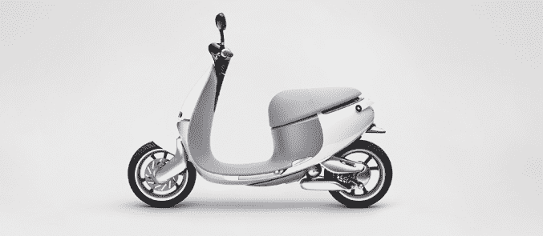
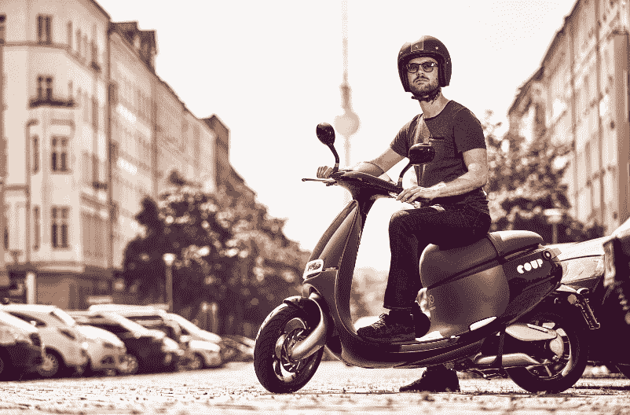

# 售出 10，000 辆 smartscooters 后，Gogoro 与柏林的博世合作推出租赁服务 

> 原文：<https://web.archive.org/web/https://techcrunch.com/2016/08/03/with-10000-smartscooters-sold-gogogo-powers-up-a-rental-service-with-bosch-in-berlin/>

# 售出 10，000 辆 smartscooters 后，Gogoro 与柏林的博世合作推出了租赁服务

Gogoro 的电动 smartscooter 相当时髦…但除非你住在台湾，否则你很可能没有亲眼见过。这种踏板车需要一个电池交换终端网络才能正常工作，所以它们一次只运出一个国家——到目前为止，“一次一个国家”指的是“一个国家”:台湾。

这种情况从今天开始发生了变化:Gogoro 的滑板车立即在柏林推出，尽管是滑板车租赁服务的一部分。

Gogoro 正在与博世合作，为这家德国大型公司提供 200 辆小型摩托车，用于他们称为“政变”的按需租赁服务。Gogoro 首席执行官 Horace Luke 告诉我，博世将拥有这款踏板车，但除此之外，他拒绝对交易的财务状况发表评论。

这些滑板车的租金为 30 分钟 3 欧元，或每天 20 欧元。要租一辆，你可以打开 Coup 应用，租一辆最近的摩托车；完成后，你只需把车停在最近的合法停车位，让别人去抢。头盔将包含在租赁价格中，存放在滑板车的行李箱中。

“但是等等！Gogoro 不需要换电站才能正常工作吗？”

确实！这种电台在柏林还没有普及。因此，Coup 将在这个初始阶段处理电池交换——他们将确定滑板车的电池何时电量不足，并在滑板车停放时用新电池进行交换。

这并不是柏林第一家代步车共享服务——甚至也不是该市第一家电动代步车共享服务。例如，一个名为 eMio 的共享服务从去年 3 月就出现了。

在很大程度上，这些滑板车与 Gogoro 在台北销售的相同——只有一个问题:它们的时速限制在 45 公里(约 28 英里)，而购买版本的最高时速为 95 公里(约 59 英里)。为什么？驾照。Gogoro 说，通过保持有限的数量，他们可以租给有标准驾照的人，而不是有摩托车驾照的人。为了打造品牌，他们也换了一个新形象:

Gogoro 的踏板车最初在台湾推出，价格大约相当于 4100 美元。这个价格很快就降到了 3000 美元左右。推出一年多一点，Gogoro 说他们已经卖出了 10，000 辆踏板车。

唉，希望真正拥有一辆 Gogoro 踏板车的柏林人还是要等一等了——目前，这只是一个严格的租赁协议。与此同时，该公司表示，他们计划今年夏天晚些时候在阿姆斯特丹出售他们的滑板车。

你可以在这里查看我们对 Gogoro 发布的最初报道。