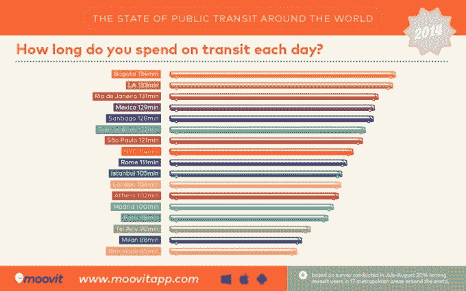
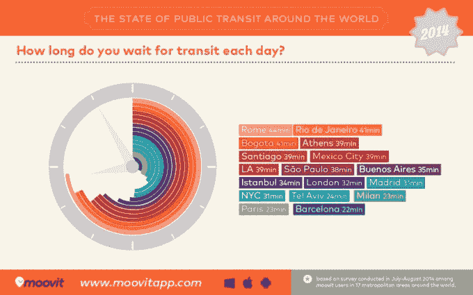

# 拥有 1000 万用户的以色列 Moovit 试图跟随 Waze 的脚步进军公共交通 

> 原文：<https://web.archive.org/web/https://techcrunch.com/2014/09/21/with-10m-users-israels-moovit-tries-to-follow-in-wazes-footsteps-for-mass-transit/>

# 拥有 1000 万用户的以色列 Moovit 试图跟随 Waze 的脚步发展公共交通

在 Waze 以 11 亿美元的价格将 T2 出售给谷歌之后，很明显有人应该为世界公共交通系统做同样的事情。事实上，Waze 的本土市场以色列的另一家公司正试图提供公共交通的实时众包数据。

名为 [Moovit](https://web.archive.org/web/20221208174619/http://www.moovitapp.com/) ，其[由包括红杉资本在内的投资者提供超过 3000 万美元的支持。这家初创公司每两天就增加一个新的城市，并以每月约 100 万用户的速度增长。Moovit 总共有 1000 万注册用户；这不是分享每日或每月的活动。](https://web.archive.org/web/20221208174619/https://beta.techcrunch.com/2013/12/18/moovit-raises-28m-from-sequoia-and-others-to-be-the-waze-for-crowdsourced-public-transit-data/)

与优步等其他应用程序不同，Moovit 吸引了完全不同的客户群，这些应用程序在转向低端市场之前一直被批评为过于排外。例如，他们在洛杉矶的许多用户是拉丁裔工人阶级，他们严重依赖公共交通而不是开车上下班。

在 400 多个城市，Moovit 开始收集不同城市公共交通效率的数据。例如，他们发现波哥大和洛杉矶的通勤时间最长，每天两个多小时。虽然洛杉矶的扩张是可以理解的，但波哥大以开创特殊的快速公交系统而闻名，该系统有专用车道和设计的上客站，使公交更快。他们还发现，像罗马和里约热内卢这样的城市有一个不幸的特点，那就是在他们的全球网络中等待公交的时间最长。

像 Waze 一样，Moovit 用户可以查找不同地方的方向，并查看实时通勤时间。他们还可以输入提示或数据，提醒社区中的其他用户注意延迟。

如果他们能够足够快地扩大用户群，这可能会形成一个有价值的地图数据网络的基础。Waze 采取了类似的方法，最终成为一项巨大的战略收购，尽管谷歌已经拥有重叠的地图和交通数据。谷歌不希望这款应用落入脸书或苹果这样的竞争对手手中，后者可能会利用 Waze 的实时数据打造或改进与之竞争的地图产品。

Moovit 现在有大约 55 名员工，正在围绕营销和业务发展开设湾区办事处。