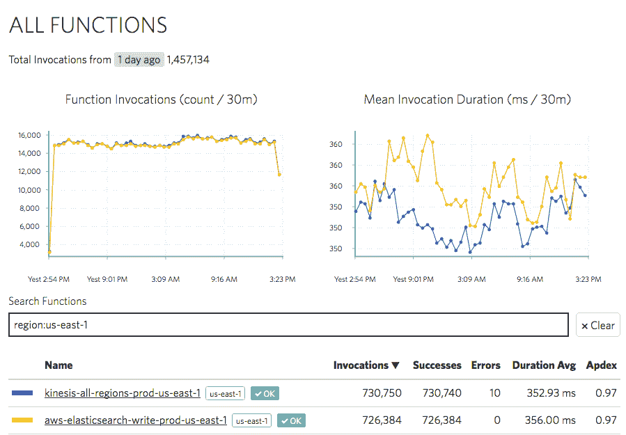

# 凭借 250 万美元的种子资金，IOpipe 将监控引入无服务器应用 

> 原文：<https://web.archive.org/web/https://techcrunch.com/2017/08/14/with-2-5m-in-seed-funding-iopipe-brings-monitoring-to-serverless-applications/>

# 凭借 250 万美元的种子资金，IOpipe 为无服务器应用带来了监控

无服务器应用现在非常流行——一些公司甚至跳过容器，全力支持像 AWS Lambda 和 Azure Functions 这样的服务。不出所料，这些服务正在催生自己的创业生态系统。IOpipe 是一个为 AWS 的 T2 服务开发的应用操作平台(目前主要用于监控)。

这家总部位于西雅图的公司今天还宣布，它已经从马德罗纳风险投资集团、NEA 和下划线风险投资公司筹集了 250 万美元的种子资金，这些公司在基础设施领域都有丰富的经验。

IOpipe 的联合创始人亚当·约翰逊(首席执行官)和埃里卡·温迪施(首席技术官)在这一领域也非常有经验，他们之前曾在 Docker 和 Midokura 等公司工作过(亚当是 Midokura 的第一名员工，埃里卡创建了 Docker 的安全团队)。他们最近[从纽约科技之星项目](https://web.archive.org/web/20221205121412/https://alexiskold.net/2016/09/29/meet-15-startups-from-techstars-nyc-summer-2016-program/)毕业。

IOpipe 背后的想法非常简单:让开发人员和运营团队更好地了解他们的应用如何在 Lambda 上运行(支持未来可能出现的其他平台)，以帮助他们解决 bug、内存泄漏和其他问题。该服务在一个实时仪表板中为开发人员提供其功能的所有常用性能指标，开发人员只需将他们的功能封装到 IOpipe 的代码中。该服务还测量对第三方服务的调用，包括所有标准的 AWS 服务，如 S3 或 DynamoDB。

约翰逊告诉我，该公司的客户范围很广，包括初创公司和企业。当然，这也是 Lambda 客户的一项功能。“每周我都会惊讶于我遇到的运行 Lambda 的公司，”Johnson 说。一年前，这些用户还大多是早期采用者，但从那时起，相当多的企业开始尝试 Lambda，甚至在该平台上运行生产工作负载。

该公司目前有八名员工，尽管有了新一轮融资，它可能会迅速扩张。展望未来，该团队计划在其当前解决方案(现在以插件架构为特色)的基础上构建更多功能，以从其当前的运营中心扩展开来，更好地直接为开发人员服务。“到目前为止，我们花了很多时间来构建用于监控的牌桌赌注功能，并确保它们是可扩展的和稳定的，”Johnson 指出，并补充说该服务的插件架构现在允许团队为其用户提供更多功能。

