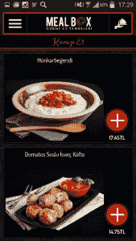

# 凭借 360 万美元的资金，Meal Box 正在打造一个土耳其食品配送帝国 

> 原文：<https://web.archive.org/web/http://techcrunch.com/2015/08/03/with-3-6-million-in-funding-meal-box-is-building-a-turkish-food-delivery-empire/>

一年多前，健康送餐初创公司[饭盒](https://web.archive.org/web/20230129230445/https://www.mealbox.com.tr/)在伊斯坦堡推出后，正寻求垄断全球第五大城市[的外卖市场。](https://web.archive.org/web/20230129230445/https://en.wikipedia.org/wiki/Istanbul)

在土耳其最活跃的风险投资公司之一[Aslan oba Capital](https://web.archive.org/web/20230129230445/https://www.crunchbase.com/organization/aslanoba-capital)360 万美元资金的支持下，该公司希望为越来越少依赖全职家庭厨师的一代年轻人和家庭，用传统、健康的土耳其烹饪取代快餐。

就在三个月前，土耳其在线食品订购初创公司 [Yemeksepeti](https://web.archive.org/web/20230129230445/http://www.yemeksepeti.com/) 以 5 . 89 亿美元的高价出售给了 Delivery Hero，这是迄今为止最大的食品配送收购案之一。餐盒希望通过迎合不同的需求来获得同样多的关注。

“在土耳其，最大的机会是有当地的口味，但没有值得信赖的企业或餐厅送货上门，”饭盒创始人穆拉特·德米尔汉说。“我可以通过食品订购网站订购的不是当地食品，而是披萨和快餐。”

从烹饪到配送，饭盒通过一个中心和特许经营模式控制着整个过程，使公司能够以更低的价格提供更高质量的食物。所有的饭菜都在一个集中的厨房里烹饪和组装，并在凌晨由卡车运送到 20 个特许配送中心。

德米尔汉说，伊斯坦布尔是一个大城市，面积超过 2000 平方英里，人口 1400 万。拥有这样的准备中心网络意味着餐盒可以承诺在点餐后 30 分钟内将热食送到顾客手中。

“这些是码头商店，所以租金很低，而且因为没有烹饪，只有一两个人处理整个业务，劳动力成本很低，”德米尔汉说。

尽管 90%的餐盒订单是通过网站、手机应用程序和 Yemeksepeti(餐盒食品的列表)完成的，但该公司仍然运营着一个呼叫中心，以迎合土耳其人口中更传统的部分。

自去年 6 月推出以来，该公司仅在伊斯坦布尔就完成了超过 16 万份订单，而且他们的销售额还在增长，目前每天的订单约为 1300 份，月环比增长超过 30%。餐盒将在今年年底前扩展到安卡拉和土耳其的其他主要城市。

Aslanoba Capital 的创始合伙人坎库特·杜尔贡(Cankut Durgun)表示:“当你访问土耳其领先的在线食品订购市场 Yemeksepeti 时，对健康、家常菜的需求显而易见，大多数餐馆都提供快餐和土耳其街头食品。”。“伊斯坦布尔和土耳其其他地方的全部潜力是一个巨大的、未开发的机会。”