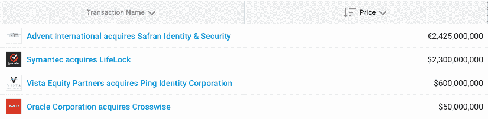

# 2016 年交易额达 60 亿美元，ID 管理是你可能错过的热门领域

> 原文：<https://web.archive.org/web/https://techcrunch.com/2017/02/13/with-6b-in-2016-ma-id-management-is-a-hot-sector-you-may-have-missed/>

乔安娜·格拉斯纳撰稿人

More posts by this contributor

什么技术受到收购者的欢迎，帮助企业避免代价高昂的违规行为，甚至可以减少第三大死因？

如果您回答了身份管理，那么恭喜您。 这是从身份管理领域的 Crunchbase 分析中得出的结论，该分析是在该领域公司最近的一系列收购和大规模融资之后进行的。我们发现，身份管理公司去年从战略和私募股权买家那里获得了超过 60 亿美元的收购。

*来源:Crunchbase。全互动列表* [*此处*](https://web.archive.org/web/20230320002704/https://www.crunchbase.com/app/lists/identity-m-a-2016/b73552e1-2a2e-472f-884c-26bb532dbe4d/acquisition?new=false) *。*

许多目标都是以高于交易价格的价格出售的上市公司。身份盗窃防范服务提供商 [LifeLock](https://web.archive.org/web/20230320002704/https://www.crunchbase.com/organization/lifelock#/entity) 就是这种情况，该公司在 11 月接受了赛门铁克 23 亿美元的收购要约。医疗保健行业的患者身份验证技术提供商 Imprivata 去年夏天以高于其公开估值 33%的价格卖给了私募股权公司 Thoma Bravo。

私营公司和他们的支持者也做得不错。甲骨文以 5000 万美元收购了 A 轮融资的技术开发商 Crosswise，为投资者带来了丰厚的回报。私募股权公司 Vista Equity Partners 以 6 亿美元收购了风险投资支持的身份管理和单点登录工具提供商 Ping Identity。

私人股本收购者的活跃表明，未来可能会有更大规模的退出。私募股权投资买家不会无限期地买入股票——他们喜欢在几年内出售投资组合中的公司或进行 IPO，以获取高额利润。这通常是通过在同一领域进行几笔收购，或者利用他们的关系向大公司购买资产来实现的。

收购者并不是唯一让资本发挥作用的人。风险投资公司也在身份管理方面进行了大量投资。根据 Crunchbase 的数据，该领域的公司去年融资超过 2 亿美元，延续了多年来风险投资总额接近或超过这一水平的趋势。

许多投资者特别关注医疗保健 IT 和身份认证。正是在医疗保健和身份管理的交叉点上，减少第三大死亡原因的概念开始发挥作用。心脏病和癌症被广泛认为是美国的两大死亡原因。但是第三个最常见的原因——可预防的医疗失误——并不广为人知。

然而，这些数字是惊人的。几年前，一项经过同行评审的 [研究](https://web.archive.org/web/20230320002704/http://journals.lww.com/journalpatientsafety/Fulltext/2013/09000/A_New,_Evidence_based_Estimate_of_Patient_Harms.2.aspx) 估计，每年去医院的多达 44 万美国患者遭受某种可预防的伤害，导致他们死亡 。(相比之下，2014 年美国约有 14，000 人被谋杀)。

虽然许多与医疗差错相关的死亡与数字技术无关，但很大一部分与数字技术有关。去年，ECRI，一个非盈利性的病人安全组织，公布了一份医疗机构十大安全问题的清单。排在首位的是“互不支持的医疗 IT 配置和组织工作流程”第二是病人识别错误。

尽管企业需要改进的身份和认证工具，但该领域的许多参与者未能实现投资者的期望。其中最引人注目的是 Jumio T21，这是一家硅谷的初创公司，提供数字身份验证，在去年申请破产保护后出售其资产之前，筹集了超过 3500 万美元的风险资金。

然而，精明的投资者也在押注未来更大的退出机会。也许最受关注的是 [Okta](https://web.archive.org/web/20230320002704/https://www.crunchbase.com/organization/okta#/entity) 。这家基于云的企业身份工具提供商已经从风险投资者那里筹集了超过 2 亿美元的资金，并且是据说正在考虑今年进行 IPO 的科技独角兽的长名单上的一员。