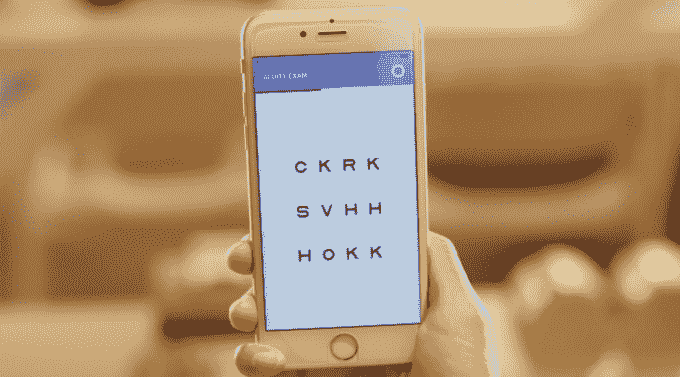

# 新推出的 200 万美元简单隐形眼镜有望降低镜片的填充成本 

> 原文：<https://web.archive.org/web/https://techcrunch.com/2016/11/07/with-a-fresh-2-million-simple-contacts-looks-to-cut-refill-costs-for-lenses/>

# 新的 200 万美元的简单接触看起来可以减少镜片的填充成本

由前 Techstars 常驻企业家和 3D 打印初创公司 Sols 的联合创始人发起的新公司 Simple Contacts 正在寻求使重新填充隐形眼镜的过程更便宜、更实惠。

该公司是从创始人 Joel Wish 深感痛苦的地方起步的。作为一个终生佩戴隐形眼镜的人，Wish 对重新配同样的处方的费用感到非常震惊——这个过程可能要花费 100 多美元。

希望有一个更好的方式，希望，一个连续的企业家和前 Techstars 常驻企业家，推出了简单的联系。大约 80%的隐形眼镜佩戴者去验光师那里只是为了得到同样的处方。

Wish 说，这种既费钱又费时的旅行在今天的移动技术下是不必要的。于是他想出了一个更好的办法。Simple Contacts 将数字健康和在线咨询的优势集中在一个特定的利基市场，该市场具有经常性收入和易于解决的痛点。

使用通过移动设备进行的标准眼科测试，并由有执照的眼科医生验证，用户可以在几分钟内看到新的处方和新的隐形眼镜。

然后，联系人到达用户的家门口。

该应用程序在 20 个州可用，包括纽约和加州，该公司已经成功筹集了 200 万美元的种子期资金。

该公司的种子轮由 Autonomous Ventures(由 Tikhon Bernstraum 发起的基金)牵头，包括贾斯汀·坎(Twitch 和 Justin.tv 的创始人)等天使投资人以及许多医生。CityMD 急救诊所网络的创始人理查德·帕克也参与了融资。

