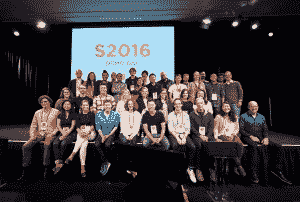

# 有了新的首席执行官，Y Combinator 将减少奖学金，开始 MOOC 

> 原文：<https://web.archive.org/web/https://techcrunch.com/2016/09/13/with-a-new-ceo-y-combinator-will-wind-down-fellowships-and-start-a-mooc/>

近年来迅速扩张的 Y Combinator 正在进行广泛的组织变革——这是今年的第二次变革。

最引人注目的是，Y Combinator 将在 2017 年减少其 YC 奖学金，并推出 MOOC，即大规模在线开放课程。

此外，2005 年开始作为加速器的风险基金已经任命[迈克尔·赛贝尔](https://web.archive.org/web/20230328200937/http://www.michaelseibel.com/)为其 Y Combinator 核心部门的首席执行官，现在简称为 YC。

赛贝尔之前是 Justin.tv 的联合创始人，SocialCam 的首席执行官，长期以来一直是 YC 承认的企业家的友好面孔。他是 Y Combinator 的早期顾问，并被认为将 Airbnb 引入了 Y Combinator 的竞争。

YC 集团还任命前推特首席财务官和首席运营官·阿里·罗加尼为其 [YC 持续基金的首席执行官。](https://web.archive.org/web/20230328200937/https://blog.ycombinator.com/yc-continuity-fund)该基金于 2015 年末宣布成立，是 YC 集团投资于其成功的后期校友公司的一个工具。

他说，山姆·奥特曼将继续担任 YC 集团的总裁，并将继续负责整个 Y Combinator 组织，但他将在近期专注于开发 MOOC。

*Y Combinator 2016 春季批次。*

奥尔特曼说，他预计 YC 集团将在未来几年增加更多的组织单位，但没有预测会是什么。

Y Combinator 的高管和附属公司看到，他们在斯坦福大学的一个创业学校系列中教授的课程获得了比预期更大的反响，他们在网上[联合了这些课程。](https://web.archive.org/web/20230328200937/http://startupclass.samaltman.com/)

在奥特曼的指导下，Y Combinator 今年早些时候收购了一家名为 Imagine K12 的教育科技加速器。

Y Combinator 拥有如此丰富的内部教育专业知识，它完全有能力运营自己的 MOOC，而不是依赖其他电子学习平台或品牌。这一努力可能会让 YC 集团在全球范围内获得令人难以置信的交易渠道。

Y Combinator 计划推出的 MOOC 将向任何人开放，是 YC 的轻量级版本。训练营式的项目帮助企业家磨练他们的产品、商业模式，并巩固与共同创始人的关系。

奥特曼说，“我们尽可能地扶持和帮助更多的创业者。我们看到的公司来自比以往更多的背景和国家。从影响力来看，我们已经是一个大组织了。”

YC 集团即将推出的 MOOC 的目标是接触并帮助更广泛的创业者。

*YC 首席执行官迈克尔·赛贝尔*

据 YC 新任首席执行官迈克尔·赛贝尔称，完成 YC 在线课程的初创公司，如果他们的创始人申请 YC 的核心项目，将不会得到任何特殊待遇。

他指出，YC 最近一批创业公司中，约有 40%的创始人承认之前从未接触过该项目。

迄今为止，Y Combinator 已经有 3015 名创始人参加了它的项目。该基金的合伙人估计，所有 YC 校友的总市值超过 700 亿美元，YC 公司筹集的资金总额超过 100 亿美元。