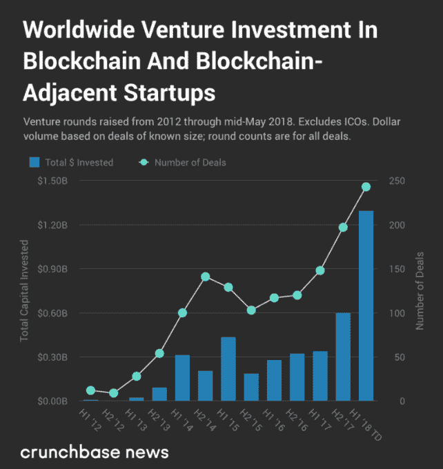

# 2018 年全球投资至少 13 亿美元，区块链的风投资金超过了 2017 年的总额 

> 原文：<https://web.archive.org/web/https://techcrunch.com/2018/05/20/with-at-least-1-3-billion-invested-globally-in-2018-vc-funding-for-blockchain-blows-past-2017-totals/>

杰森·罗利是《金融时报》的风险投资和科技记者

[Crunchbase News](https://web.archive.org/web/20221025222257/https://about.crunchbase.com/news/)

.

More posts by this contributor

尽管比特币和区块链技术可能不会像几个月前那样占据公众那么多的精神带宽，但该领域的公司仍在继续从投资者那里获取资本。

最近这样做的一个是 [Circle](https://web.archive.org/web/20221025222257/https://www.crunchbase.com/organization/circle-2) ，它最近宣布[获得由比特币挖矿硬件制造商](https://web.archive.org/web/20221025222257/https://www.crunchbase.com/funding_round/circle-2-series-e--99fa3cee)[比特大陆](https://web.archive.org/web/20221025222257/https://www.crunchbase.com/organization/bitmain)领投的 1.1 亿美元 E 轮。其他参与投资者包括[图斯克创投](https://web.archive.org/web/20221025222257/https://www.crunchbase.com/organization/tusk-ventures)、[潘迪拉资本](https://web.archive.org/web/20221025222257/https://www.crunchbase.com/organization/pantera-capital)、 [IDG 资本合伙人](https://web.archive.org/web/20221025222257/https://www.crunchbase.com/organization/idg-capital-partners)、[普通催化剂](https://web.archive.org/web/20221025222257/https://www.crunchbase.com/organization/general-catalyst-partners)、 [Accel 合伙人](https://web.archive.org/web/20221025222257/https://www.crunchbase.com/organization/accel-partners)、[数字货币集团](https://web.archive.org/web/20221025222257/https://www.crunchbase.com/organization/digital-currency-group)、[区块链资本](https://web.archive.org/web/20221025222257/https://www.crunchbase.com/organization/crypto-currency-partners)和[布雷耶资本](https://web.archive.org/web/20221025222257/https://www.crunchbase.com/organization/breyer-capital)。

这一轮进入了加密公司的专属俱乐部，这些公司在最近一轮风险投资中的美元估值达到 10 亿美元或更多。根据 Crunchbase 的数据，Circle 的前期估值为 29 亿美元，高于 2016 年 5 月结束的 D 轮 4.2 亿美元的前期估值。根据 Crunchbase 的数据，只有[比特币基地](https://web.archive.org/web/20221025222257/https://www.crunchbase.com/organization/coinbase)和[罗宾汉](https://web.archive.org/web/20221025222257/https://www.crunchbase.com/organization/analyst)——一个移动优先的股票交易平台，最近大力推进加密货币交易——在加密独角兽俱乐部，这个圈子现在已经加入。

但这不是风险投资支持的加密货币和区块链初创公司世界的唯一里程碑。

早在 2 月份，Crunchbase News [预测](https://web.archive.org/web/20221025222257/https://news.crunchbase.com/news/2018-vc-investment-crypto-startups-set-surpass-2017-tally/)2018 年区块链和区块链附近的初创公司在老派风险投资回合中筹集的资金数额将超过 2017 年的数额。现在才五月，看来预测是正确的。

在下面的图表中，你会发现区块链和区块链周边公司的全球风险投资交易和金额。我们有意排除了 ico，包括那些有传统风投参与的 ico，而是专注于风险交易:天使投资、种子投资、可转换债券、A 轮、B 轮等等。下面显示的数据基于 Crunchbase 中报告的数据，这些数据可能会受到报告延迟的影响，并且在某些情况下是不完整的。

2018 年刚过五个月，区块链公司筹集的风险投资金额超过了 2017 年的总额。不仅如此，近 13 亿美元的全球美元交易量大于 2016 年 7 月 1 日至 2017 年新年前夕这 18 个月的报告融资总额。

尽管 Circle 的 E 轮融资肯定有助于提高今年迄今的融资总额，但 2018 年还有许多其他大型融资轮次:

当然，在过去的五个月里，还有许多其他的大型回合。毕竟，我们必须以某种方式达到 13 亿美元。

所有这些都意味着，投资者对区块链空间的兴趣没有立即放缓的迹象，即使比特币、以太坊和其他加密货币的价格徘徊在不到历史高点的一半。考虑到监管机构仍在研究如何对待大多数加密资产、巨大的价格波动和该技术可疑的现实用途，一些人可能会惊讶于风险资金池中风险最高一端的投资者像他们在区块链那样投资。

## 方法论笔记

就像在我们的【T12 月分析中，我们首先创建了一份 Crunchbase 的[比特币](https://web.archive.org/web/20221025222257/https://www.crunchbase.com/search/organizations/field/organizations/categories/bitcoin-1c16)、[以太坊](https://web.archive.org/web/20221025222257/https://www.crunchbase.com/search/organizations/field/organizations/categories/ethereum-3e04)、[区块链](https://web.archive.org/web/20221025222257/https://www.crunchbase.com/search/organizations/field/organizations/categories/blockchain)、[加密货币](https://web.archive.org/web/20221025222257/https://www.crunchbase.com/search/organizations/field/organizations/categories/cryptocurrency)和[虚拟货币](https://web.archive.org/web/20221025222257/https://www.crunchbase.com/search/organizations/field/organizations/categories/virtual-currency)类别的公司列表。我们将所有使用这些关键词的公司，以及“数字货币”、“公用令牌”和“安全令牌”添加到这个列表中，这些都是之前没有包含在上述类别中的。在删除重复列表后，我们将这组公司与 Crunchbase 中的融资轮数据合并。

请注意，对于 Crunchbase 的回合数据中的一些条目，筹集的资金数额是未知的。而且，如前所述，Crunchbase 的数据容易受到报告延迟的影响，尤其是对于种子期公司。因此，实际资金总额可能比这里报告的要高。