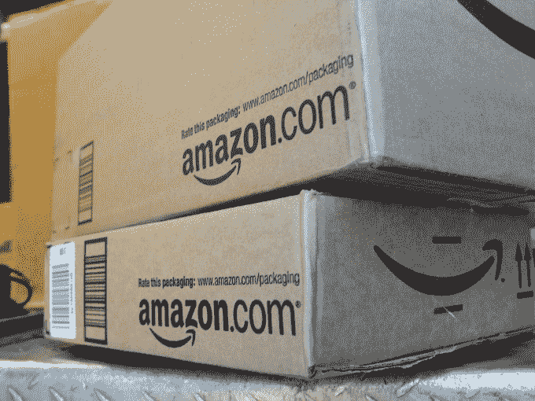

# 随着价格匹配的改变，亚马逊和沃尔玛迎来了零售的新时代

> 原文：<https://web.archive.org/web/https://techcrunch.com/2016/06/13/with-changes-to-price-matching-amazon-and-walmart-usher-a-new-era-of-retail/>

More posts by this contributor

沃尔玛和[亚马逊](https://web.archive.org/web/20230311111712/https://techcrunch.com/2016/05/23/amazon-kills-its-price-protection-policy/)最近都改变了他们的价格匹配政策，这些变化可能是零售业未来的一个预兆。

如果购物者展示相同产品的广告，沃尔玛将匹配竞争对手的价格，而亚马逊的转变是针对最近购买的商品的价格下降。

如果一种产品的价格在 7 天内下跌，顾客将会收到差价。假设是跟踪退款的第三方应用程序对亚马逊调整其定价算法的方式产生了影响，并导致追溯性的利润率下降。

作为一名曾经与亚马逊价格相当的零售商，我能够看到亚马逊有时以成本价甚至低于成本价降价，并提供一些最低的价格。

作为亚马逊的前竞争对手，我很久以前就看到了“给他们让路”的必要性……但那是另一回事了。

虽然这一政策使竞争对手难以竞争，但较低的价格帮助亚马逊建立了忠诚的客户群，并促进了业务增长。

退款政策的变化解决了第三方应用程序暴露的这个“漏洞”，使亚马逊能够继续其定价流动性，而不会造成追溯性损害。

事实上，亚马逊已经成功地将他们的业务打造成了网上搜索次数最多的资产之一，在这方面甚至可以与谷歌相媲美。亚马逊在搜索领域的增长已经被[很好地记录了](https://web.archive.org/web/20230311111712/http://bloomreach.com/2015/10/survey-amazon-is-burying-the-competiton-in-search/)——他们占据了所有产品直接搜索的 44%，超过了搜索引擎的 34%和所有其他零售商的 21%。

由于在谷歌、脸书等公司的广告上花费了数十亿美元，亚马逊在这一领域的“控制”相当于在广告上节省了数十亿美元，并获得了巨大的竞争优势。

沃尔玛退款政策的转变也很有趣。沃尔玛认为，他们不再需要与竞争对手进行价格竞争，这表明他们认为自己有足够强大的品牌来支持消除人们眼中的“最低价格保证政策”。

多年来，沃尔玛还成功地将自己打造成一家拥有强大实体和在线业务的零售商。随着对物流的持续投资，这有助于支持更低的价格，他们在与亚马逊的竞争中处于独特的地位，并在过去十年面对技术变革从传统零售商转型方面做得非常出色。

但是，面对坚持“最低价格保证”的竞争对手，改变他们的退款政策违背了消费者几十年来对零售商的期望。

我们从这一变化中能得出的唯一结论是，亚马逊和沃尔玛必须对自己的品牌感到足够舒服，以至于他们觉得不会轻易失去客户。

**阈移**

在零售业的演变中，这种变化标志着两家零售商都认为消费者放弃的门槛发生了变化。

亚马逊和沃尔玛认为，他们的竞争对手已经被削弱到不再是一个可信的威胁的程度——他们的客户群忠诚于两家零售商已经在市场上确立了自己作为购物场所的地位。

对于沃尔玛和亚马逊来说，现在是时候开始有计划地提高利润率了。退税政策的调整是朝着这个方向迈出的第一小步。

凭借亚马逊的辅助服务，如 Prime、Echo 和高效物流，他们获得了竞争对手无法比拟的强大互补组件。沃尔玛的实体存在、规模、配套物流和持续创新是亚马逊唯一真正的竞争对手。

任何轻微的价格“上涨”都可能超过在其他地方购物的好处。

随着对价格、选择和服务的强烈感知，消费者知道他们可以以优惠的价格高效地获得他们想要的东西。他们为什么要在其他品牌上冒险呢？

从全局来看，我们似乎刚刚到达了零售业新一轮进化的临界点。