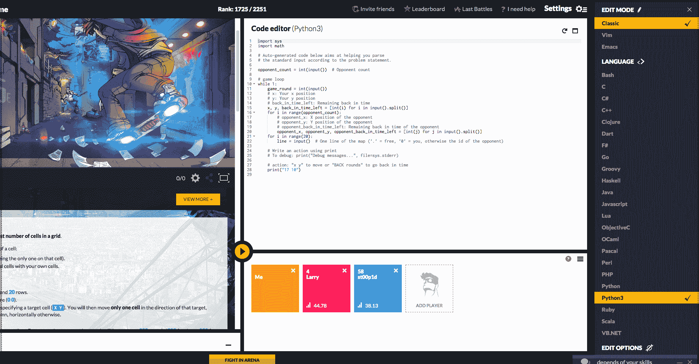

# 有了 CodinGame，学习编码变成了一种游戏

> 原文：<https://web.archive.org/web/https://techcrunch.com/2015/11/11/with-codingame-learning-to-code-becomes-a-game/>

法国初创公司 [CodinGame](https://web.archive.org/web/20230308054859/https://www.codingame.com/) 刚刚从 [Isai](https://web.archive.org/web/20230308054859/https://www.crunchbase.com/organization/isai) 为其创新的代码学习平台筹集了 160 万美元。顾名思义，CodinGame 就是关于游戏的一切——不是游戏开发，不是游戏化，只是普通的游戏。每个练习背后的逻辑都与一个实际的游戏相关联，这样当你解决一个练习时，你就可以得到视觉反馈和实际的奖励。

“这不仅仅是一个噱头，因为我们有指标来支持我们的愿景。如果你把游戏和学习结合起来，你会得到一种非常激励的体验，”联合创始人兼首席执行官 fre de desmou Lins 告诉我。“边玩边学，是良性循环。”

对于每个练习，你可以从 20 多种编程语言中选择一种，比如 Python、Ruby、Java、Scala 等等。该公司的目标人群是已经掌握编程基础知识的人，对专业开发人员也有严峻的挑战。

特别是，多人模式在开发者中变得相当流行。在这种模式下，你学习人工智能的基础知识，并与他人发生冲突，看看你的代码是否更高效。

“我们支持 23 种不同的编程语言，我们所有的游戏都支持你选择的语言，”联合创始人兼首席技术官 Nicolas Antoniazzi 告诉我。“我们的目标是已经懂一点编程的人。但是我们最后的练习非常辛苦，目标是铁杆编码员。而一旦击败了最后一关，就可以和平台上的其他玩家一起战斗，而且这种模式是没有限制的。”

当你注册 CodinGame 时，一切都发生在浏览器中。基于浏览器的 IDE 允许你在同一个窗口中编码和编译，你可以在屏幕的角落里实时看到游戏。到目前为止，已经有 23 万人报名了。

此前，该公司已经通过 [Seed4Soft](https://web.archive.org/web/20230308054859/https://www.crunchbase.com/organization/seed4soft) 和 [Venise Invest](https://web.archive.org/web/20230308054859/http://www.venise-invest.com/about) 从商业天使手中筹集了 50 万美元(€45 万)。在某些方面，该公司与 [CodeFights](https://web.archive.org/web/20230308054859/https://techcrunch.com/2015/04/02/codefights-scores-2-4-million-to-turn-coding-practice-into-a-game/) 竞争，当然还有更传统的代码学习网站，如 [Treehouse](https://web.archive.org/web/20230308054859/https://teamtreehouse.com/) 和[代码学校](https://web.archive.org/web/20230308054859/https://www.codeschool.com/)。

但 CodinGame 正在全力以赴，将游戏作为区别于竞争对手的一个因素。据联合创始人和 CMO·奥德·巴勒称，将游戏和编码结合起来是可行的，因为这两项任务有些相似。“当人们编码时，他们喜欢他们有挑战要解决的事实，”她说。换句话说，编码本身已经是一个游戏，所以让你的代码看起来像一个游戏是有意义的。

