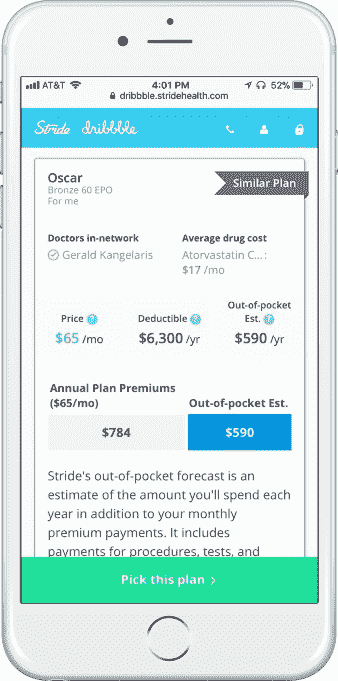

# 开放报名仅剩一天，各公司转向 Stride Health 寻求帮助 

> 原文：<https://web.archive.org/web/https://techcrunch.com/2017/12/14/with-just-one-day-left-in-open-enrollment-companies-turn-to-stride-health-for-help/>

今年政府强制医疗保健开放注册期的压缩时间表让一些公司陷入困境，随着注册最后时间的流逝，他们转向初创公司 [Stride Health](https://web.archive.org/web/20221025222942/https://www.stridehealth.com/) 寻求帮助。

Stride 为客户管理许多不同的税务和医疗保健相关信息，包括优步、Etsy、Postmates、TaskRabbit、Instacart、DoorDash、Care.com 和 Homebase。

首席执行官诺亚·朗(Noah Lang)表示，现在，Fiverr、Dribbble、Bonsai、HoneyBook、Samaschool 和 Wonolo 等一系列其他零工经济公司已经注册了这项服务，而激励因素是医疗保健。

Stride 的联合创始人兼首席执行官郎在一份声明中表示:“政府今年在宣传拥有医疗保险的重要性方面投入较少，因此这些公司承担起了确保人们获得保险的责任。”。

事实上，Stride 客户群中的许多新成员都是在过去两周内注册的，以确保他们可以帮助他们平台上的自由职业者获得他们所需的医疗保险。

自四年前推出以来，Stride 已经建立了声誉，成为寻找负担得起的医疗保健计划和降低保险价格的补贴的最简单方法。

根据 Crunchbase 的消息，今年早些时候，该公司筹集了 2350 万美元，并利用这笔资金将业务扩展到医疗保健之外，为零工经济工作者提供额外服务。例如，该公司与 H & R Block 在税务问题上合作，威利斯韬睿惠悦与 Stride 合作，帮助其客户为其临时员工服务。

Stride 通过向临时工介绍保险来赚钱，从这些工人支付的保险费中提成。

该公司向其客户提供联合品牌网站、电子邮件和产品内提示，以鼓励在这些网站上推销服务的独立承包商获得医疗保险。

获得保险是至关重要的，患者保护与平价医疗法案为数百万本来没有保险的美国人打开了保险的可能性。虽然现任政府正在尽一切努力取消这些医疗保障，但他们只能做这么多。目前，保险保障仍然存在，人们利用它们是值得的。

因此，对于任何感兴趣的人，[这里有一个资产](https://web.archive.org/web/20221025222942/https://www.stridehealth.com/)的链接。

Lang 说:“虽然我们与合作伙伴密切合作，为他们的受众建立联合品牌体验，但我们希望让任何组织都能轻松地鼓励他们的社区获得他们需要的报道，因此我们提供了一套资产——横幅、电子邮件和其他视觉材料——任何组织都可以用来向他们的用户传达信息。

对于 Stride Health 来说，这是忙碌的一年。除了合作伙伴关系之外，它还推出了牙齿和视力保健咨询计划，并在今年将通过 Stride 平台接受保险的人数扩大到了 1000 多万人。