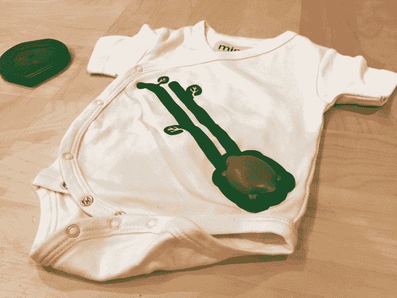

# 有了 Mimo，麻省理工学院的校友们正在颠覆婴儿托儿所，一次一件

> 原文：<https://web.archive.org/web/https://techcrunch.com/2015/01/27/with-mimo-mit-alums-are-disrupting-the-baby-nursery-onesie-at-a-time/>

尽管创业公司有很多创新，但很少有人解决了世界上最困难的任务之一:照顾新生儿。无论是在凌晨 3 点提供牛奶，还是确保婴儿接触到适合其年龄的正确形状和声音，父母都面临着几乎持续不断的挑战，往往承受着难以置信的压力和紧张。

利用移动、物联网和云计算的融合，Rest Devices 是一家由麻省理工学院校友和辍学者创办的波士顿初创公司，希望通过开发智能婴儿托儿所来改变这一切。

他们的第一款产品被称为 [Mimo](https://web.archive.org/web/20221225125948/http://mimobaby.com/) ，这是一款婴儿连体衣，包括用于监测婴儿呼吸、压力、湿度和温度的传感器。这些数据从传感器传输到附近的基站，并最终传输到云中，可以在任何移动设备上查看，也可以在父母和护理人员之间共享。

Mimo onesie 和基站

智能托儿所就是从这一点开始的。通过分析这些数据，这家初创公司能够随着时间的推移跟踪婴儿的睡眠时间表，最终预测婴儿何时入睡——最重要的是，何时醒来。那就意味着可以提前通知家长，让他们已经准备好奶了。

该公司目前正在测试的最新功能是一个“睡眠训练”系统。该公司的联合创始人达尔西·马登(Dulcie Madden)表示，该公司从用户那里听到的一个主要问题是，睡眠可能非常分散和不稳定。

“我们正在尝试看看是否有办法延长婴儿的睡眠时间，”她解释道。从长远来看，该公司希望增加一个社交组件，让父母能够向其他父母提供关于他们睡眠策略的见解。

除了睡眠功能，Mimo 还可以跟踪婴儿是否睡眠正常，防止出现罕见的悲惨情况，即婴儿猝死综合症。

许仕达基金的创办人之一钟志伟，最近刚生了一个孩子，开始为人父母。这一经历激发了他对 Rest 设备的思考，他为公司投资了一笔小规模的种子资金。“世界上最长的时间是从你的孩子开始哭到牛奶变热之间的五分钟，”他告诉我。

这种感觉在父母之间是相互的，这就是为什么该公司的下一款产品将是一款智能暖瓶器，它将与睡眠预测功能相连接，一旦婴儿表现出不安，就会自动加热牛奶。

Madden 的最终目标是提供一套完整的产品，这些产品通过其云托儿所系统协调在一起。“我们希望围绕饮食、睡眠、活动和移动性打造一系列产品，所有这些都建立在一个平台上。”

虽然照顾新生儿的问题显而易见，但解决这些问题却绝非易事。马登说，公司在设计连体衣时面临的第一个挑战就是让它足够耐用，适合家庭使用。其中一个要求是，包括传感器和发射器在内的整个连体衣必须可以机洗。

该公司通过将传感器超声波焊接到衣服上解决了这个问题，确保水无法接触到下面的电子设备。然而，这产生了一个新问题:一旦它被密封，就不可能打开故障传感器并调查出了什么问题。这家初创公司最终购买了一台 x 光机，以便能够窥视内部。

它还制造了一套机器人洗衣机和烘干机，可以监控其产品的耐用性。如今，这种产品平均可以经受 90 次清洗，这家初创公司正在不断努力提高这个数字。

该公司在波士顿的位置给了它很大的制造灵活性。它的注塑机离这里只有 45 分钟的路程，这使得团队可以旅行并直接观察产品规格的实施。在许多情况下，如果在制造过程中出现了问题，公司可以对设计进行更改，将它们提交给制造商，并在短短一天内获得新的产品。

该公司测试它生产的每一件连体衣，并继续在内部进行超声波焊接，每周几千件。“父母和婴儿之间发生的每件事都在一天内发生多次——睡眠周期、喂食，”马登向我解释道。“所以你必须把它做好，这样它才不会成为一个问题。”

目前，Mimo 连体衣的初始包装是三件连体衣加基站，建议价格为 199 美元。之后，父母可以花 29 美元购买两套连体衣。这家初创公司已经与 Babies“R”Us 和亚马逊建立了几个零售合作伙伴关系，还有两个合作伙伴关系正在筹备中。

如果婴儿是人类未来的进化，那么休息设备可能只是物联网热的下一个阶段。不仅仅是在预定的时间间隔开灯，这种新一代产品有机会重塑我们对家庭关系的看法，并通过其便利性，最终改善我们最关心的东西:我们的孩子。