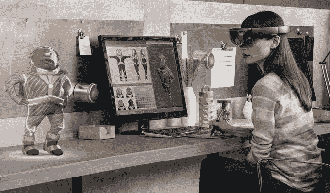
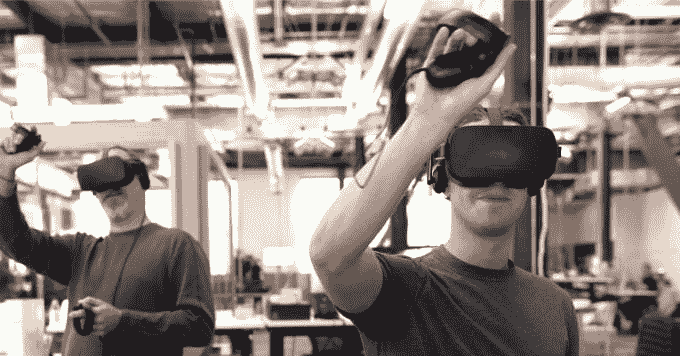

# 面对新的现实，Unity 定位于成为科技巨头 

> 原文：<https://web.archive.org/web/https://techcrunch.com/2017/05/25/with-new-realities-to-build-unity-positioned-to-become-tech-giant/>

扮演上帝从来都不是硅谷特别奇怪的野心。

即便如此，很少有垂直行业比工作室和初创公司构建虚拟和增强现实体验更充满乌托邦梦想。虽然有些人希望打造融入现实世界的 3D 体验，但其他人的目标是创造我们可以逃离的巨大世界。然而，它们有一个共同点，那就是它们都是基于一家名为 [Unity](https://web.archive.org/web/20221009045651/https://unity3d.com/) 的公司的游戏引擎。

Unity Technologies 为开发人员制作跨多个平台的 3D 内容提供工具，这一年业绩相当不错。

本周早些时候，该公司宣布[已经完成了来自 Silver Lake Partners】的 4 亿美元巨额投资，据《华尔街日报》报道，这笔投资对该公司的估值为 28 亿美元。这次融资紧随 10 个月前的 1 . 81 亿美元投资而来。](https://web.archive.org/web/20221009045651/https://beta.techcrunch.com/2017/05/23/unity-whose-software-powers-half-of-all-new-mobile-games-lands-400-million-from-silver-lake/)

“Unity 可能是未来十年最重要的科技公司之一，”DFJ 成长公司(Bernstein Growth)的合伙人巴里·舒勒(Barry Schuler)说，该公司领导了 Unity 的上一轮融资。

舒勒的偏见应该是显而易见的，但他的信念——如果虚拟和增强现实成功起飞，那么 Unity 将会变得伟大——是我与之聊天的许多投资者和业内人士的共同信念。

## 机会

Unity 成熟的世界是一个基于*空间计算*的世界，空间计算是一个技术术语，它使我们与数字对象的交互更加符合我们与现实世界事物的交互方式。

用户使用 Microsoft HoloLens 查看 3D 对象的渲染

网上购买衣服可能会从手持设备上的滚动转变为凝视现实世界的镜子，看看帽子或衬衫在你头上的 3D 映射会是什么样子。这是一个潜力无限的世界，尽管它很可能依赖于一些突破性的硬件以及强大的软件套件，如游戏引擎。

游戏引擎最初可能是为视频游戏而构建的，但其他几个主要行业的需求开始排队，并塑造了 Unity 等公司的雄心。

Unity 首席执行官约翰·里奇泰洛

“我们称之为游戏引擎，但实际上它是一个动画/互动/照明/物理/存在引擎，”Unity 首席执行官约翰·里奇泰洛告诉 TechCrunch。“这恰好也是奥迪所需要的。而这恰好也是大型强子对撞机的家伙们所需要的。”

里奇泰洛于 2014 年加入 Unity 担任首席执行官，接替联合创始人大卫·赫尔加松执掌公司，后者在哥本哈根一个摇摇欲坠的游戏工作室的废墟上创建了该公司。在加入之前，里奇泰洛曾担任世界上最大的视频游戏公司之一电子艺界的首席执行官。

## 到处存在

当 Unity 推出时，它只是另一个游戏引擎——当它首次推出对 iPhone 的开发支持时，它的突破时刻到来了，在早期，它将许多开发者带入了 iOS 的世界。

十年后，该公司拥有约 1400 名员工，其软件驱动了超过一半的新手机游戏。

这家总部位于旧金山的公司可能已经很好地掌握了移动领域，像 [Epic Games](https://web.archive.org/web/20221009045651/https://epicgames.com/) 这样的竞争对手和他们的虚幻引擎更专注于桌面游戏，但 Unity 越来越专注于 AR/VR 领域。

“5 年或 10 年前在 Unity 工作的人都不认为我们会在虚拟现实方面处于完美的位置，”Riccitiello 说。“我不认为我们正在将 Unity 整合到所有这些不同的东西中，我认为所有其他行业现在都需要传统上称为游戏引擎的东西。”

为 AR 和 VR 创建的所有内容中，超过三分之二使用 Unity 的引擎。微软 HoloLens 等新兴 AR 平台上 91%的应用程序都是在引擎上创建的，而三星的 Gear VR 约 90%的游戏产品都是使用 Unity 构建的。

虽然 AR 和 VR 技术非常年轻，但争夺平台主导地位的公司已经出现了很长一段时间。

脸书首席执行官马克·扎克伯格演示了公司的一个虚拟现实原型

谷歌有其移动 VR 的 Daydream 平台和移动 AR 的 Tango 平台。脸书刚刚在最近的 F8 开发者大会上推出了其增强现实平台，并拥有 Oculus，该公司生产高端 VR 头戴设备。今年晚些时候，微软将为 VR 头戴设备带来 Windows 全息支持，该公司已经在其增强现实 HoloLens 头戴设备上做了大量工作。

Schuler 认为，Unity 只会从这些公司继续争夺控制权中受益，因为该引擎广泛支持不同的平台，用户只需点击几个复选框就可以同时发布到这些平台。

“在过去，当没有标准或赢家出现时，这通常是不好的，因为你需要让开发者购买你的开发平台，并决定谁将成为领导者，这一过程会减慢一切，”Schuler 说。“对于 Unity，你真的是在赌这个类别，因为它有一个伟大的‘一次编写，发布到一切’的平台。”

该公司的工具可供个人免费使用，并为较大客户的每台设备订阅定价，根据带来的收入进行扩展。

随着其能力的扩大和产品受欢迎程度的提高，关于这家快速成长的公司的下一步该怎么走的问题出现了

舒勒没有预料到 Unity 会被平台巨头收购。“如果谷歌或脸书收购 Unity，让 Unity 运转的一切都将消失，让它运转如此良好的是，它们是一家纯粹的独立公司。”

里奇泰洛没有过多谈论退出的话题，但表示上市将是未来的话题。“总有一天我们会谈到 IPO，但肯定不是现在，”他说。

## 简单

Riccitiello 表示，Unity 的简单性可能是其最大的卖点之一，但随着该引擎在其雄心中变得成熟，损害其核心使命的风险也在增加。

“Unity 内部的矛盾始终是如何提供这种性能，否则会产生越来越多的复杂性，而这样做却非常简单。这总是一个令人烦恼的问题，也是一个平衡的问题，”里奇泰洛说。

下面是 Unity 的 Adam 演示的一个例子，突出了该引擎在工作中的一些更密集、边界推进的能力。

[https://web.archive.org/web/20221009045651if_/https://www.youtube.com/embed/GXI0l3yqBrA?feature=oembed](https://web.archive.org/web/20221009045651if_/https://www.youtube.com/embed/GXI0l3yqBrA?feature=oembed)

视频

本月早些时候，在 Unity 主办的虚拟现实峰会上，著名的进化生物学家 Richard Dawkins 上台发表了他对 Unity 正在为其构建平台的世界的看法，他说:“我们对现实的感知……这是虚拟现实，但它是由大脑中的软件运行的。”

Riccitiello 表示，Unity 可能还没有涉足大脑制造业务，但虚拟和增强现实成为广泛平台的前景给了该公司新的梦想，可以通过其游戏引擎来实现。"我们的雄心比以往任何时候都要大得多。"