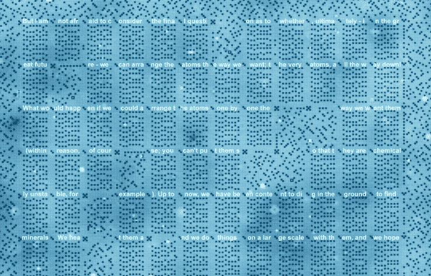
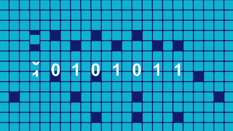
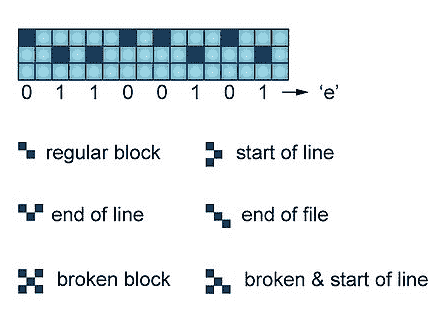

# 每位一个原子，这个 1 千字节的硬盘只有 100 纳米宽

> 原文：<https://web.archive.org/web/https://techcrunch.com/2016/07/18/with-one-atom-per-bit-this-1-kilobyte-hard-drive-is-only-100-nanometers-wide/>

这里有一个围绕饮水机谈论的有趣里程碑:荷兰的研究人员创造了一个微观存储系统，用单个原子对每一位进行编码——允许它们在直径不到 100 纳米的空间内存储一千字节。

这相当于每平方英寸约 500 兆兆位的存储密度。相比之下，你今天能买到的 4tb 硬盘大约是每平方英寸*1*TB。这是因为，与这种新系统不同，它们使用数百或数千个原子来存储一位。

“理论上，这种存储密度将允许人类创造的所有书籍都写在一个邮票上，”代尔夫特理工大学首席科学家桑德·奥特在新闻发布会上说。不过，这并不能让你真正了解这项技术有多酷。

存储阵列(“硬盘”并不完全准确，但能表达重点)在其组织中非常优雅——如果它要在原子级别上工作，就必须如此。

“每一位由铜原子表面的两个位置和一个氯原子组成，我们可以在这两个位置之间来回滑动，”Otte 解释道。因为铜上的氯形成了一个完美的正方形网格，所以很容易(至少相对而言)定位和读取它们。如果氯原子在上面，那就是 1；如果在底部，那就是 0 分。将 8 个氯原子排成一行，它们组成一个字节。

然后还有一些特殊的标记，表示行或文件的结束，或者下一个空格应该被忽略(例如，在损坏的情况下)。总的来说，该系统足够高效，他们能够在 96×128 纳米的空间(12 行 12 列，每个单元容纳 8 个字节)中存储数百个字母。而且做这些操作很容易，过程可以自动化。

 研究人员选择展示的数据这是费曼讲座的片段，[“底部有足够的空间”(PDF)](https://web.archive.org/web/20230328032358/http://www.pa.msu.edu/~yang/RFeynman_plentySpace.pdf)——恰当地说，是关于在极小的尺度上存储数据。(你可以在这里看到阵列的高分辨率图像。)

不过，这是严格的实验室限制，至少现在是这样。氯铜阵列只有在洁净的真空和 77 开尔文(大约是液氮的温度)下才稳定。超过这个温度和热量就会破坏原子的组织。

这是早期研究，但仍有希望。使用单个原子作为比特存储的想法是许多科学家梦寐以求的，这种高密度存储的应用当然是数不胜数的。这项研究发表在今天的《自然纳米技术》杂志上。