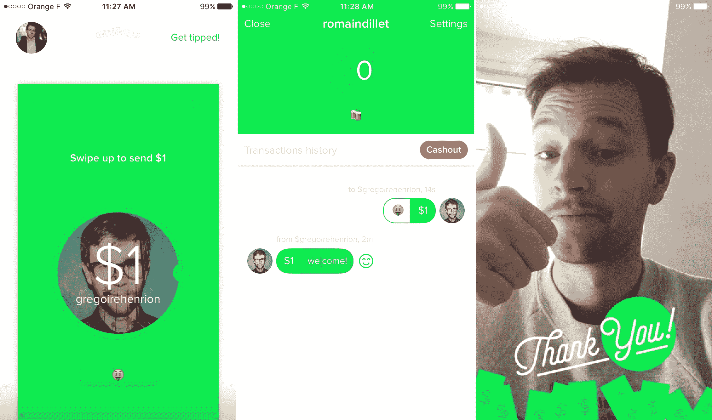
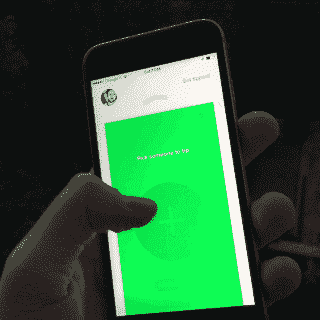

# 用一张现金，给你爱的人 1 美元小费，或者让它下雨

> 原文：<https://web.archive.org/web/https://techcrunch.com/2015/11/12/with-one-cash-tip-1-to-people-you-love-or-make-it-rain/>

来自带给你 [Mindie](https://web.archive.org/web/20230321010010/https://techcrunch.com/2013/10/17/mindie-is-an-immersive-music-and-video-jukebox-app-done-right/) 、 [One Cash](https://web.archive.org/web/20230321010010/https://one.cash/) 的团队是一款新的 iOS 支付应用，但有所改变。这一次，它不是像无数其他应用程序那样回报你的朋友。这都是关于给你欣赏的人 1 美元小费…或者更多。它是这样工作的。

“目前的支付应用大多是为了偿还你的朋友。联合创始人格雷瓜尔·亨里翁告诉我:“我们想创造一些公共的东西，让你支持创作者。“我们想创建一个有趣的应用程序。”

当你第一次启动应用程序时，设置过程非常简单。你只需要让应用程序访问你的 Twitter 账户，并输入你的美国信用卡或借记卡。之后，你可以给任何有 Twitter 账户的人小费。

One Cash 完全依赖 Twitter 的社交图谱。你可以搜索任何 Twitter 用户，看看他们是否已经在使用这个应用。如果他们没有听说过 One Cash，他们会收到一条推文，他们可以安装应用程序来兑换小费。

但相比其他支付 app，One Cash 好玩。一旦你选择了某人，你向上滑动手指扔给这个人一张 1 美元的钞票——没有任何费用。没有确认屏幕，只有一个简单的手势。CTO Baptiste Truchot 在隐藏支付应用的复杂性方面做得非常好。如果要寄一块钱以上的怎么办？让它下雨吧:

One Cash 从即时通讯应用中借鉴了许多 UX 技巧。您可以在个人资料中添加简历，在提示中添加信息。你的交易历史看起来像一个对话屏幕。当有人看到你的提示时，你会收到通知，人们可以用一张感谢自拍来回答。所有这些都很重要，可以让应用变得更加个性化。

这也是理解一笔钱真正用途的关键。这不是给你的朋友寄几美元。这家初创公司希望为内容创作者创造一种简单的接受捐赠的方式。如果你是一名专业的 YouTube、Vine、Instagram 或 Snapchat 内容创作者，你可能想开始接受粉丝的捐赠。

已经有一些方法，包括像 [Patreon](https://web.archive.org/web/20230321010010/https://www.patreon.com/) 这样的订阅服务。但是都没有一张现金那么简单。

“我们的利基是拥有足够多的观众来吸引小费，但又太小而无法获得广告收入的创作者，”Henrion 说。"如果大明星除了广告之外还能使用小费，那就太好了."

为了实现这一切，One Cash 用户可以获得一个唯一的个人资料 URL，以便与他们的关注者分享。例如，下面是我的简介的样子。

许多内容创作者仍在思考如何将观众转化为收入。YouTube 找到了一种方法来帮助这些创作者制作前置广告。但 Instagram、Vine 和其他平台尚未为其高级用户提供一种原生的赚钱方式。One Cash 用一个设计良好的应用程序填补了这一空白，我希望我能在未来几个月里给我最喜欢的互联网明星小费。

https://www.youtube.com/watch?v=PNsV83z3SyU