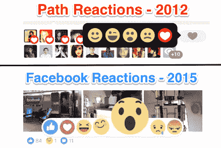

# 有了反应，脸书用 6 个感同身受的表情符号取代了“喜欢”按钮

> 原文：<https://web.archive.org/web/http://techcrunch.com/2015/10/08/with-reactions-facebook-supercharges-the-like-button-with-6-empathetic-emoji/>

9 月，脸书首席执行官马克·扎克伯格暗示脸书正在想办法扩展其著名的 Like 按钮，这引起了一些轰动——不是通过添加传说中的“不喜欢”选项，而是通过让它更有同理心，表达悲伤和其他情感。今天，脸书正在揭开这个新形象的面纱。它正在推出“反应”，这是一套新的六个表情符号，将与最初的大拇指放在一起，让用户快速做出爱、笑、快乐、震惊、悲伤和愤怒的反应。

脸书告诉我们，弹出功能将首先在西班牙和爱尔兰两个市场进行测试，然后再决定是否调整和/或如何进一步推广。

(那两个国家的原因？脸书的产品总监 Adam Mosseri 说，这是因为两者都有很大程度上的国内用户基础，没有广泛的国际朋友网络，所以他们作为封闭的测试小组工作得更好。爱尔兰说英语，而西班牙让脸书测试无字表情符号在非英语用户中的表现。)

拥有一套更具反应性的表情符号对你来说可能听起来很熟悉。在 9 月份有报道称脸书正在开发一个“不喜欢”按钮后，我们自己的 Josh Constine [预测](https://web.archive.org/web/20230405000119/https://techcrunch.com/2015/09/17/emoji-button/)脸书可能会提供一小部分表情符号，类似于 2012 年提供的反应按钮 Path。原来脸书[甚至已经为这种表情符号反应功能的工作原理和外观申请了专利。(这些指示似乎完全正确。)](https://web.archive.org/web/20230405000119/http://www.google.com.ar/patents/US8918339)

更一般地说，一小组反应性表情符号绝对是在线用户熟悉的界面:Path 等社交网络和 Buzzfeed 等网站已经让用户能够以不同的反应来回复帖子，而不仅仅是简单的喜欢和收藏。

新的反应将出现在该应用的移动和桌面版本中，以及新闻源中的所有帖子上——无论是来自朋友、你关注的页面/账户，还是广告商。

莫塞里告诉我，目前还没有计划将它们放入 Messenger 或其他脸书拥有的产品中。(举例来说，虽然你可以看到这在 Instagram 这样的产品中也很有意义。)

这些反应非常简单。在手机上，当你触摸屏幕上的“喜欢”按钮时，表情符号就会出现；在桌面上，当你将鼠标悬停在图标上或点击它时，它们就会出现。

脸书添加表情符号的举动来自社交网络注意到的一些不同的挑战和趋势。

首先，用户对脸书的基本要求是提供不仅仅是一个简单的赞。有时候竖起大拇指并不是你想要的快速反应，例如，如果有问题的新闻是令人震惊的坏消息。

然后是人们在移动设备上互动的问题。

对于越来越多的脸书用户来说，移动平台越来越成为默认平台，因此，对于一个非常依赖用户参与来开展业务的社交网络来说，有些人不喜欢花时间在手机上点击回复是一个需要解决的重要问题。

Mosseri 说，一些人已经使用贴纸作为一种无言的方式来记录他们的回应，但这将使他们更快地做到这一点。

“在手机上打字很难，”莫塞里说，“这比在 feed 中找到一个贴纸或表情符号来回复要容易得多。”

提供不同的表情符号也意味着脸书将开始记录和显示这些不同的反应:所以，就像今天你会看到有多少人和谁喜欢一个帖子，现在你会看到哪些人喜欢它，或者觉得它令人惊讶，或者悲伤，等等。

对于页面所有者和出版商来说，这些数据收集最终也会进入脸书的分析仪表板。因此，正如今天社交媒体经理可以监控某些帖子的分享和喜欢，他们现在可以获得更多关于人们对社交网络上内容的情感反应的数据，这也应该有助于脸书在销售广告和简单地为用户提供更多相关内容方面发挥更大的作用。

Mosseri 说，就像喜欢按钮或总体评论一样，一旦它们出现在你的订阅源中，你就会被它们缠住——没有关闭回复的选项，就像出版商有时对网站上文章的评论所做的那样。莫塞里说，给用户关闭表情符号的选项是“我们考虑过的”,但他们决定反对。“如果你首先考虑用户体验，这个选项可能会变得令人困惑，人们反而会认为有东西坏了。”

下面的视频展示了这项新功能的工作原理:

> 今天，我们将推出一个反应试点测试——一个更具表现力的 Like 按钮。正如你所看到的，这不是一个“不喜欢”按钮，尽管我们希望它能更广泛地满足这个请求的精神。我们研究了哪些评论和反应是全脸书最常见、最普遍表达的，然后围绕它们设计了一种优雅而有趣的体验。从今天开始，爱尔兰和西班牙可以通过悬停或长按他们看到的“喜欢”按钮，开始对脸书上的帖子表示喜爱、惊叹或同情。我们将利用由此得到的反馈来改进该功能，并希望很快将其推广给所有人。
> 
> 由[克里斯·考克斯](https://web.archive.org/web/20230405000119/https://www.facebook.com/chris.cox)于 2015 年 10 月 8 日星期四发布