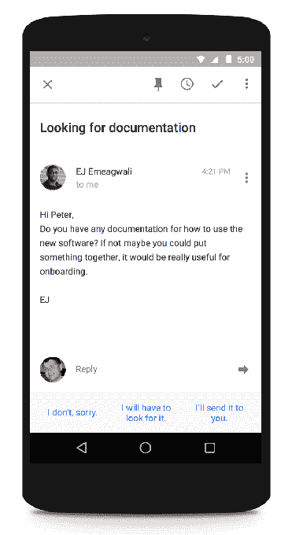

# 有了智能回复，谷歌的收件箱现在可以自动回复邮件了

> 原文：<https://web.archive.org/web/https://techcrunch.com/2015/11/03/with-smart-reply-googles-inbox-can-now-respond-to-emails-for-you-automatically/>

一些人认为电子邮件已经臃肿不堪，正在消亡，但通过实施其机器学习和人工智能团队的进步，谷歌一直在使用[Inbox](https://web.archive.org/web/20230307025829/https://www.google.com/inbox/)——其基于 Gmail 的移动电子邮件客户端——作为一种提高如何改善体验的方式，并使其再次成为一个与人交流的高效场所。今天，该公司推出了其最新功能:[智能回复](https://web.archive.org/web/20230307025829/http://gmailblog.blogspot.co.uk/2015/11/computer-respond-to-this-email.html)，这是收件箱为你制作自动回复的一种方式。

谷歌表示，这项将于本周晚些时候推出的功能将是这样的:当你收到一封电子邮件时，智能回复将“阅读”邮件内容，并在屏幕底部选择三个基本回复进行快速回复。

“对于那些需要更多思考的电子邮件，它给了你一个跳跃的起点，让你可以立即回复，”谷歌的软件工程师巴林特·米克罗斯写道，他曾参与这项服务。这种跳跃开始的形式是收件箱在自动回复屏幕底部建议的短语，然后这些短语成为你回复的开始。

这款应用还会在你使用它的时候“学习”。所以，如果你从来不选择“是的，请给我发更多的信息！”当回复一个在电子邮件中向你推荐某样东西的人时，当那个人再次写信(一次又一次)时，它不太可能继续作为一个选项出现。

已经有很多应用程序出现，试图让浏览收件箱变得更容易，但也许最重要的是智能回复让我想起了[TL；DR](https://web.archive.org/web/20230307025829/https://techcrunch.com/2015/01/28/tldr-a-new-app-from-everything-mes-co-founder-wants-to-make-email-more-like-messaging/) 是一款小应用程序，来自于[现已解散的 Android launcher everything . me](https://web.archive.org/web/20230307025829/http://www.techmeme.com/151025/p5#a151025p5)的联合创始人之一，该应用程序还通过提供如何回复的建议，缩短了回复信息的步骤，从而使电子邮件更像信息传递。

在这款应用和智能回复的情况下，难点是众所周知的:对大多数人来说，在智能手机上打字实际上是一种痛苦，因此尽可能创造一些方法来规避这一点是很有意义的。

这也是移动应用逐渐变得更具预测性的另一步。这方面的其他明显例子是苹果或 Google Now 的 Siri 等服务，甚至是 LinkedIn 的应用程序，当联系人进入你的附近时，这些应用程序会提示他们的信息。这里更大的想法不仅仅是应用程序变得更容易使用，因为我们在它们的小屏幕上输入的东西更少了，而是它们变得更加智能，能够在我们的生活中充当有用的助手。

这在一定程度上是开发者的实际举措:我们的手机上应用越多，我们就越不可能打开那些难以使用的应用。但这也是一个迹象，表明所有应用程序可能会随着时间的推移而演变。

谷歌多年来建立了一个庞大的团队，从事机器学习、自然语言处理和人工智能等领域的工作，以构建搜索、移动和许多应用程序的功能。

在这种情况下，智能回复并不是 Inbox 的第一个功能 Inbox 于 2015 年 5 月向所有用户开放——它依赖于这些技术。谷歌还会推送待办事项提醒，帮助组织旅行，并提供“帮助”——在应用程序中提示你下一步应该做什么。在智能回复的情况下，谷歌工程师使用[深度神经网络](https://web.archive.org/web/20230307025829/https://en.wikipedia.org/wiki/Deep_learning)构建了这一功能，这也是谷歌语音搜索和 YouTube 缩略图改进的基础。你可以在这里阅读更多关于智能回复[背后的机制。](https://web.archive.org/web/20230307025829/http://googleresearch.blogspot.co.uk/2015/11/computer-respond-to-this-email.html)