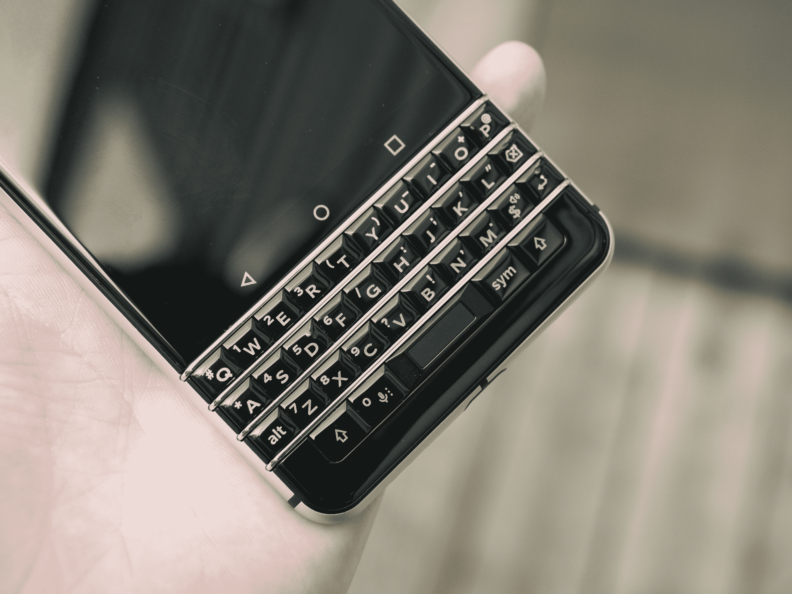

# 通过 KEYone，黑莓在复古智能手机吸引力上穿针引线 

> 原文：<https://web.archive.org/web/https://techcrunch.com/2017/05/31/with-the-keyone-blackberry-threads-the-needle-on-retro-smartphone-appeal/>

今天在其祖国加拿大上市的黑莓 KEYone 是一款奇怪的设备。

但奇怪的不是因为它不是内部设计的，而是由合作伙伴 TCL 负责；这很奇怪，因为它奇怪地成功实现了一种奇怪的平衡行为，将现代功能与富士胶片设法在他们的无反光镜相机系列中注入的复古吸引力相结合，带着对智能手机早期的怀旧，这显然离我们很远，我们可以对它们感到真正的怀旧。

直到最近，黑莓试图保住其硬件键盘遗产的努力，感觉就像抓住了一个可悲且不可逆转的过去。当然，你会在头发花白的 C-Level 高管中找到一些粉丝，他们发现向触摸屏键盘的过渡是不可能的(咳咳)。但总的来说，世界已经发生了变化——屏幕越来越大，多点触控和界面适应性越来越强。

但就在黑莓的 BB10 实验失败几年后，KEYone 凭借其坚固、相对未受影响的 Android 版本，以及其标志性的硬塑料按键，感觉就像一个你很高兴决定拜访的老朋友。这可能与 Android 自己最近的改进有很大关系(KEYone 运行的是 Nougat，这是最近的公开发布)，但这也是一种深思熟虑的成熟，它抵制了抛弃黑莓遗产的冲动，但也没有紧紧抓住该公司的硬件历史。

例如，KEYone 有一个很好的摄像头，这是黑莓品牌从来没有过的。它使用与谷歌 Pixel 相同的传感器，尽管其软件意味着 KEYone 仍不在顶级智能手机相机行列中。尽管如此，它的功能非常强大，可能会满足 KEYone 的主要人群，这可能是那些不想为了获得像样的智能手机体验而必须随身携带的商务人士。

如前所述，该软件也很好，因为它非常不起眼。黑莓仍然希望你使用集线器和 BBM，但如果你不是这些的忠实粉丝，你可以很容易地跳过这两个。此外，该公司的一些软件修改非常有用，包括能够在主屏幕图标上滑动带有小工具的应用程序，以便在不实际打开应用程序的情况下快速浏览。

当然，我没有忘记那个硬件键盘——这个感觉像是黑莓签名文本输入设备，但如果你已经有一段时间没有使用带有打字硬件的黑莓手机了，你可能会对其中的一些升级感到惊喜。比如触敏键，你可以在键盘上上下左右滑动来滚动内容，包括你的 Twitter feed，而不会遮挡显示屏。以及用户可分配的键盘快捷键——每个键多达两个，因为您可以为每个字母的长按和短按设置一个快捷键。对于快速启动应用程序和以尽可能少的步骤执行其他系统功能来说，这是一个非常节省时间的功能。

KEYone 实现了看似不可思议的事情；它让智能手机上的硬件键盘感觉像是一种新颖的创新，而不是我们已经尝试过、彻底探索过和超越过的东西。此外，如果你是一个老黑莓用户，肌肉记忆马上就会发挥作用，你会立刻不计后果地清理你的电子邮件债务。

KEYone 的其他亮点包括 USB-C 充电，快速充电模式可以关闭非必要的任务，使您的设备更快地恢复电力，以及一个可分配的硬件按钮，您可以设置它来做任何事情。我的调成了安卓助手(又名语音搜索)，总体来说非常有用。此外，键盘上的每个键也仍然是一个自定义的快速启动。

KEYone 与包括贝尔、罗杰斯和 Telus 在内的一系列加拿大运营商的合同起价为 0 美元，这取决于你的质量激励。它还将以 729 美元的价格提供解锁版，这与顶级高端手机一样高，但鉴于我迄今为止非常喜欢使用 KEYone，我真不敢相信我是在 2017 年谈论黑莓手机。