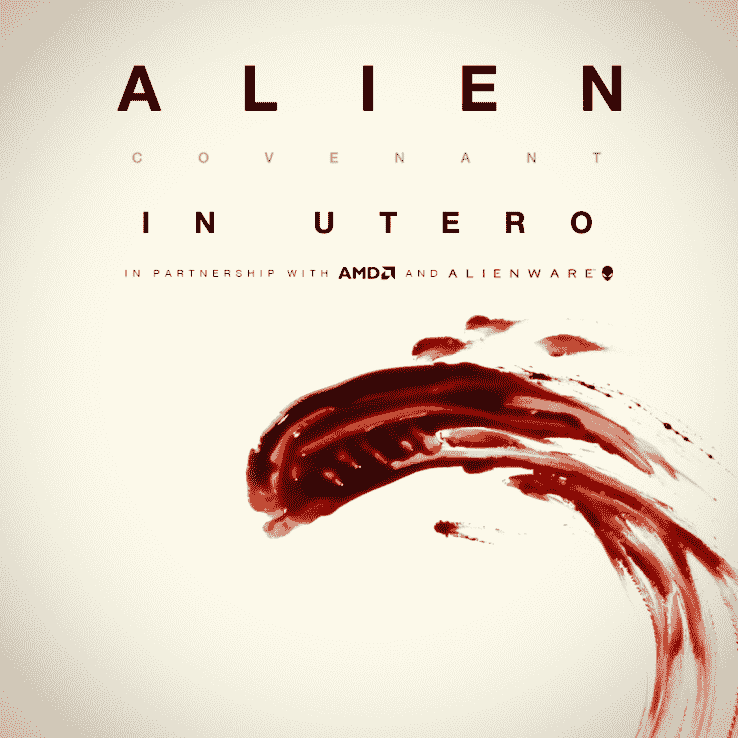

# 通过新的《异形:虚拟现实之约》体验，成为你想在影院看到的异形

> 原文：<https://web.archive.org/web/https://techcrunch.com/2017/04/25/with-the-new-alien-covenant-vr-experience-be-the-alien-you-want-to-see-in-the-theaters/>

作为围绕《异形:盟约》(定于 5 月 19 日首播)首映的媒体宣传的一部分，二十世纪福克斯及其同胞提供了一个虚拟现实预告片——子宫内的异形:盟约。

这部[非涅槃相关的](https://web.archive.org/web/20230405175440/https://www.youtube.com/watch?v=L8zxyPvH5jc)短片将观众带入了《异形》同名异形的诞生时刻。这部短片(就像这张专辑一样，它的名字并不是由此而来)血腥、恐怖、难以置信。

在《子宫内》中，人们可以听到目睹外星人出生的人类惊恐的叫声，以及当“新形态”挣扎着挣脱时宿主越来越强烈的心跳和身体反应。

这款迷你体验时长约为 90 秒，将于明天通过 Rift 在 Oculus 视频应用程序或由 Oculus 支持的三星 Gear VR 上提供。脸书上还提供 360°沉浸式预告片。

虚拟现实体验对福克斯来说并不新鲜，它首次涉足长短形式的虚拟现实，为雷德利·斯科特的另一部作品“火星人”提供了预告片和虚拟现实体验

最终，电影观众不愿为 30 分钟的虚拟现实体验支付 20 美元，但福克斯希望第二次是有魅力的。

除了 RSA VR([雷德利和托尼·苏格特工作室](https://web.archive.org/web/20230405175440/http://www.rsafilms.com/)新成立的虚拟现实部门)、FoxNext VR 工作室、 [MPC VR](https://web.archive.org/web/20230405175440/http://mpc-15.moving-picture.com/) (一家 Technicolor 公司)、声音工程工作室 Mach1 Studios、AMD 镭龙和戴尔的外星人游戏电脑，福克斯正在巡回演出，并将在全国 15 家富豪影院上映，让电影观众体验福克斯希望成为下一波娱乐的东西。

从 5 月 10 日开始，在《异形:盟约》发布前一周多一点，子宫内的表演将在所有移动和有线虚拟现实平台上提供，包括谷歌的 Daydream View，HTC Vive 和 PlayStation VR。

“有了子宫内体验，观众的参与达到了一个全新的水平。雷德利·斯科特在一份声明中说:“你将成为一名新生，探索你周围和你内心正在发生的事情。”。

制作《虚拟现实体验》的斯科特将导演大权交给了新人大卫·卡拉克，后者凭借短片《崛起》在科幻电影界声名鹊起。

https://www.youtube.com/watch?DQ

“这个项目的种子整体上是外星的，”卡拉克在洛杉矶 Technicolor 的卡尔弗城活动空间举行的关于 VR 短片的小组讨论中说。“《异形》是一部粉碎了我的电影，当然也是一部让我踏上电影制作人之旅的电影。”

利用 Technicolor 的 MPC 数字特效团队从电影本身中挑选的资产，Karlak 和创作团队的其他成员着手构建明天将推出的虚拟现实体验。

所有这些行动都为卡拉克和斯科特工作室在虚拟现实体验方面的扩大合作奠定了基础，这种体验类似于福克斯在《火星救援》中推出的体验。我交谈过的每个人都很平静地谈论这可能会是什么样子，但它肯定会到来。越来越多的这种多平台娱乐是 Fox 希望在其他 tentpole 版本中推出的东西。

今年年初，福克斯[宣布，它将与克里斯·米尔克的](https://web.archive.org/web/20230405175440/https://techcrunch.com/2017/01/19/foxnext-and-chris-milks-within-partner-for-planet-of-the-apes-arvr-experience/)[无限合作](https://web.archive.org/web/20230405175440/https://with.in/)，为下一部《人猿星球》电影提供虚拟现实体验。福克斯还投资了该公司的 1250 万美元融资轮。

而且 Within 并不是 Fox 在 VR 世界的唯一投资。该工作室是[也是 Osterhout 设计集团的大支持者](https://web.archive.org/web/20230405175440/https://www.crunchbase.com/organization/21st-century-fox#/entity)，该集团开发了虚拟和增强现实头戴设备的技术和 [Dreamscape Immersive](https://web.archive.org/web/20230405175440/http://variety.com/2017/digital/news/dreamscape-immersive-vr-multiplex-1201986722/) ，虚拟现实多元化开发商正在洛杉矶建设其第一个网站。

目前，工作室的重点是推出子宫内体验(真的很酷)。值得一看，但只要记住……[在 VR 里每个人都能听到你的尖叫](https://web.archive.org/web/20230405175440/https://www.youtube.com/watch?v=5NcKKNcZ_1k)。