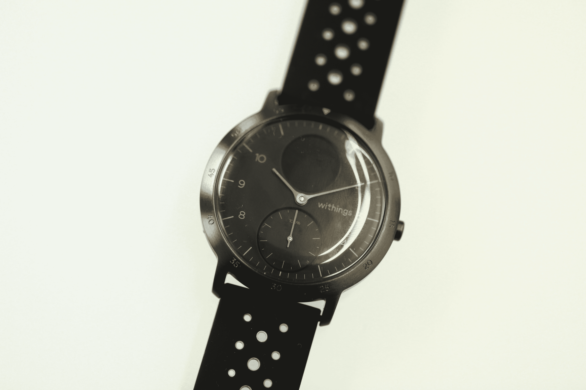
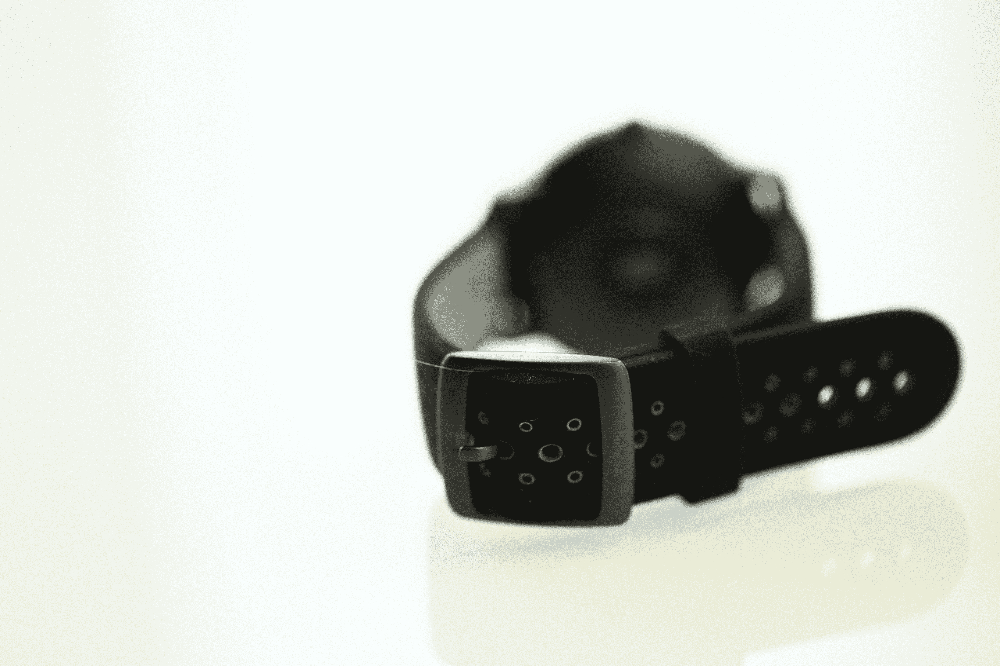

# Withings 凭借 Steel HR Sport watch TechCrunch 起死回生

> 原文：<https://web.archive.org/web/https://techcrunch.com/2018/09/18/withings-returns-from-the-dead-with-steel-hr-sport-watch/>

# Withings 带着钢制 HR 运动手表起死回生

每当小公司被大公司吞并时，你都会做最坏的打算。在诺基亚收购 Withings 的案例中，差不多就是这样。首先，诺基亚以自己的名字推出了一些产品，最终彻底放弃了这家法国医疗硬件公司。

四个月前，Withings 的联合创始人之一从诺基亚买回了这个品牌。今天，这家创新的法国硬件公司带着老产品的新面貌回来了。钢铁 HR 运动。这是一个受欢迎的回归，它已经成为我最喜欢的健身追踪器之一，在该品牌于 5 月份不合时宜地消亡之前。

Steel 系列的简洁一直是其最吸引人的特点之一。最初于 2014 年推出的是早期的混合智能手表之一——一种相当标准的模拟时钟，在表面下隐藏了一些智能功能。这些设备的顶部有一个小的单色显示屏，用于显示通知和菜单，还有一个嵌入面部的小辅助仪表，显示每天健身目标的百分比。

Steel HR Sport 为该系列带来了一些关键更新，包括跟踪 30 种不同活动的能力，包括瑜伽、排球、划船、拳击、滑雪和冰球。这款手表还提供“健康水平评估”，通过测量最大摄氧量等指标来提供更好的整体健康状况。虽然没有内置 GPS，但这款手表使用手机来跟踪距离、海拔和速度，并绘制跑步地图。

除了美观之外，电池寿命一直是这些混合设备的最大优势之一，这款新手表充电 25 天，待机 20 天。这意味着，与大多数竞争对手不同，这款手表实际上可以跟踪白天和夜间的活动，而无需充电。

与有 36 毫米和 40 毫米两种尺寸的钢制 HR 不同，HR Sport 仅提供后者——尽管这仍然比市场上的许多智能手表更加紧凑。今天 200 美元就能买到。