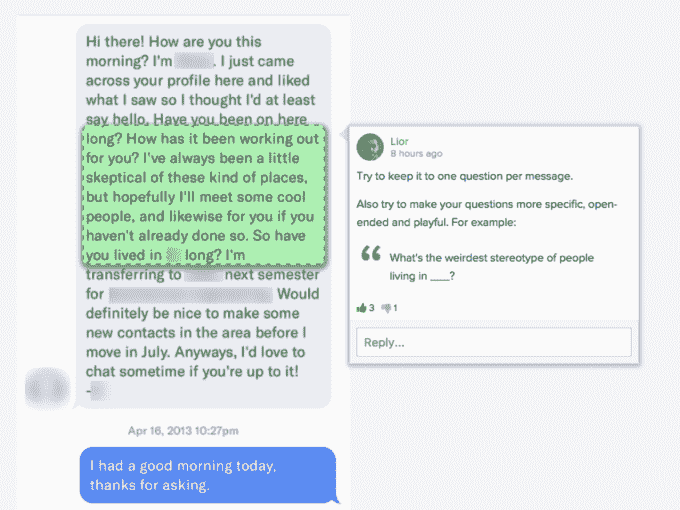
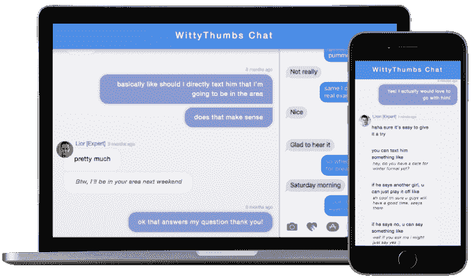

# WittyThumbs 将帮助你解读你的约会信息的真正含义 

> 原文：<https://web.archive.org/web/https://techcrunch.com/2017/06/05/wittythumbs-will-help-you-decipher-what-your-dates-messages-really-mean/>

# WittyThumbs 将帮助你解读你的约会信息的真正含义

在线和基于手机的约会一直有一个主要问题——很难弄清楚你的伴侣的信息是什么意思。

当然，他们可能认为他们很直接，很中肯，但是如果你真的试过约会应用，你就会知道事实并非如此。

输入 [WittyThumbs](https://web.archive.org/web/20221025222306/https://wittythumbs.com/) 。该网站今天发布，是来自[爱马仕](https://web.archive.org/web/20221025222306/https://hermes.social/)的第一个产品，这是一家总部位于 YC 的初创公司，希望通过教育内容和专家帮助来帮助人们改善他们的约会生活。

WittyThumbs 本质上是约会对话的 RapGenius。你把你的短信截屏，上传到网站，用户可以进行注释并给出反馈。

这家初创公司由 Liron Shapira 和 Lior Gotesman 创建，他们创办该公司的论点是，多亏了 Tinder 和 Bumble 等应用程序，找到约会对象不再是一件困难的事情——现在的问题是知道说什么才能引起他们的注意。

此外，在这些应用程序出现之前，我们大多数人都会和我们认识或有共同之处的人约会。现在有这么多陌生的对手，你更有可能会陷入试图弄清楚他们想说什么的困境——即使你的对手不想让人难以捉摸或困惑。

WittyThumb 的客户年龄和性别各不相同——这家初创公司解释说，通常会发现一些 20 出头的人开始约会时需要帮助，或者一些 50 多岁的人最近离婚，从来没有经历过基于聊天的约会。

还有一个高级选项，可以立即与约会专家一对一地聊天，这是按分钟计费的，30 分钟的建议起价为 30 美元。创始人解释说，他们在世界各地有大约 15 名专家，这意味着你应该能够在一天中的任何时间获得实时关系帮助。

当然，所有的聊天上传都是匿名的——用户为网站创建新的用户名，并模糊截图中的任何识别信息，如个人资料图片或真实姓名和号码。

虽然爱马仕开始提供聊天建议和分析，但最终他们计划扩大产品线，在约会过程的各个阶段帮助用户。

